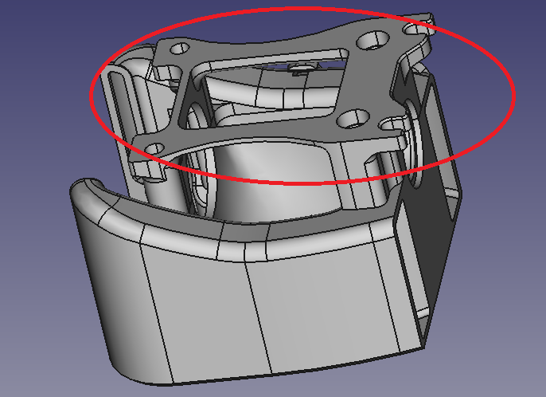
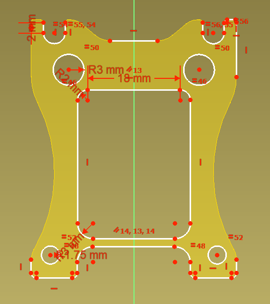
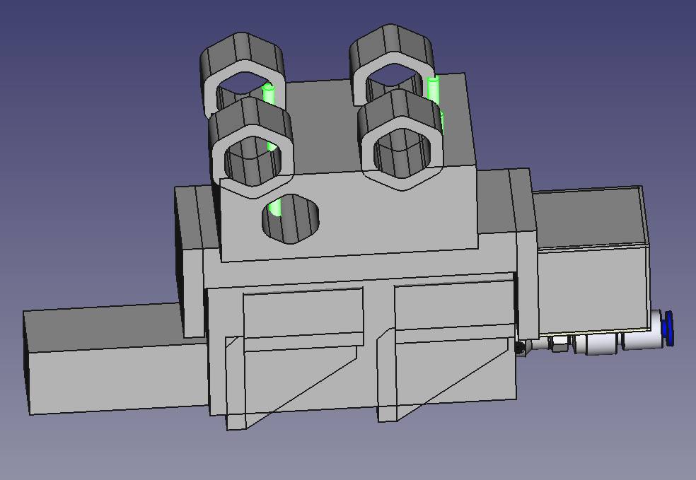
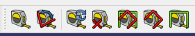
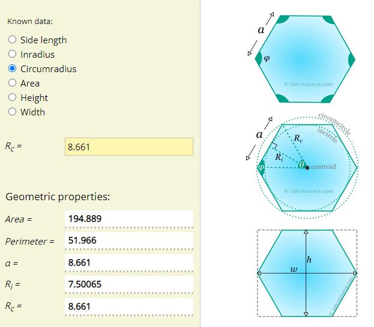
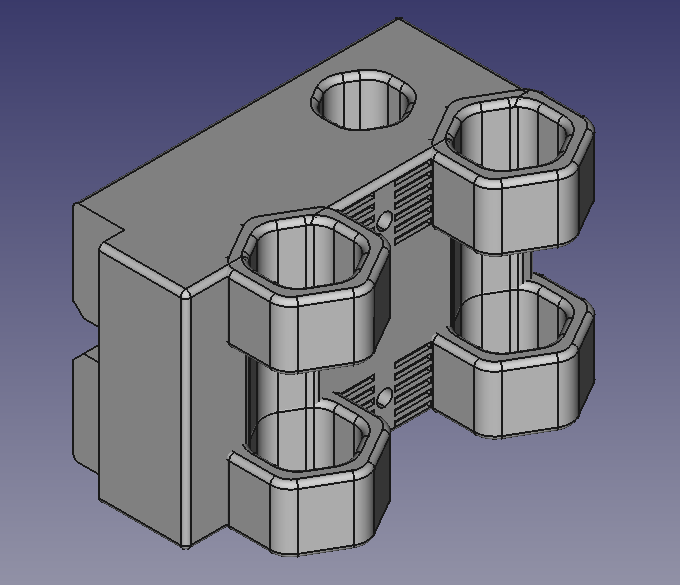
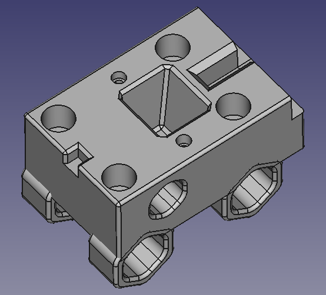
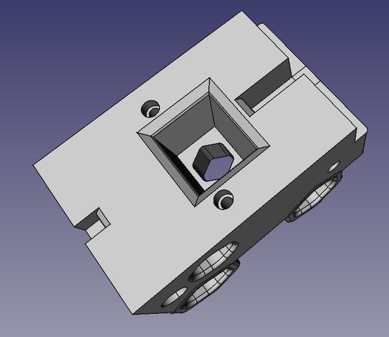

... in the design was always going to be the mating of Z and X Axis.

Two options, both I will investigate. Both due to parts in the STEP files for the VORON Legacy not being conducive to binary operations, so not able to snip bits off for re-assembly. No matter, forces me to learn more about FreeCAD and CAD in general.

The first option is designing a foot for mounting onto the seat on the X-Axis.

So, based upon the foot in Figure 1, I am now dabbling with Sketcher in Figure 2. That would allow me to bolt straight onto the X-Carriage.

As usual I did not read the manual LOL, but assumed that if you fiddle with options, FreeCAD would have a way. So there is an option of reverse engineering using Sketcher that will grab a face for you to then trace. Very neat. So Figure 2 is part of the way there. The pesky problem will be sorting out the constraints for this to close the sketch (set all lines to green, not white and certainly not red). I feel that will be a little painful while I learn what I suspect is more art than science (unless you're a freaking math's freak!).

Figure 1

Figure 2

The other option was, since the old skool way is to build from scratch, to design a new X-Carriage from scratch.

The problem, see Figure 3, is the pesky holes for the M3 bolts to hold the Z-Axis on - and, of course, where they need go. Hmm. There will be an infinity discourse over the design spectrum here. Love knowing what that phrase means!

Figure 3

So, first things first. I worked out these were my best friend when reverse engineering. They'll be yours too.

* 

So, where I got to is not bad. Using prisms and fillets or chamfers etc. Getting a prism with 15mm between flats was as simple as setting the circumradius to 8.66mm. I fudged this by fiddling until I go 15mm, but you can [get help off the Net](https://calcresource.com/geom-hexagon.html) as well, see Figure 4. And so Figure 5 shows the results.

Figure 4

Figure 5

So, the problem with the Z-Axis mount is to be solved, this first pass, with use of keys and magnets, see Figure 6. I can't vouch for this yet, but I have a print running of the design below and magnets coming from Aliexpress. So by the time I go to assemble this (maybe over Christmas), I'll have 2 to 3 X-Carriage/Z-Axis mating options to trial.

I took a punt and started with 4x10x10mm magnets in the X-Carriage and 4x10x5mm magnets in the Z-Axis foot, I am banking on this being good enough. However, I need revisit this as I did not do the research first. The 10x10mm magnets will have 3.4Kgs pull force each, so may be over the top, especially when mated with 10x5mm magnets on the Z-Axis foot. A 6x10mm magnet provides a 1.74Kgs force, so I need play with this idea a little. Certainly a single, larger magnet in the bottom of the large centre pin might be enough, so something more like Figure 7.

Figure 6

Figure 7

I am trying a hexagonal hole, instead of round, for the magnets. I also opted for the hole to pass through, since I will want to check various Kg forces (by changing lengths of magnets).

Now the trick with the original X-Carriage for the VORON Legacy, was it was in two pieces, to avoid supports etc. So, I have the thing split in two and happily printing a draft for now moving onto the design of the foot for the Z-Axis. It will have 3 pins as you can see from Figure 7. A cube at the bottom. A wedge with magnet holder in the middle, and a 'T' shaped pin at the top. The T-shaped pin, as it will be at the top, will have a gap between it and the X-Carriage, so as to allow insertion of a screw driver, or specially printed lever maybe, to "break" the hold of the magnet (I hope), by providing some leveraging to get an air gap started.
