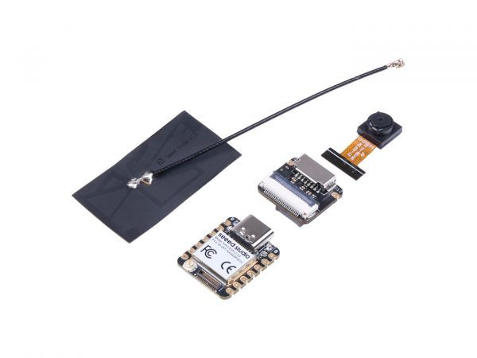
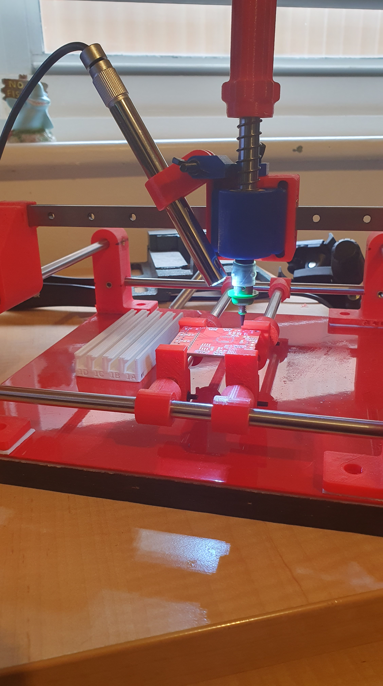
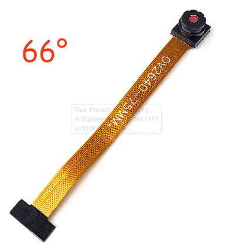
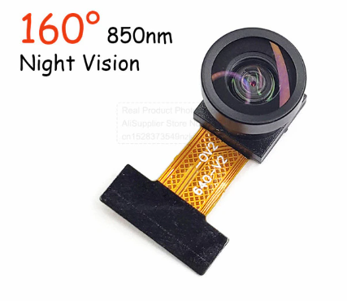

Yeah, so no joy really trying to get a camera server running on the ye olde Acer Aspire ONE, the process has been so [Painful!](https://organicmonkeymotion.wordpress.com/2023/06/04/painfull/)

But!

Then I came across the [Seeed Studio XIAO ESP32S3 Sense](https://core-electronics.com.au/seeed-studio-xiao-esp32s3-sense-24ghz-wi-fi-ble-50-ov2640-camera-sensor-digital-microphone-battery-charge-supported-rich-interface-iot-embedded-ml.html) at [core-electronics](https://core-electronics.com.au/).

So I've ordered me one of those suckers.

You can serve the camera on the XIAO as if an IP camera. So, I should be able to mount that tiny module onto either or both my manual PnP machines. Once mounted, the XIAO will pump the picker viewpoint to the VisualPlace instance running on the Aspire ONE.

Instead of this

Now, ahead of the game, I have ordered a longer OV2640 camera, than the one that comes with the XIAO.

So two of these, one for each manual PnP

So, I also thought a couple of IR cameras would be handy, since I am battling with fruit rats stealing me citrus fruit. So, I want to build a system to chase them away, so need to "see" them at night.

