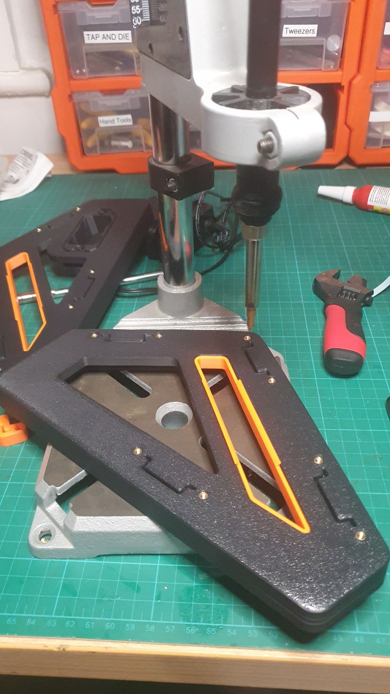
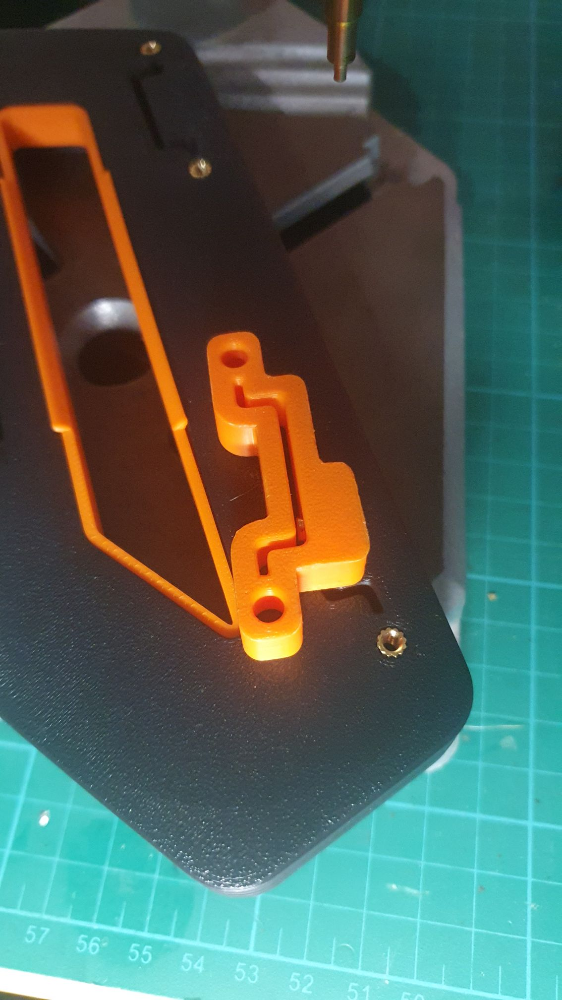
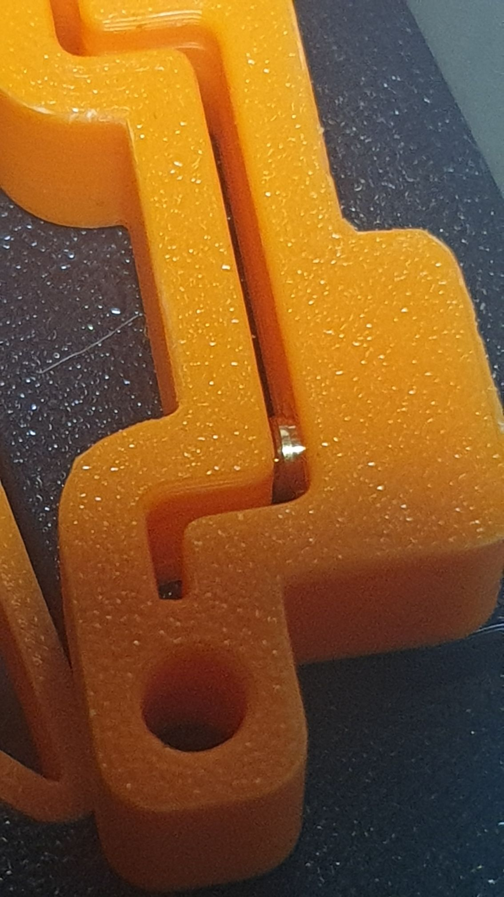
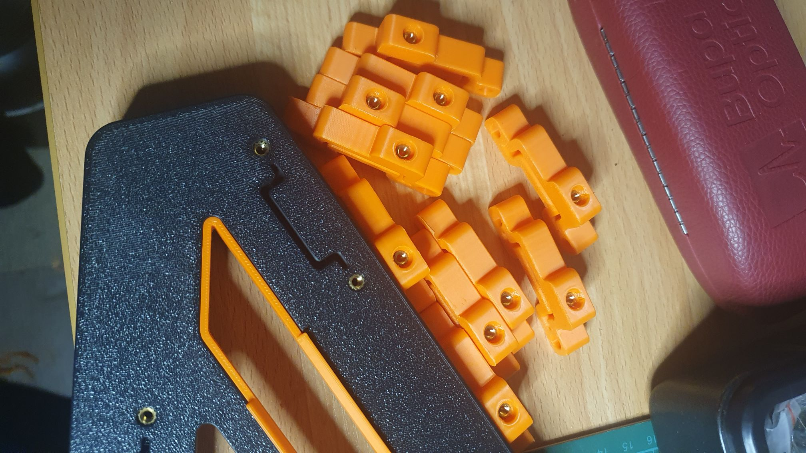

So, I did a print of 55% "triangles", understanding 1) that's dense (snortle there with the double entendre) and 2) suffered a tad with the slightess corner lifting.

I do, however, luv the weight of it! Literally, I feel it wants to be heavy.

So Black and Orange of course.

I LUVvvvvvvv my [adaptor for my drill press for the heat set inserting](https://www.thingiverse.com/thing:6024649)! Once you set the depth you can safely plod through with gusto!

There are a bunch of brackets that have been added in the V2 of this widget that help hold the DIN rail in. There's a heatset in the top for your grub screws. BUT! I didn't set the depth properly, and now think I'll wait on the DIN rail to turn up as it would have made more sense to have the DIN rail stop the insert when setting the depth on the press.

Not worth trying to save as I can print another, but should have throught it through.

DIN rail isn't something I have lying around.

So, I "shimmed" the slot with two spatula and pressed ahead, ...

..., get it ...

... pressed ahead.

You're such a hard audience.
