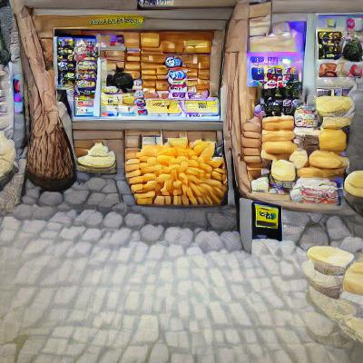
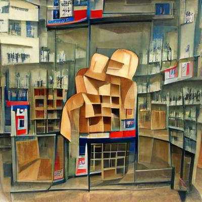

A good old Russian joke (meaning that, old - think Cold War vintage).


```
An old lady goes into a shop.  She looks startled and sees that the shelves are empty, but the shop owner is intently polishing them.
```


```
The old lady asks "I see you have no cheese?"
```


```
The shop owner looks up from his polishing task.  "Why madam, this is not the shop with no cheese.  This is the shop with no meat.  The shop with no cheese is two doors down."

The old lady waves him off and turns and leaves grumbling.

The shop owner sighs, and then goes back to polishing the empty shelves.
```


Nitecafe has, apparently, no sense of humour ...


[](./a2sf1czuthsnv8ofars7-1.jpg)

"Shop with no cheese", fail! No NLP to note the negation


[](./6aqohpi7jqkjx0vnffab.jpg)

Had to go with the literal "Empty Shelves", shame
