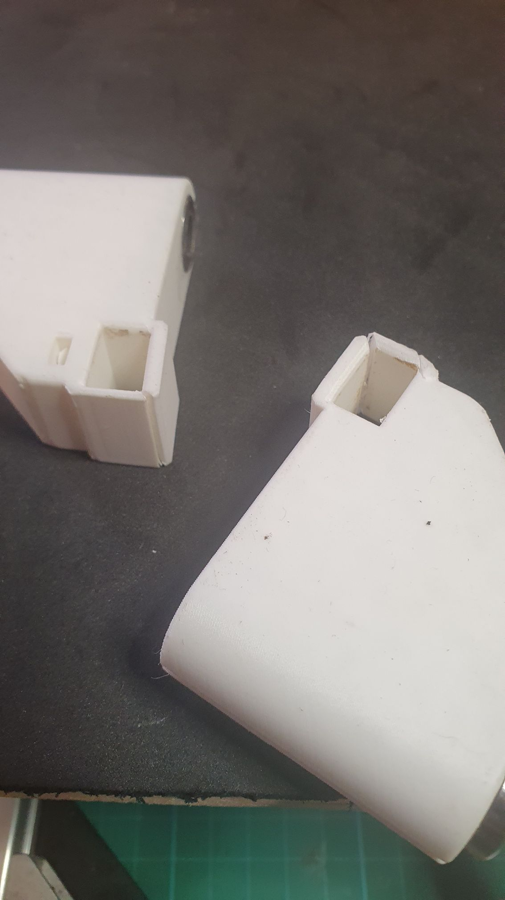
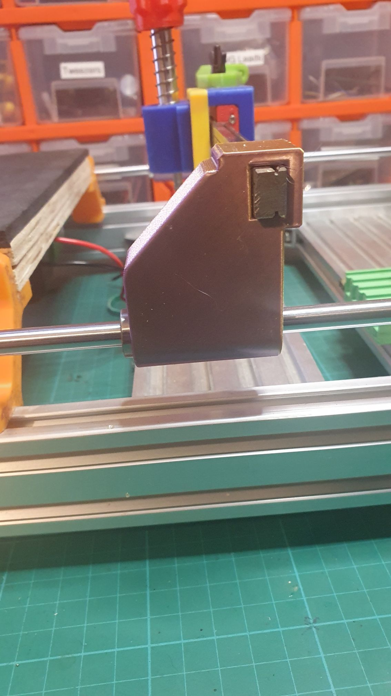
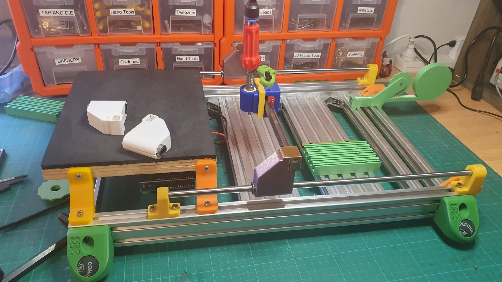
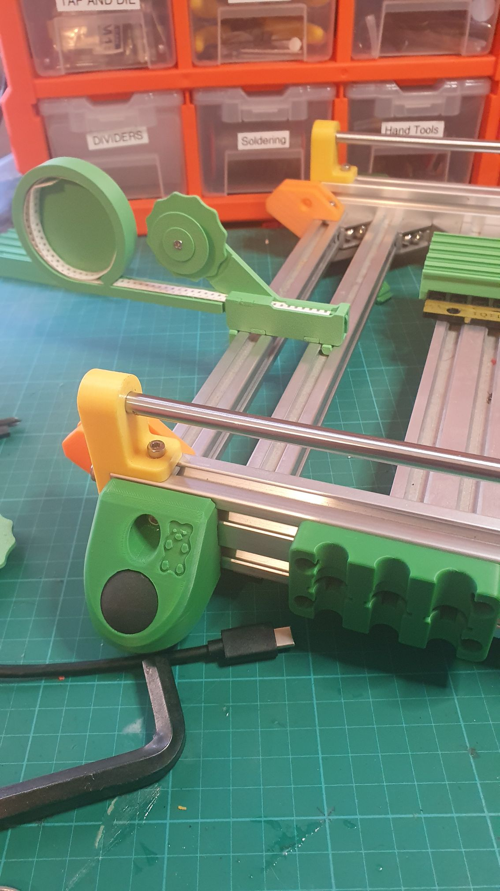

Outside upgrading the larger manul PnP machine, with it's [own vacuum pump setup](https://organicmonkeymotion.wordpress.com/2024/10/19/like-da-a-k-a-doh/), I had an accident moving it to/from the makerspace, and broke the linear rail posts.

Hence I updated it ot make it thicker in and around the linear rail, model updated [here](https://www.thingiverse.com/thing:6011574/files).

So, maybe the idea of just printing whatever colour was on the makerspace printer, as a statement, probably takes away the zing? The yellow armrest holder was a replacement when I dropped the thing and broke that holder. The green for the tape holders will mean 8mm, and I will have different colours for different widths. The strip feeder is a [modified design to allow for screwing down](https://www.thingiverse.com/thing:6734536) into the aluminium extrusion. The other feeder is also a mod to hold [sample tape up to 300 pieces](https://www.thingiverse.com/thing:6733394). I've [another design](https://www.thingiverse.com/thing:6734702) for holding [small spools you make yourself](https://www.thingiverse.com/thing:6721295), but that needs a little tweaking.

Below is a better view of what is going on with the second tape feeder. You can see the sense in using the "sprung" feet? Doesn't damage desktops, and holds still, seeminly more cushioned to boot (though I am sure I am imagining that).

Don't forget, the original manual PnP design is [here](https://www.thingiverse.com/thing:3644398).
