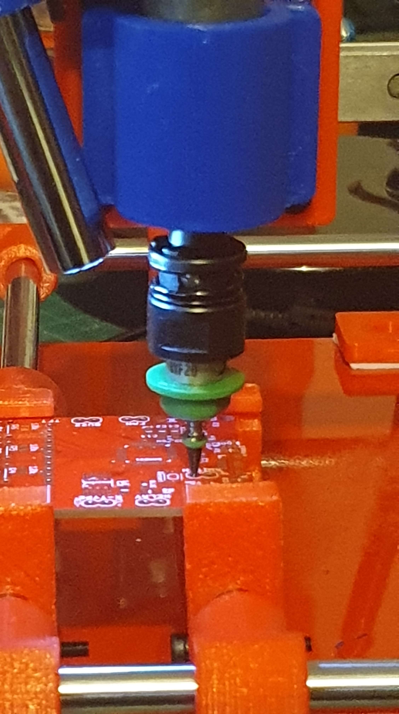
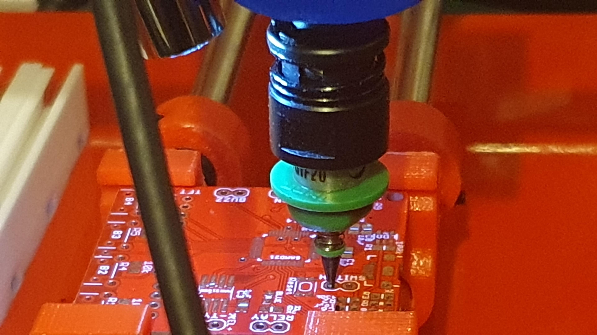
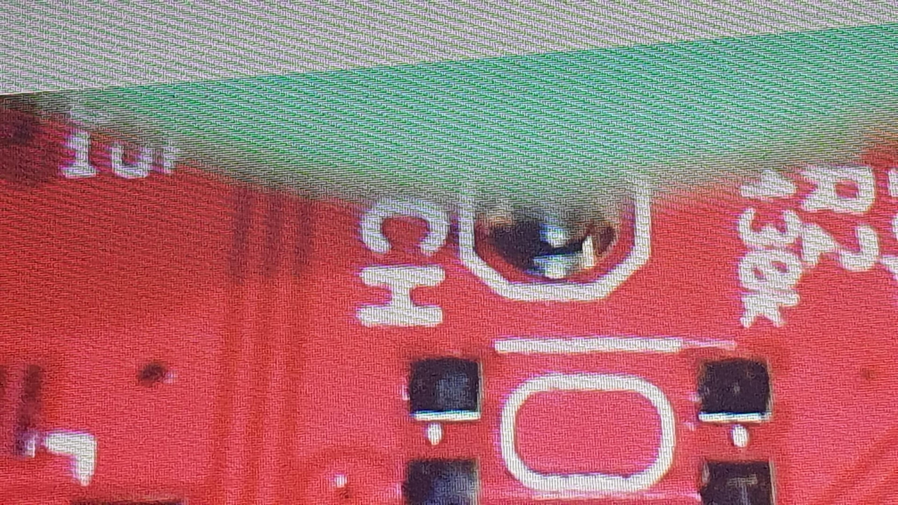
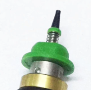
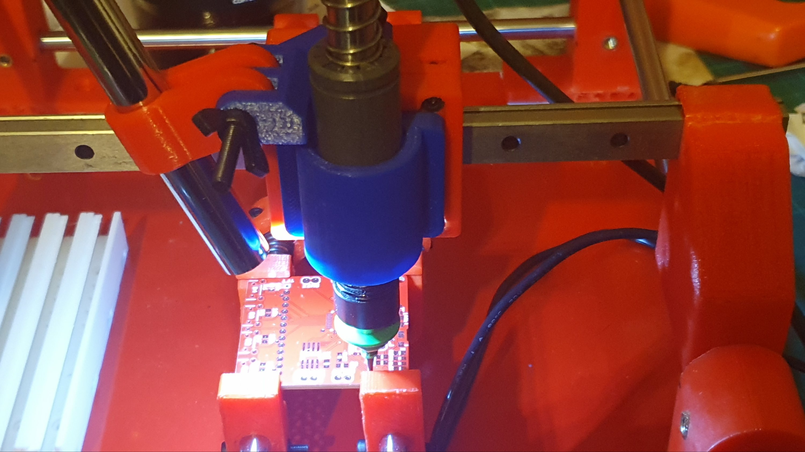
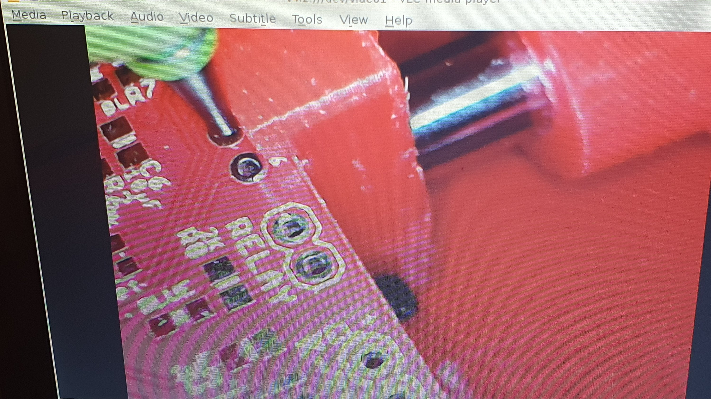
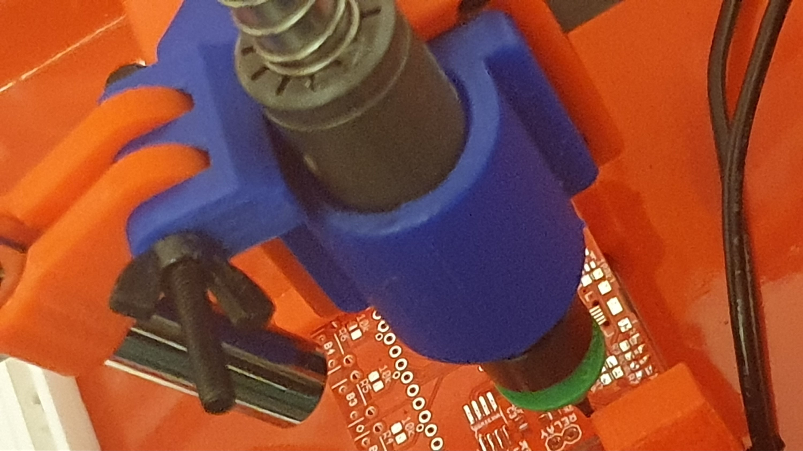

... prototype manual PnP machine.

So, hmmm.

There are two optional jigs to hold the USB camera.

I can see why the original one was dropped, since it went no way to pointing at the tip of the SMD picker - at least when I tried using it.

However, the photos show me trying out the second jig for holding the USB camera.

The jig and/or the camera are striking the picker holder, and so the best pic (so far) on the USB camera is at the bottom.

Same USB camera as recommended in the [original build](https://www.thingiverse.com/thing:3644398).

Now, to be fair, this setup is shorter than the original.

So, I am in a quandary.

I don't really want to rebuild, though I will redesign and put that onto Thingiverse [here](https://www.thingiverse.com/thing:6011574) (eventually).

I had to use superglue in the end, and not to mention the painted mild steel plate, now with double sided tape stuck on, to require rework.

I think this needs a redesign of the jig holding the USB camera, for this prototype arrangement only.

Less pain I think.

But, again, measure twice, 3D print once, ... , oh the pain, the pain.

The real pain was, that with all the man handling of the picker, while fiddling with the blinking USB camera, to try to line it up, I found something out that was very useful. You can flat out lose your spring and your spring clip of your nozzle with ease.

It took me an hour, on me hands and knees, with a pocket torch, and a magnifying glass, to eventually find the spring clip.

I gave up, after another hour, trying to find the spring. I sobbed a little, hopped onto my laptop to attempt to find replacement springs. To then find, of course, you can get springs, and replacement tips, and, ... ,

in the middle of placing an order for new springs, ... ,

the tool picker was sitting on me desk, ... ,

by the BT keyboard I was using, ... ,

I noticed something stuck inside, ... ,

you guessed it, found the spring.

In any event, a packet of 10 springs is on it's way, along with a 505 nozzle, to go with me 503 (now re-sprung), me 504, and me 506. Mind you, the pesky spring caps are stupidly expensive at [AUD$7.20](https://www.aliexpress.com/item/4000087151437.html?spm=a2g0o.detail.1000014.16.31ee7b6fU9ytyy&gps-id=pcDetailBottomMoreOtherSeller&scm=1007.40000.326746.0&scm_id=1007.40000.326746.0&scm-url=1007.40000.326746.0&pvid=7d29b785-8edb-4f3a-b1f9-382460bcdc93&_t=gps-id:pcDetailBottomMoreOtherSeller,scm-url:1007.40000.326746.0,pvid:7d29b785-8edb-4f3a-b1f9-382460bcdc93,tpp_buckets:668%232846%238110%23388&pdp_npi=3%40dis%21AUD%2110.76%217.21%21%21%21%21%21%40210318ef16842365159375157ebda7%2110000000232729391%21rec%21AU%21117209436) or [AUD$2.32](https://www.aliexpress.com/item/32975284491.html?pdp_npi=2%40dis%21AUD%21AU%242.44%21AU%242.32%21%21%21%21%21%40210318ef16842371266241847ebda7%2166726709802%21btf&_t=pvid:7242abf2-cca0-481c-a923-feeaef946ba9&afTraceInfo=32975284491__pc__pcBridgePPC__xxxxxx__1684237126&spm=a2g0o.ppclist.product.mainProduct).

Which reminds me of as story a buddy told me years ago. His father was a millionaire who ran an injection moulding firm. It would cost them a couple of cents to make an article about the size of a beer cooler, then sell the things for tens of dollars.

So how the FRACK is something, that is a couple to 3 mm across AUD$2.32, let alone AUD$7.20?

The spring cap is that tiny green ring, under the tip.

Redesigned jig

Hmm. Probably good'n'nuff?!

The picker is not centred, currently, because (see below) the jury-rigged setup displaces the camera angle, since the picker is too long for this setup. Normally, the 10LUU nylon linear bearing would be flush with its holder. You'll note below, that the camera jig is askew because it is pushed out of position by the 10LUU jutting out of the holder.

Just need to turn down a new placer, with the smaller nozzle holder.
