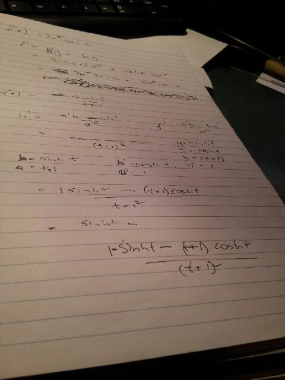

... semester and my Masters has fired up again.

I worked out that I needed to spend this weekend re-learning Calculus (differentiation and integration) before going back to my reliability engineering stats as, go figure, you need your calculus to do the stats.
Very slow on hobby stuff for next 24 weeks (two subjects and exams).
I do get distracted though.
I found [Boa Constructor](http://boa-constructor.sourceforge.net/ "Component Based Application Development") which is a python software tool that resembles Borland Delphi (although it works more like their C++ Builder).
I love the idea as I was a big fan/user of Delphi a while back - but it looks like a dead project, based upon python 2.5 and older versions of wxWindows and wxPython - and especially no useful examples for adding your own components. Pity.
Just looking at Kivy vs Qt.  Kivy seemed great.  Ran on my phone okay but wouldn't run on my desktop - so I may loose interest.  Not going to go through the "newbie" insult if they have software that does not deploy properly as that is a quality issue on them more than on my "competency".
