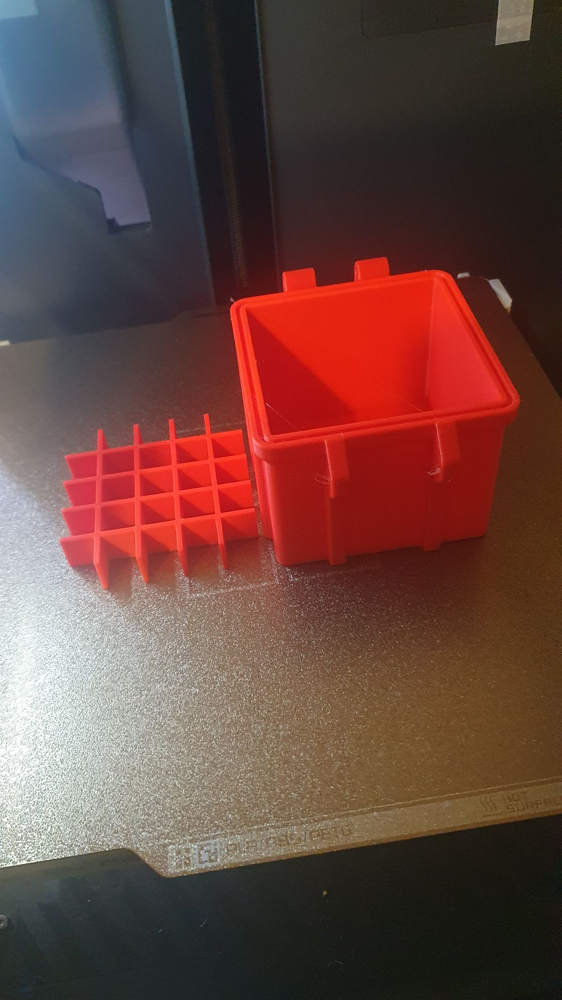
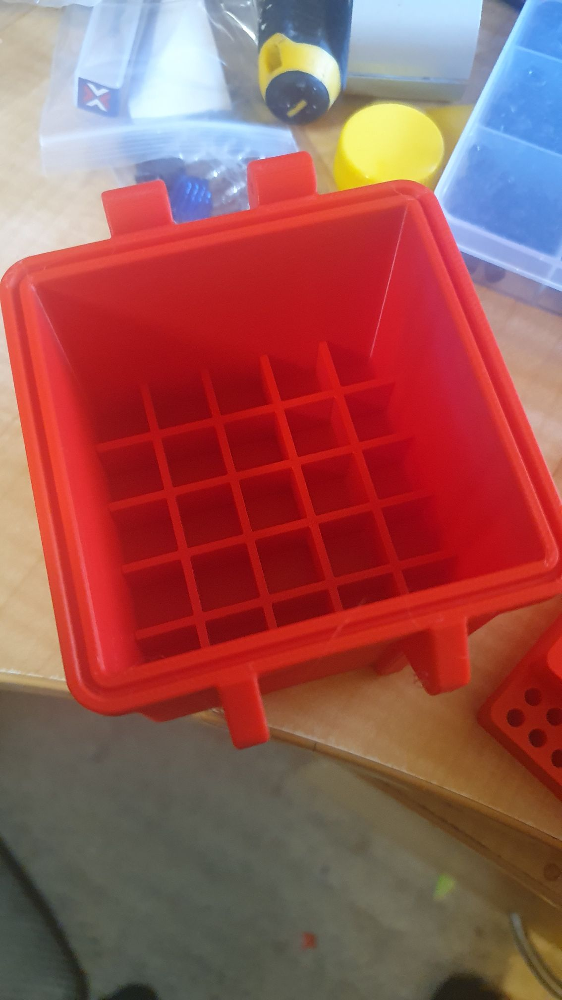
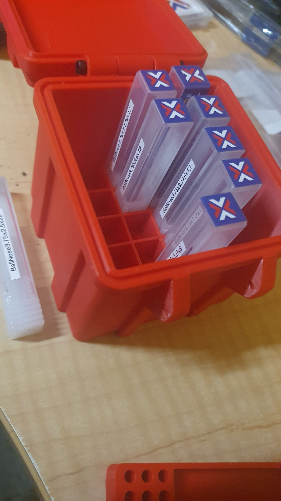

Just grabbed a parametric tough box off printables, fiddled with the parameters.

Now I've a box to keep me 1/8" mill bits tidy. I hacked a grid to drop into the box to organise the bits in their little old boxes.

It'll hold 25.

Just need to fiddle with one for me 1/4" bits.

