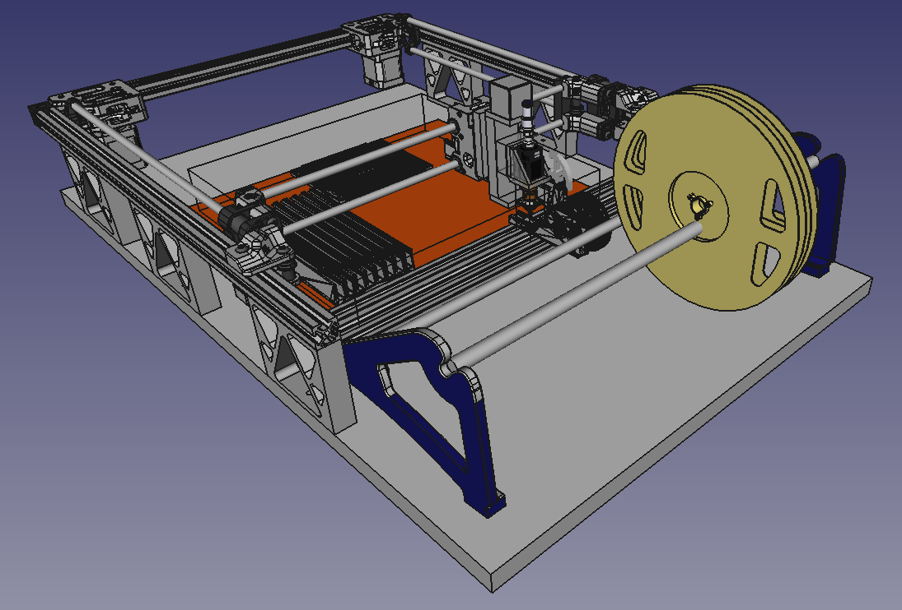
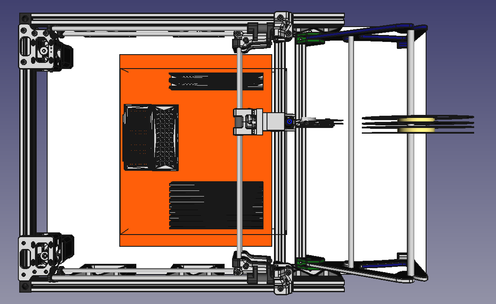
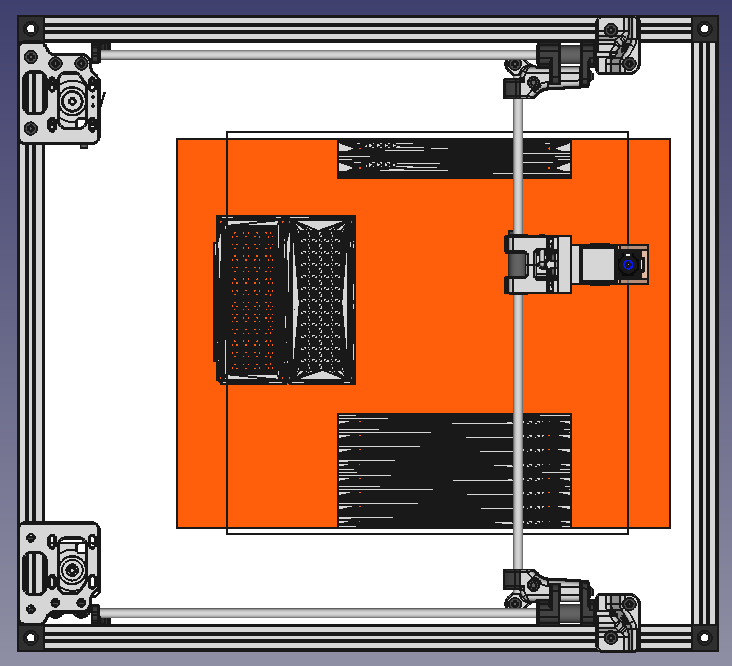
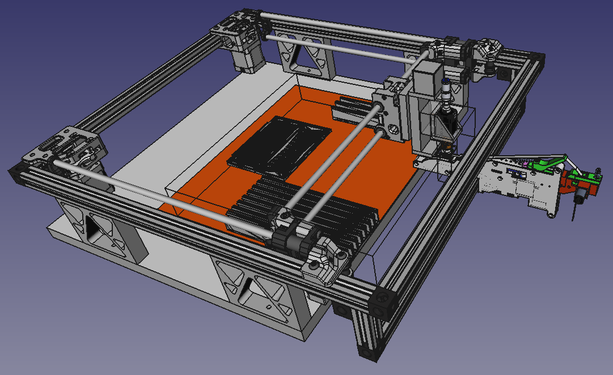

Figure 1

So, I just had a breather and tidied up a few things, see Figure 1.

I have replaced the 60mm stanchions with 81mm stanchions, to lift the 2020 extrusions 80mm above the 1mm steel plate on the base. I have also moved the box for the 310x310x50mm range of motion of the feeder carrier to line up with the furthest reach of the centreline of the feeder nozzle.

From above it (Figure 2) doesn't look economical space wise, but that's because I want to play with a corexy system.

Figure 2

Where all this falls down, at the moment, is exactly where does the spent tape go? Which again begs the question of whether the Y-Axis need be larger. Or drop the spooled feeders. Or use something other than the pushpull feeder.

Flat bed usually will have space under the work area for the tape to disappear into.

Since its for small runs, I might as well drop the pretence and drop the spools and feeders, and just use trays.

So, something closer to Figure 3.

Figure 3

So using the full 310x310x50mm workspace as per Figure 4. I am chasing down a 310x310x1mm sheet of steel as well (red area is currently 300x380x1mm that I found online).

Figure 4

This design does not preclude adding feeders off the right hand side later. They could also optionally be added if and when needed for longer runs. Although, the base board might like to be shorter (figure 5) to allow spent tape to be fed downwards.

Figure 5
