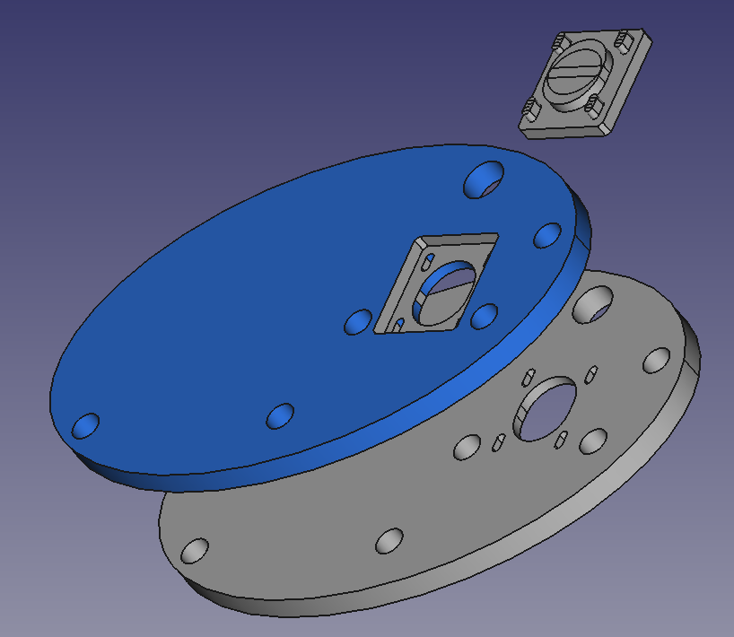
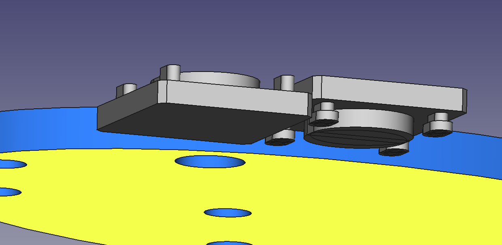
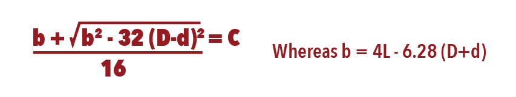

Brilliant, should have thought of this in the first place, but there are [belt length calculators out there](https://www.omnicalculator.com/physics/belt-length). So, I lucked in (I think) to a standard 188mm belt assuming the 70tooth is about 47mm diameter and the 20tooth is around 15mm.

Otherwise, I redid the side panel for the side with the motor. I did a cut-out for the sliding motor and mirrored the piece so you can opt to having motor on the outside on either side as per your preference.

I thought to, if I had to fiddle with the motor slot location, a tool to cut-out the motor from a panel would make sense. So all three elements (two mirrored sides and a motor cut-out) at Figure 1.

Figure 1

Eh? Yes, it makes sense then to have one side and a cutter and one can then have what ever length belt. I added a means to cut-out the sliding motor slot. The final design will have two cutters, one with heads and one without, so one has options. Just import a side and one of the cutters into FreeCAD, use the belt calculator to set the distance between the centre of the 15mm hole (which will take the nylon LM8SUU), and the centre of the oval land in the middle of the cutter.

Figure 2

So, yes. That makes sense. Have found a great video tutorial on datum planes and sketches. I might also redo the cut-outs using those aspects of FreeCAD. Not to mention, placing the cut via calculating the distance between pulleys, given the [length of the belt and the diameters of the two pulleys a la the formula](https://sudenga.com/resources/figuring-belt-lengths-and-distance-between-pulleys/) (Figure 3 from the website):

Figure 3

So, a spreadsheet or a python function.
