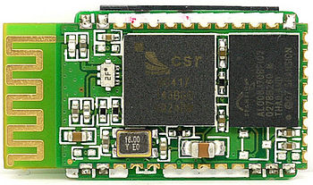

The two bluetooth "frames" turned up for the seeeduino films I have in my inventory.
But before I start playing with them I have to assemble the pesky AVR ISP programmer I bought - dang thing turned out to be a kit so some assembly required \*groan\*.
