So, I have been putting older development boards up on Ebay to clear out some of my drawers of things I don't use no more ... OH I don't ever use no morrrrRRREEEeeee!

To that end, I cleared out a batch of items as lucky dips, notably:

[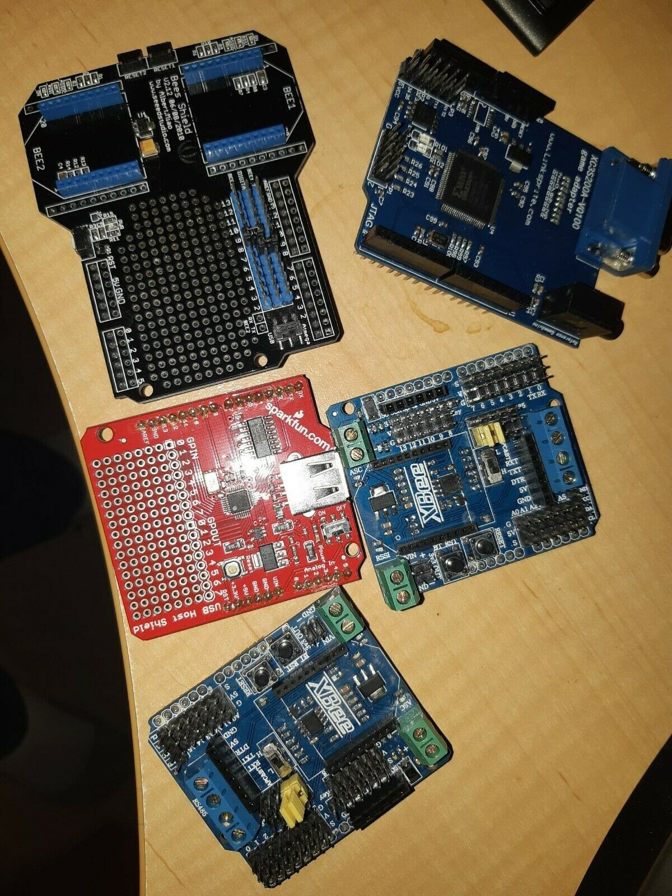](./ld1.jpg)

Lucky Dip #1

[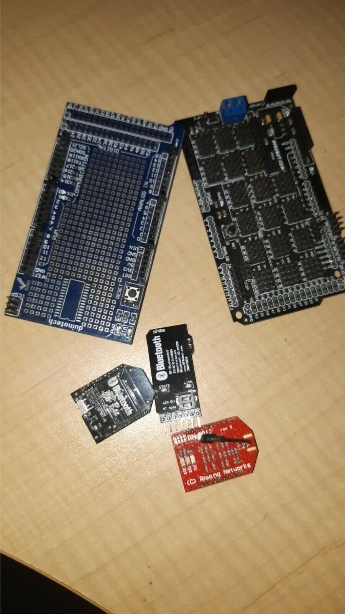](./ld2.jpg)

Lucky Dip #2

Note that pesky XBee form factor popping up?!

When I did also grab my dusty rover hack, I had forgotten I had been running a DFRobot Romeo V1.0 with XBee PRO widget attached.

[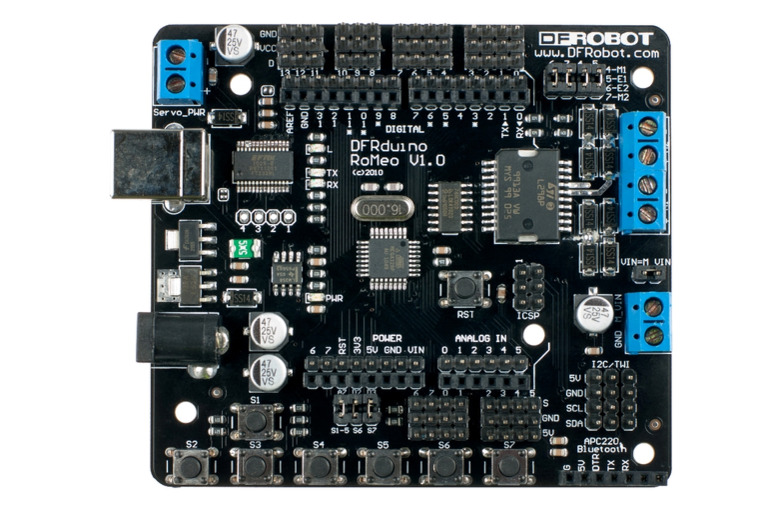](./dfromeov1.0.jpg)

[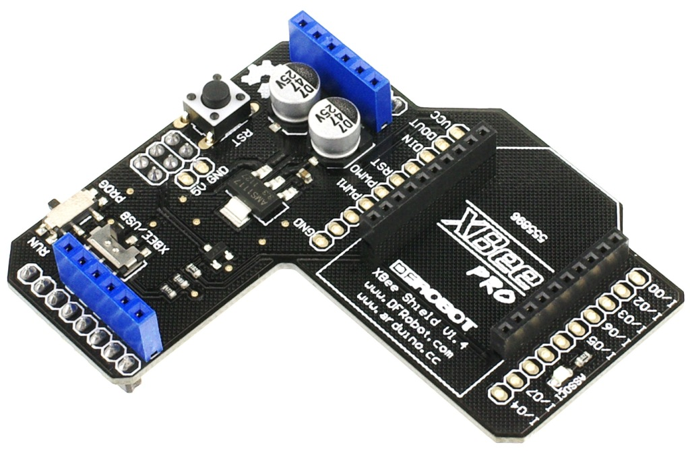](./xbee_shield_v_1_1_dfr0015.jpg)

I was using a Bluetooth XBee, I also noticed "The Beast" were a little dusty.

[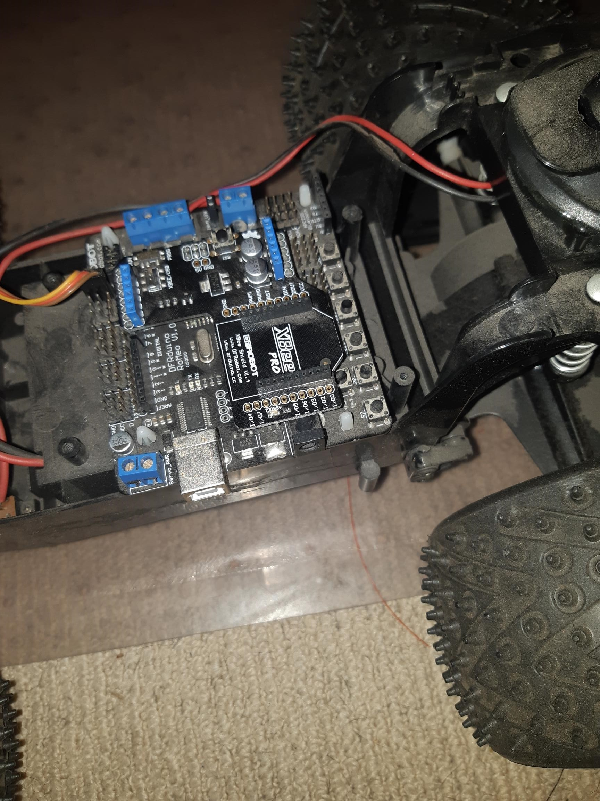](./the-beast.jpg)

Certainly can't bear to get rid of that workhorse.

But if I get rid of the Bluetooth XBee, then what? It occurred that mixing ESP chips, with their WIFI smarts, and AVR together is a great combo for robotics.

I thought someone must have snuck an ESP chip of some sort onto an XBee form factor.

Sure enough someone did. Came up with a four layer board and was charging USD$25 odd for the flaming thing (a crazy AUD$34 so why not buy a RaspingDoodleburry Pi Zilch?).

Opted to borrow the idea and re-do it as a 2 layer board, so voila!

[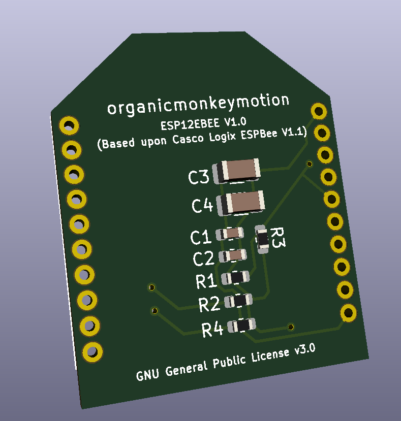](./esp12ebee1.png)

[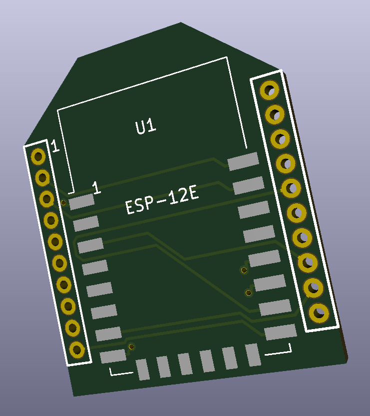](./esp12ebee2.png)

[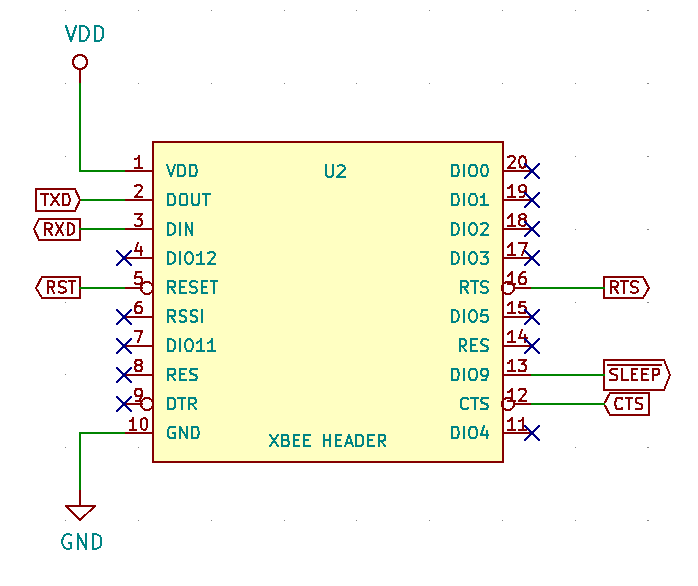](./esp12ebeev2-4.png)

So that's a direct port of the Casco Logix ESPBee V1.1, except neatly 2 layered and thus a cheaper prospect of the bat.

But you have to note that the XBee Pro does also lift additional pins off the XBee form factor out to posts. So I will need make a second version that brings out additional pins.

Go figure, that makes sense, since there is also then a range of baseboards to use:

[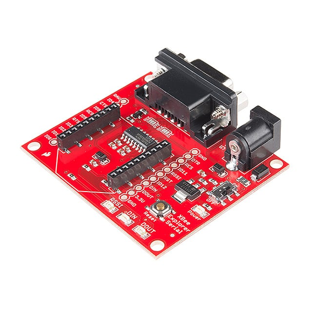](./mfg_wrl-13225.jpg)

[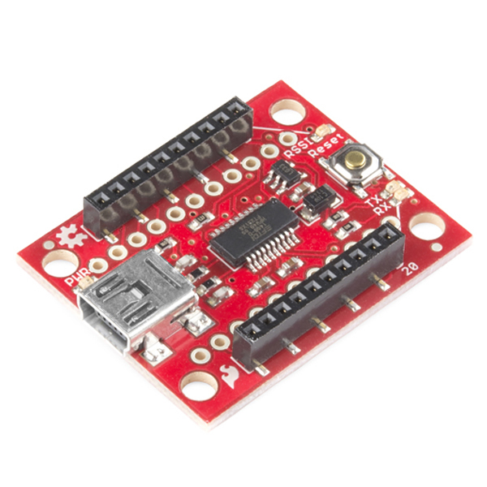](./11812-sparkfun_xbee_explorer_usb-02.jpg)

To name a few. But, there is one that makes very good sense to match to, being:

[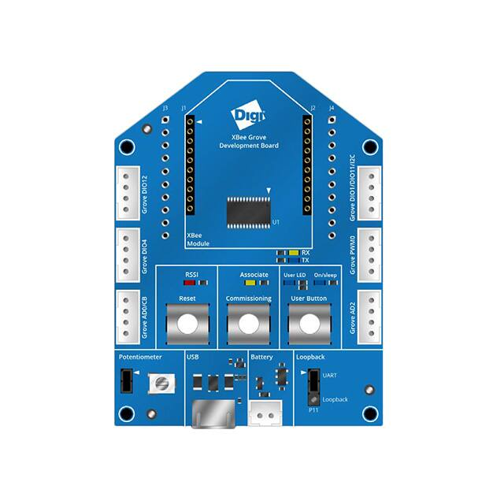](./mfg_76000956.jpg)

So I am also dabbling with an ESP12EBEE V2.0. The ESP12EBEE V1.0 only has the Rx/Tx brought out, while the V2.0 tries to support as many pins as possible. At the moment, I just brought the ADC out to XBee pin 11. I will dabble with a means to try to optionally assign the ADC at least. That will be a little trickier.

[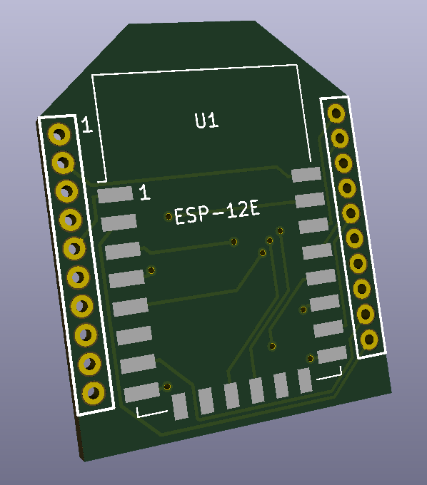](./esp12ebeev2-1.png)

[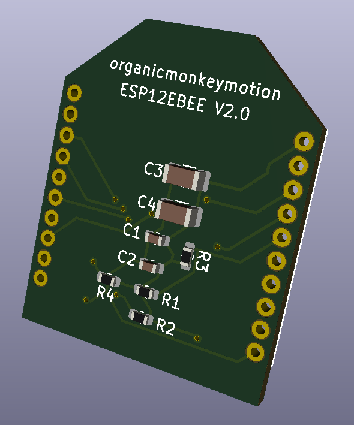](./esp12ebeev2-2.png)

[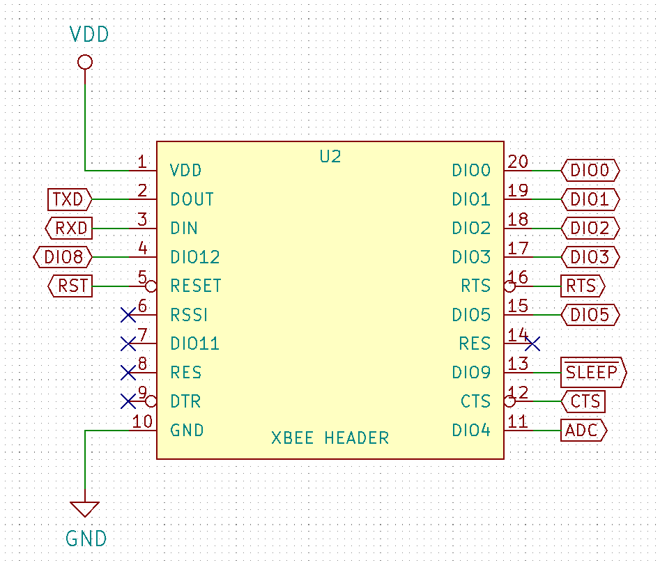](./esp12ebeev2-3.png)

Again, a 2 and not 4 sided board. To keep the unit price down.

Now, whether you use this to drive previously XBee oriented base boards using ESPHome might well and truly be up to you.

One thing I did not do is map this to the XBee Pro shield. That might either result in a V2.1 to tune it to my needs on "The Beast"!

Of course, nothing is easy. These modules need to be programmed, so it makes sense to also build a separate programmer.

Back to KiCAD!

So, a small board to take a few components, two momentary SPST and a few discretes.

The trick is I will use a Sparkfun 3.3VDC FTDI basic breakout, so a 6 post connection is all that is needed.

[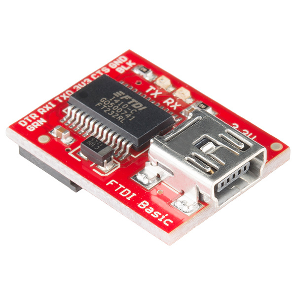](./fun1.jpg)

[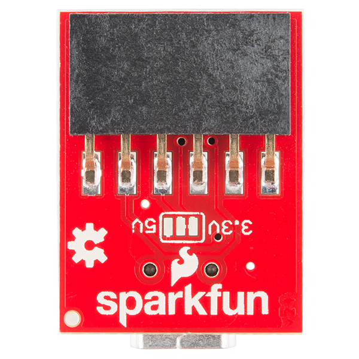](./fun2.jpg)

Although, there are a range of ESP Programmers already out there to consider:

* [ESPF](https://github.com/SuperHouse/ESPF)
* [ESPFLasher](https://www.superhouse.tv/product/espflasher-esp8266-esp32-usb-serial-flasher/)
* [ESPFlash](https://www.superhouse.tv/espflash/)
* [EFlashy32](https://github.com/gcormier/eflashy32)
* [ESP232](https://github.com/jcdennis2000/ESP232)

Most all probably borrowing from [nodemcu devkit](https://github.com/nodemcu/nodemcu-devkit).

Noting the basic problem looks like this:

[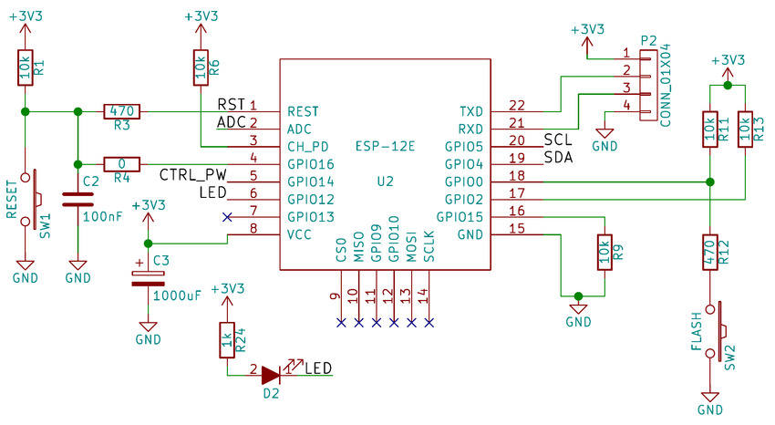](./schematic-corresponding-to-the-elements-of-the-esp-12e-module.jpg)

Where as the original ESPBee schematic is:

[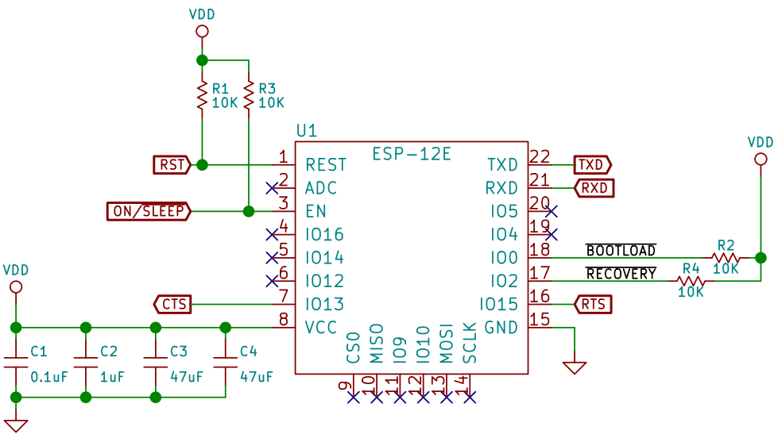](./espbee.png)
