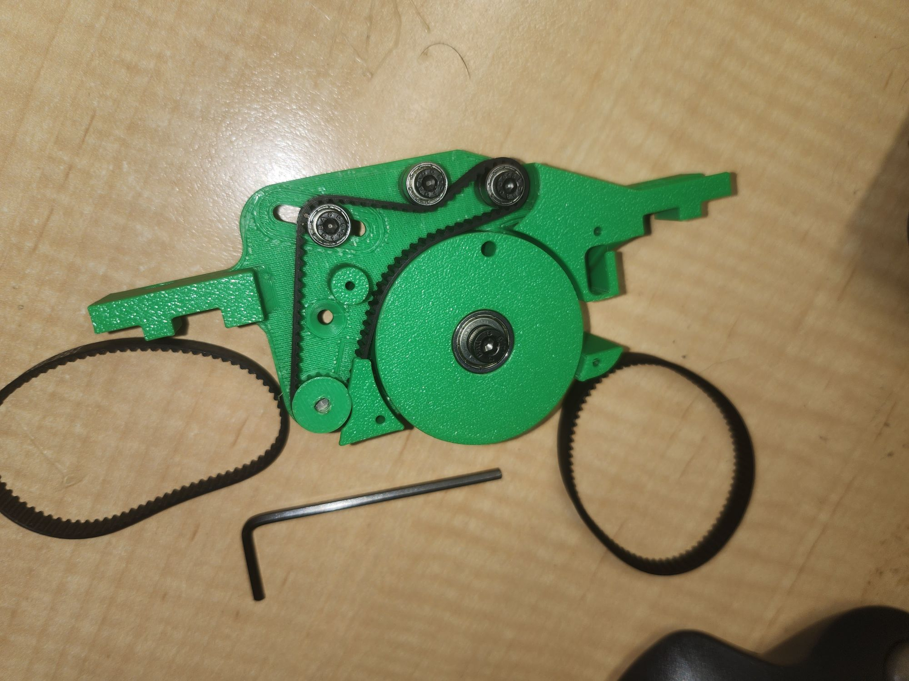

Slowly getting there.

The opto components, needed for the sensing of the holes in the tape, have long not turned up. They had arrived in country late last year so who knows.

It's now about 50/50 gear from Aliexpress doesn't leave China (if the stuff hasn't arrived, but that's rare) and it gets into country (or at least so says the tracking) and it just never arrives. Aliexpress is pretty good as you now get an automatic refund if the order times out and it hasn't arrived.

In the meantime, 3 belts turned up (160, 162 and 164) to allow me to work out which belt "fits" since the 158 belt "fitted" but was hard up one end of the run and "felt" too constricted. Turns out the 160 tooth belt seems the best "fit". So l've now loose 158, 162 and 164 tooth belts to find projects for.

I've ported the STM32 code to ESP32 C3 (supermini) that works with a QEMU setup but I am yet to burn it onto real hardware as I am still waiting on the opto stuff. More on that next post.

