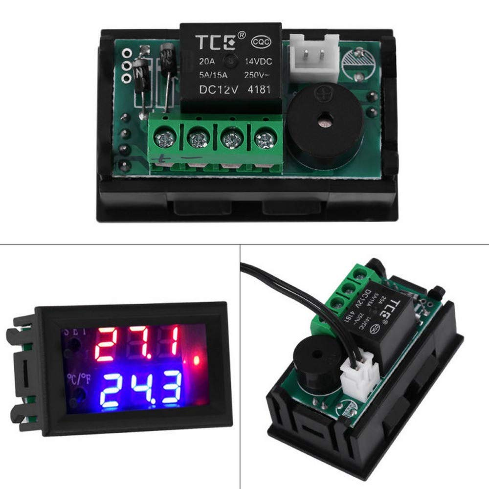
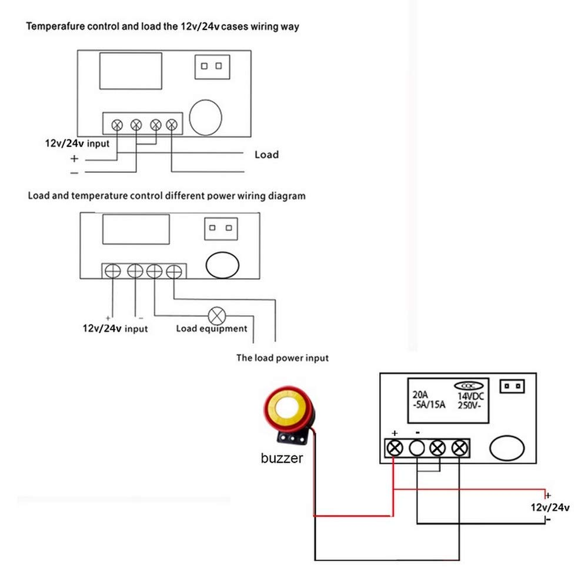

So, I have the incubator ceramic fan heater, or is it a ceramic incubator fan heater? The thermostat turned up. DOH! They didn't send the one I ordered. However, the specs of the one that was sent is fine for the job. Jipped me 10c though.

Fuming!

Not really, it isn't a fuming cupboard mwahahahahaha!

In fact, the unit sent is better, it has the temperature you set the thermostat at and the actual temperature reading provided by the thermistor.

Also wik, no wiring diagram for the item provided.

Depending upon who you believe the part is either YLN0709 or W1209WK.

In any event, here is the associated info you need. The unit I got is a 12VDC model. I got that as the fan heater is also a 12VDC.

I will be using the first wiring example above.

Video instructions and manual on its use by [Buddy Moore on youtube](https://www.youtube.com/watch?v=JaO6rNRf5Sk).
