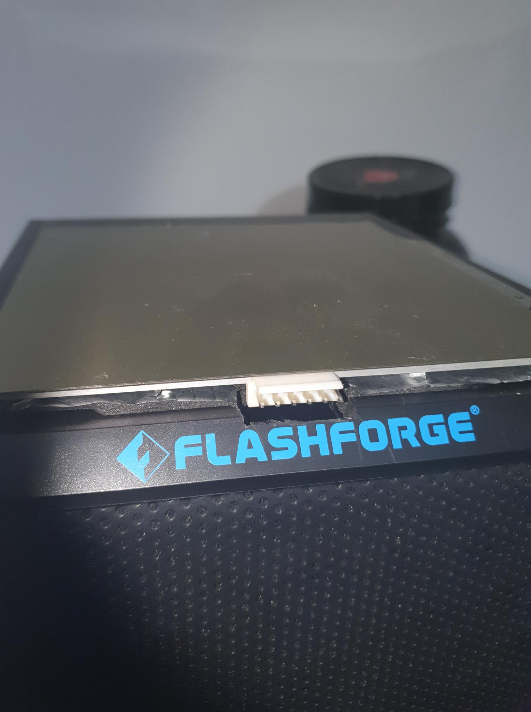

So, the design decision to stand the heated bed about 1cm above the base does not work. This is because the Finder assumes certain dimensions are fixed.

The result is when trying to level the bed, it's forever too high to start with.

I will need look into whether I can:

* Use the configuration tool in the Flashforge slicer to adjust this.
* Ask Flashforge to add an option in the firmware for the printer to adjust bed datum (upwards of 2cm once you add posts, heated bead, magnetic surface, and print surface).
* Try another slicer program.

