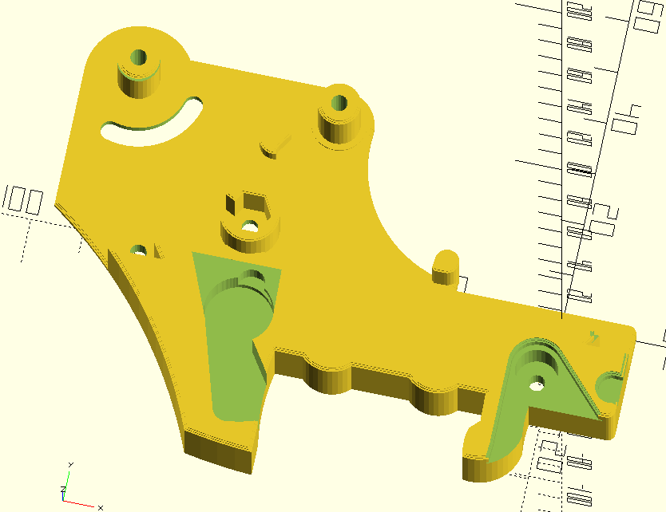
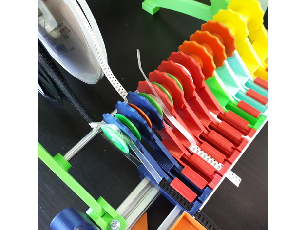

I have printed out a couple of 8mm and a couple of 24mm PnP feeders from the source design.

But I am also printing out few other feeder types to trial them.

Printed out a simple feeder. Seems good enough for those short strips of samples you get from aliexpress. Just need to fiddle with the cover strip. Actually works a treat, so I am looking for software that allows you to design compliant mechanisms. Found one or two packages, so I will dabble.

https://www.youtube.com/watch?v=S1jxeCK4YC0

Printed out a ploopy feeder, to find it's got a roller-blade or something or other bearing. Still trying to find the type, but I'll take a punt from the dimensions etc. Another not bad one for strips, you have to fiddle with the plastic cover etc.

https://www.youtube.com/watch?v=qa37CS5gLkE

Quite interested in the Buddha tape feeder. Tape come up from beneath and between the two drums. So very good for spools and so happily will work with the spool holder on the manual PnP.

https://www.youtube.com/watch?v=DwUKRlJsiOY

So called pushpull feeder (without the spool holder). Is the one I like to replace the supplied feeders, as you can print it without the spool holder - since the OpenSCAD file is heavily parametrized. Including, would you believe, either having a extrusion mount (of any size extrusion) or screw down. Very clever.

https://www.youtube.com/watch?v=cNCjjvCT4Fc

What was not so clever was I went to look at a test fitting this to my PnP. The tuning parameters default to fitting OpenBuild V-Slot. Turns out the 4020 I have is V-Slot and the 2020 I got, from the same vendor, is T-Slot. So a little fiddling with the parameters required to get it to sit properly ... but that extrusion vendor is the gift that never stops giving, right?!

Luckily, part of the cockup from the vendor is, because 4 x 4020 x 300mm were sent, I can swap out the two 2020 (and since it's t- and not v-slot) that are need to mount the incumbent feeders with the 4020 v-slot. The feeder base plate, with 4040 rail hugger and no reel is:

I did have a quick look at adding a t-slot option. But some other time. The OpenSCAD for this is a brilliant example of parameterised code, so have a look - even if you don't want to build this widget.

So try to image the following with the 2 parallel 2020 rails gone and a single 4020 rail, with the thang immediately above attached. Just a tug of a lever and no fiddling with the incumbent feeders. Which require a tug on the tape and a twisting of a knob.

