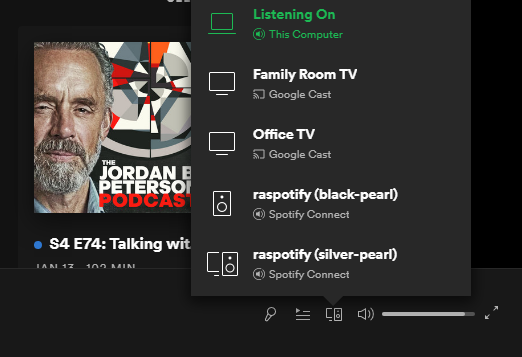

So, I have had this long winded task with the wife. She wanted wifi speakers (really BOSE), so I originally grabbed a couple of bar speakers from Target and installed [shairpoint-sync](https://github.com/mikebrady/shairport-sync) on a couple of [C.H.I.P](https://organicmonkeymotion.wordpress.com/category/c-h-i-p/).


Of course, she was not inclined to use it, and so her Apple ITunes account was not much use.


She then opted into getting a Spotity account, gave me a hook into it so I have my own song library.


I opted into looking into setting up the RPi 3 B+ home server with a spotify client, to play to the speaker that was previously driven by a C.H.I.P.


Found [raspotify](https://github.com/dtcooper/raspotify) which ended up being a bit of a pain to get set up, but that was because, as it usually is, you might fiddle with the nuts'n'bolts of linux based audio once in a blue moon. So, yes, I had forgotten most everything I had worked out when getting the C.H.I.P. going.


The starting position was a hypriot based image on the home server (black-pearl) that had never really been set up for audio.


I had tried to get the audio to default to the headphones using `sudo raspi-config`, but while that made the headphones available, it did not select them for output??!!


It appears you still have to manually set up an alsa config file for the black-pearl thus:


```
#/etc/asound.conf
defaults.ctl.card 1
defaults.pcm.card 1

```


The "1" is because the headphones were setup as the second "card" per:


```
$ sudo aplay -l
**** List of PLAYBACK Hardware Devices ****
card 0: b1 [bcm2835 HDMI 1], device 0: bcm2835 HDMI 1 [bcm2835 HDMI 1]
  Subdevices: 4/4
  Subdevice #0: subdevice #0
  Subdevice #1: subdevice #1
  Subdevice #2: subdevice #2
  Subdevice #3: subdevice #3
card 1: Headphones [bcm2835 Headphones], device 0: bcm2835 Headphones [bcm2835 Headphones]
  Subdevices: 4/4
  Subdevice #0: subdevice #0
  Subdevice #1: subdevice #1
  Subdevice #2: subdevice #2
  Subdevice #3: subdevice #3

```


Adding to the confusion, the "help" at raspotify aimed that solution at a USB speaker, but it turns out the order of "cards" is really about how you setup the system.


As things were coming back to me, and I muddled through the setup to get Spotify going to the black-pearl host. YA FRACKING HOOOO!


I then cracked open a new RPi 3B+ I bought to drive the speaker bar in the main bedroom. Yes a RPi Zero would have done it, and would probably have been a better option, but you try buying one nowadays.


So, remembering I am building on a hypriot distro, I thought this time around I would look at how to setup the audio out of the box.


Recall the audio on the RPi wants desperately to drive up a wire in your HDMI port, and not out the audio jack. In the [flash tool](https://github.com/hypriot/flash) [examples](https://github.com/hypriot/flash/tree/master/sample) there was a file `no-uart-config.txt`. I worked through and ended up with the following which sets up your audio out to CARD 0 and does not include a HDMI card per se.


```
#no-uart-config.txt
hdmi_ignore_edid_audio=1
hdmi_ignore_hotplug=1
enable_uart=0
dtparam=audio=on

```


Works a treat, as evidenced by the following immediately after booting for the first time:


```
$ sudo aplay -l
**** List of PLAYBACK Hardware Devices ****
card 0: Headphones [bcm2835 Headphones], device 0: bcm2835 Headphones [bcm2835 Headphones]
  Subdevices: 7/8
  Subdevice #0: subdevice #0
  Subdevice #1: subdevice #1
  Subdevice #2: subdevice #2
  Subdevice #3: subdevice #3
  Subdevice #4: subdevice #4
  Subdevice #5: subdevice #5
  Subdevice #6: subdevice #6
  Subdevice #7: subdevice #7

```


Turned out then, if you flash a hypriot image with that version of `no-uart-config.txt` above, you have no fluffing around when using raspotify and simply need install it and it finds the audio no problem. As per the destructions at the raspotify site, bump your volume up with alsamixer.


For the record, the flash command was:


```
flash --userdata wifi-user-data.yml --bootconf no-uart-config.txt hypriotos-rpi-v1.12.3.img
```


So, I do also tend to use a static IP address for my hosts since, while it is apparently good practice to use cloud-init to the max, besides Android browsers, there are other apps (including the URL within rotten rhasspy) that don't understand the Avahi provided local hostname resolution using a "`<hostname>.local`". What worked for me then is the following changes to the wifi setup section of `wifi-user-data.yml`:


```
#wifi-user-data.yml
write_files:
  - content: |
      allow-hotplug wlan0
      iface wlan0 inet static
          address 192.168.1.131
          mask 255.255.255.0
          gateway 192.168.1.1
          dns-nameservers 192.168.1.1 8.8.8.8 8.8.4.4

      wpa-conf /etc/wpa_supplicant/wpa_supplicant.conf
      iface default inet dhcp
    path: /etc/network/interfaces.d/wlan0

```


[](./spot-the-spotify.png)

Two raspotify clients!


Blowed if I know why the second raspotify (silver-pearl) has a different icon above? May have to do with it being the one I have a microphone currently attached to? It otherwise seems an amalgam of a speaker and a tv?


Regardless, that's what you have to do to get the raspotify install to work "out of the box" ... ***cringe***.


One error in hindsight for the black-pearl host in the "`asound.conf`" file at the start, note the "`defaults.pcm.card 1`" is the headphones, the "`defaults.ctl.card 1`" will need revisiting, once the mic is added. Bet the "card" for the mic on the black-pearl ends up "2". May need to clean the audio up on the original host, which may be a rip it all off and build it again ... ***groan***.


Now I also have decided to use the two RPi as [rhasspy satellites](https://rhasspy.readthedocs.io/en/latest/), so much pain there I suspect. I am using my old 64bit PC as the main rhasspy host. Very fiddly setting up BUT will be fun.


For the wake word and spoken comments I needed and therefore bought me a pair of omni microphone from OfficeWorks.


[](./usbmic.jpg)


Attached a mic to the silver-pearl host, which found the mic!


```
$ sudo arecord -l
**** List of CAPTURE Hardware Devices ****
card 1: ATR4697USB [ATR4697-USB], device 0: USB Audio [USB Audio]
  Subdevices: 1/1
  Subdevice #0: subdevice #0

```


Then sorted out another file on the silver-pearl, so that the mic and headphones would work a treat. So `asound.conf` needed a little more ***love*** than the example at raspotify, thus voila!:


```
#/etc/asound.conf
pcm.!default {
  type asym
  capture.pcm "mic"
  playback.pcm "speaker"
}

pcm.mic {
  type plug
  slave {
    pcm "hw:1,0"
  }
}

pcm.speaker {
  type plug
  slave {
    pcm "hw:0,0"
  }
}
```


So that's where I'm at, having test recorded and then replayed a wav.


I have just worked out I need go to the porcupine site to download wake word files to then upload to the two RPi satellites. Or at least as I think is the case, since the satellite are responsible for wake word detection.


So much to work out, to then forget again afterwards ... groan.


POST SCRIPT


Wife no longer uses Spotify ... ***groan***. Has opted for streaming radio stations on the internet. Well, not stations, only one station. So, I am now trying to work out how to get a headless streamed internet radio station up. I was headless myself, when she told me ... ***FRACK!***


She'll have to wait until I get the rhasspy stuff up and running. Might take a while ...


https://www.youtube.com/watch?v=bxNEEoS\_Jiw
