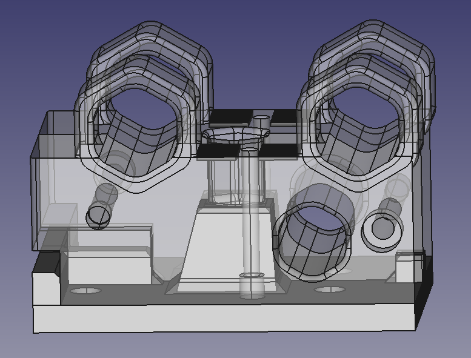
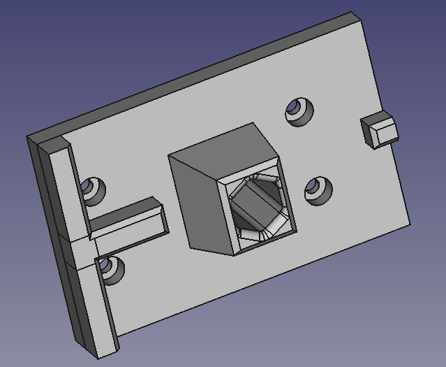
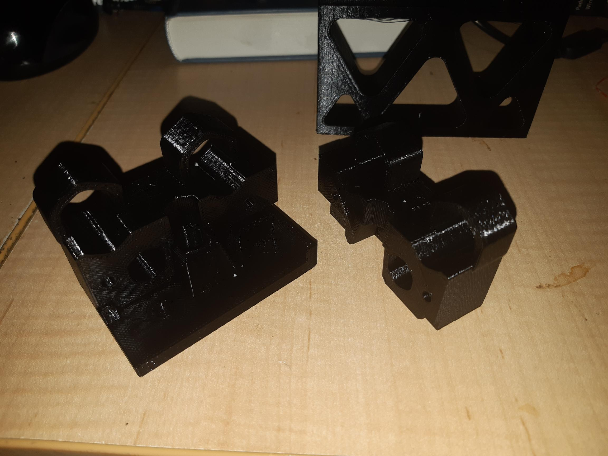

So, since I was using parts to break out key components of the X-Axis, including the "pins", it was too easy to rough draft a Z-Axis foot, to interface the Z-Axis to the X-Axis Carriage, voila! (Figure 1).

Figure 1

Notice the "notch" lower left. This is to insert a screw driver, say, to help "break" the grip of the magnets.

Notice the pin for the foot (Figure 2), with it's own hexagonal hole to take a magnet also. Magnets on order.

Figure 2

So, I did read Hitch Hiker's Guide to the Galaxy, and so, yes, this next photo is a homage to one particular bit of schtick - can you guess which bit of schtick? What you're supposed to see is one X-Axis Carriage half sitting on the keyed Z-Axis foot.

***“It’s the wild colour scheme that freaks me,” said Zaphod whose love affair with this ship had lasted almost three minutes into the flight, “Every time you try to operate on of these weird black controls that are labelled in black on a black background, a little black light lights up black to let you know you’ve done it. What is this? Some kind of galactic hyperhearse?”***
