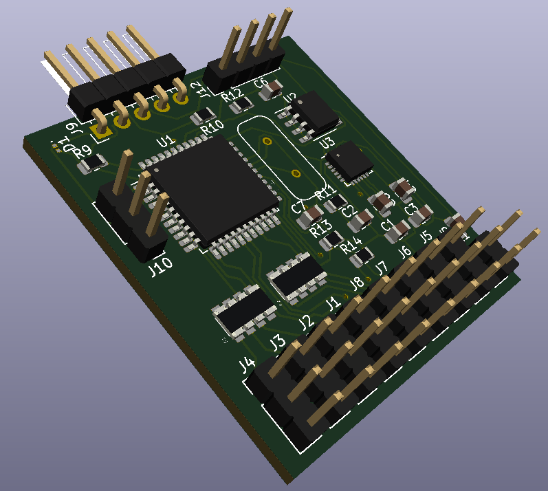

So, a bit of fiddling but I sorted what I had done wrong with the EEPROM. The resistor arrays problem was, because I had went to snapEDA to get symbols for a specific array, but it did not come with a 3D model. It turned out you just use a (so-called) R\_Array\_Convex\_4x1206.

I just now need sort the crystal and the LED and then do a quadruple check of the wiring.
