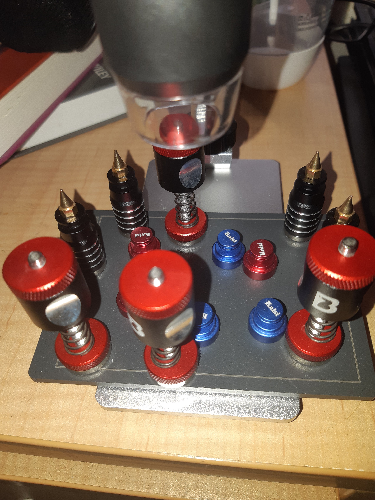

Yeah. The magnetic holders that came with the magnetic plate are good, but not GREAT!

So, a couple of extra purchases, so I have options - depending upon the board. I actually also have an old desk lamp, that I will mod to take the microscope. For when I want a bigger range of motion over larger articles.
