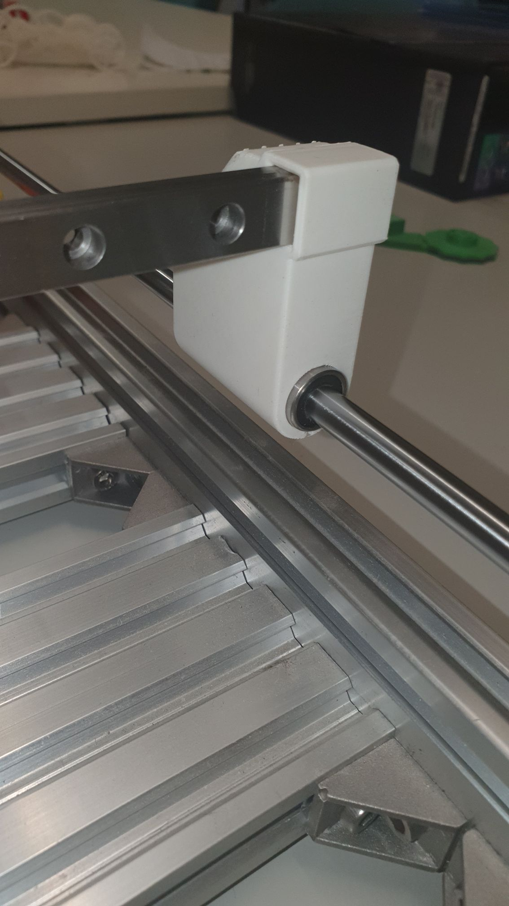
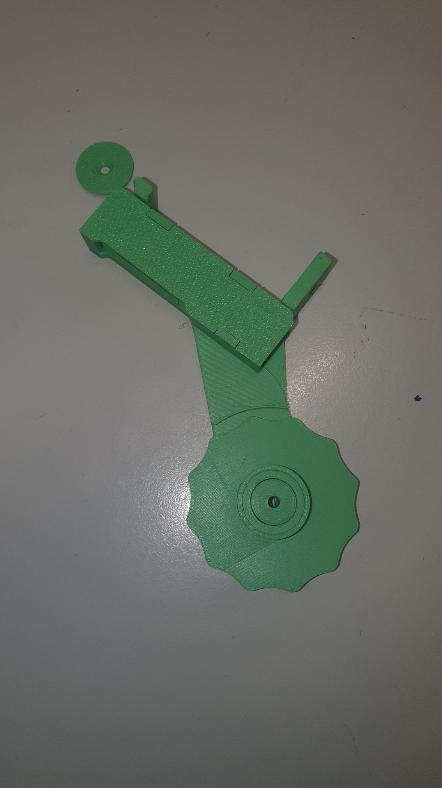
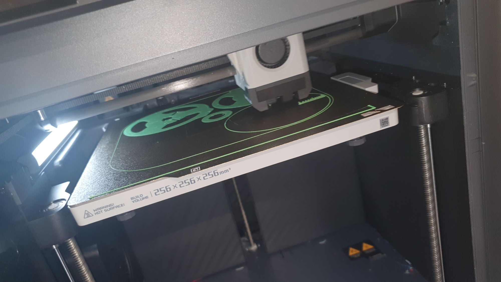
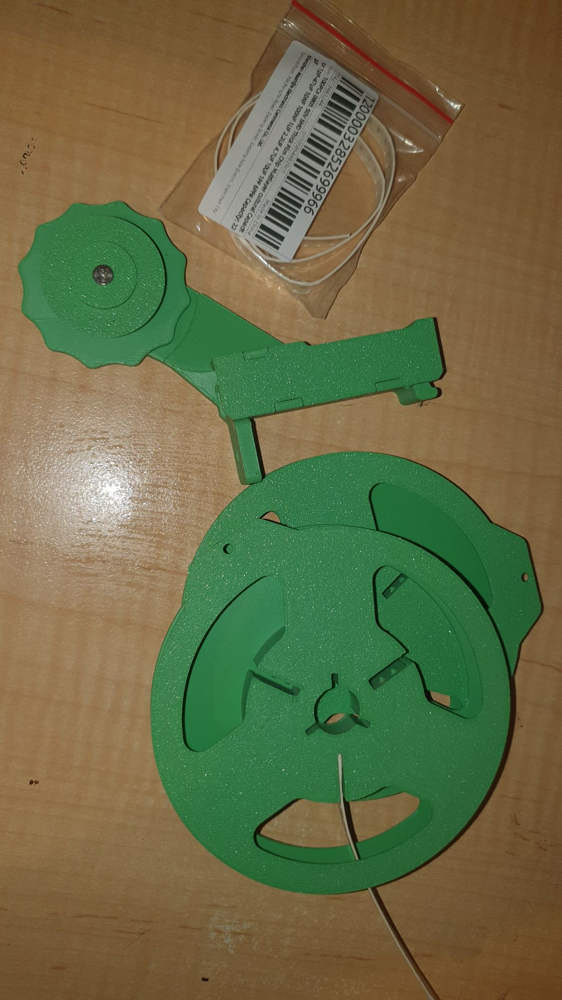
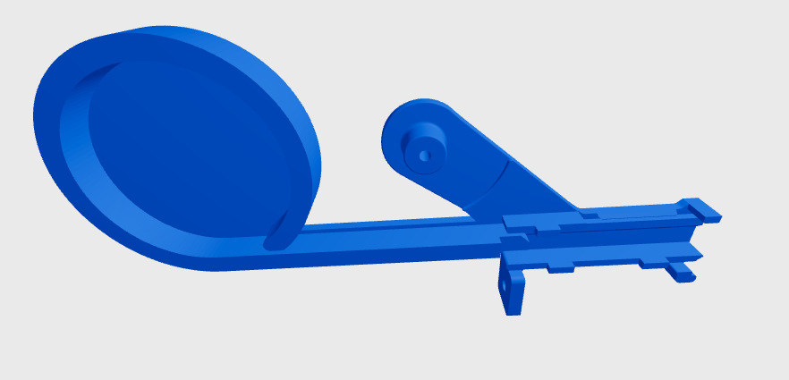
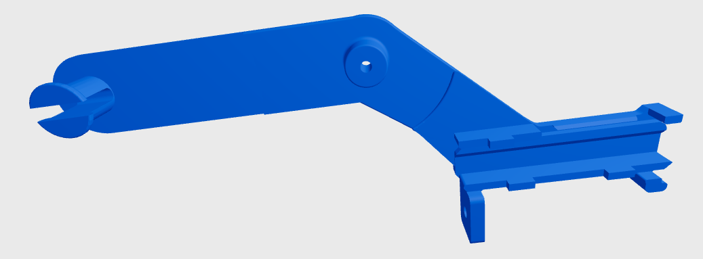

So I updated me larger manual PnP machine with the [slide end mods I did for the mini version](https://www.thingiverse.com/thing:6011574).

And I am printing a new clean batch of feeders.

8mm will all be green

And printing [100mm and eventually 170mm smt reels](https://www.thingiverse.com/thing:6721295).

All on the bambu at the maker space.

Just like a bought one

I also thought a [60mm diameter "magazine" for 8mm tapes especially](https://www.thingiverse.com/thing:6733394), integrated with the feeder, might make sense for those times you're using ends of tapes, sample tapes or you're cheap and only bought 300pcs.

Coming soon'll be a hack of this that holds a 100mm reel, since the reel holder that comes with the manual PnP design is for 170mm reels. Nice to have options right?!

Oh wait! [Here it is](https://www.thingiverse.com/thing:6734702)!

