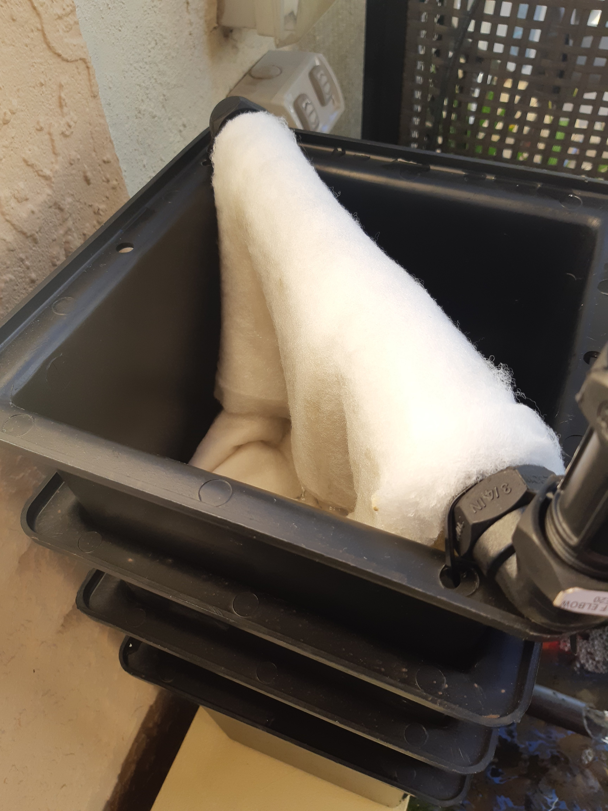

Had to drape wool over the sprayer. Too much spray noise.

Pump definitely too big. I will downsize.

You might notice the cable ties holding the sprayer to the top rainwater pit? Notice also the holes drilled in the lip for the cable ties.

Another mod will be to drill a row of holes in the front lip of the bottom pit. Why? I ran up the system to check for leaks. Bad form, I had not put thread tape in any joint. The return pipe was leaking, so I undid it and added thread tape. Stopped the leak but I had upset the large stones in the bottom. So, the hole ended up blocked. When I turned it on, up the water rose over the lip! A quick jab with a chop stick opened the pourer. But, lesson learned.

Holes in the front lip will allow accidental overflow to run dfown the front and back into the pond.
