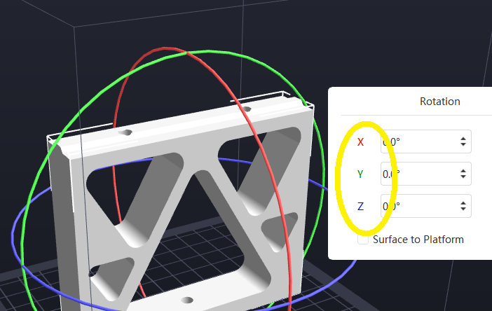

Just starting to use the new V5 of FlashPrint from FlashForge.

I noticed something sweet. I had put a suggestion in about colourising the axis annotations in the rotation wizard, to help mapping the wizard entries to the rotational axis in the graphical display. It looks like that idea was incorporated. Not earth shattering BUT it makes for a easier time relating the wizard entries to the graphical represntation.

Simple human factors improvement

I am fiddling with some of the other features, though mostly driven by a pesky problem. I had decided I would print the PnP parts in blue. Black and blue then the colour scheme. The T-Slot 2020 are in black.

The problem is I am having all sorts of problems getting the print to stick to the plate. So, I have tried out the trick to use different temps at different layers, slowed the initial layers down, heated them up (first 4 at 225oC), put pauses in to let the bottoms layers cool a tad, to then do layers 20 upwards at around 210oC.

Fingers crossed, I am up to forth attempt. I also added a wall, which I did not appear to need for the black draft prints. I am also printing fine and not standard. So whether I need the smooth look may be a question. It may be fine using a standard setting. I was just wanting a little more polish in the finish.

I also noticed that the 19mm thick base idea was a mere 1mm off as the MDF I will likely use is actually 18mm. So, some minor changes and now we've the four stanchions printed.
