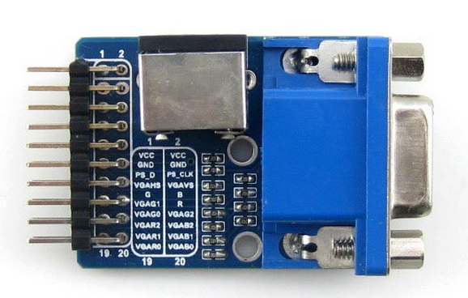

Actually, turns out it is easy to drive a [VGA output with an FPGA](http://www.fpga4fun.com/PongGame.html "Easy as ...").
Rather than fiddling with soldering, or buying a bigger board if you don't want to, you can still probably do simple VGA work with a VGA breakout and your CPLD/FPGA.
[caption id="attachment\_1220" align="aligncenter" width="300"] A couple of dollars saves hours of fiddling.[/caption]
You can also do [HDMI](http://www.fpga4fun.com/HDMI.html "Hmmmm ... nah"), but that might be a little more fiddly.
So, we can do some VGA work with either the CPLD or smaller FPGA boards so stay tuned.  This [VGA breakout](http://www.aliexpress.com/item/VGA-PS2-Board-Accessory-Test-Module-for-VGA-PS2-Control-Connector-Interfaces/1763121187.html "Save time and mess ...-") is for another series of boards but we can use wirewrapper or other trick to sort that out.
Now, the Pong Game example requires a PS/2 mouse as input - who has one of those anymore??
If you can't get hold of a PS/2 mouse there are [USB to PS/2 adapters](http://www.aliexpress.com/item/Holiday-Sale-Keyboard-Mouse-PS2-PS-2-to-USB-Adapter-Converter-1174/655299528.html "USB to PS/2") you can get.  Of course, who has a USB mouse anymore these days lol
Still, the adapter should help if using the code verbatim.  Otherwise, the code might change a little if we need to use two buttons to move paddle left and right.  We'll see.
I'll sort this out on our [FPGA board](http://www.aliexpress.com/item/Free-shipping-ALTERA-FPGA-EP2C5T144C8N-fpga-board-fpga-development-board-fpga-altera-board/1758618627.html "Our working horse") and pump the code into github once it's done - along with a PDF write up of the experiment - just let me get through this last Masters exam this coming Wednesday.
