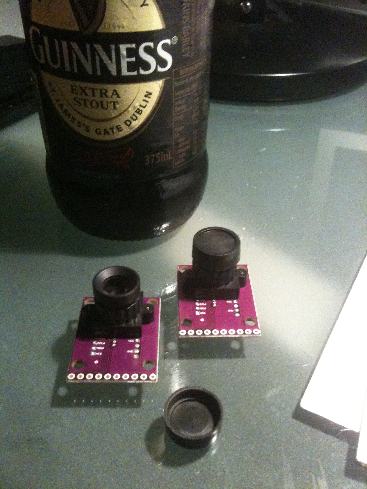

Well.  I lost heart after buying a couple of mouse sensors to find that buying a separate lens was possible from china ... but then diydrone/3drobots helped out by putting a [mouse sensor and a lens together](https://store.diydrones.com/Optical_Flow_Sensor_p/br-0016-01.htm "Hurry while they last").  In fact, they matched the lens and mounted them so was cheaper all up to bin the raw mouse sensor and buy the unit (or two of them in fact - very popular).
Along with an SPI interface I can now add optical flow/visual odometry input to my IMU/AHRS for the rock crawler.   I opted for that, initially, since it will likely be prone to wheels spinning etc so encoders on the wheels would not help as they would generate errors where the wheels turned but the chassis stayed put.
Mind you, an encoder on each wheel, and one on each drive shaft (to detect wheel spin etc) might be an interesting project but alas no open source code base for it ;)
Plenty of code comes with the kit from diydrones.  The thing is working the sensor into the IMU code - just another sensor to fuse.

Yes, that is my medicine in the background - no really, I was laid up after major abdominal surgery and they prescribed Stout.
