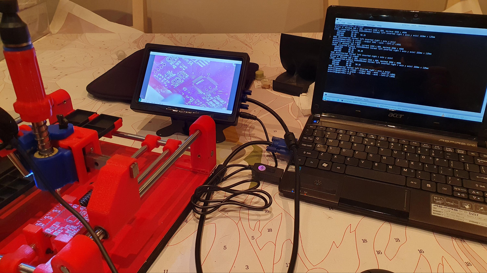
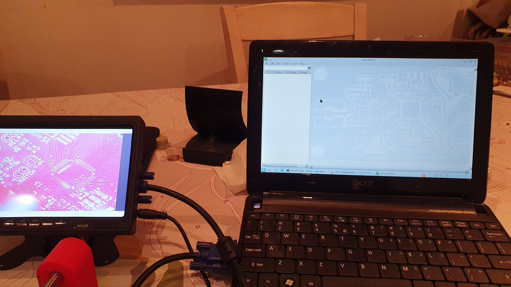
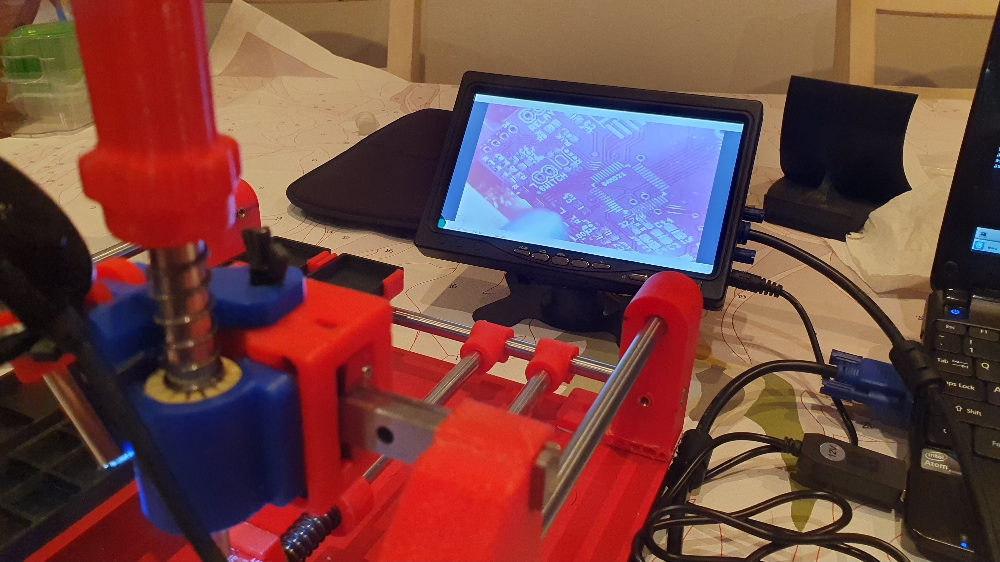
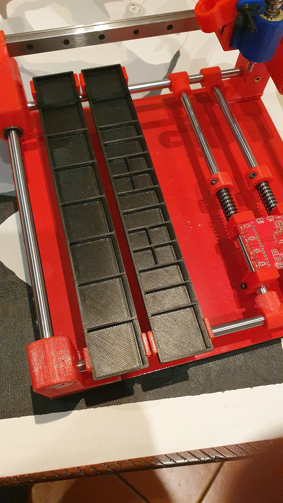
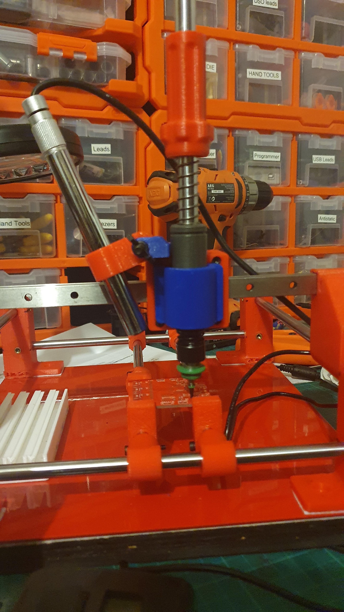

So, above is the voila! moment. I tried setting up with and old portable DVD player, which as RCA inputs. Driven, I thought, from the VGA output on the side of the Acer Aspire ONE, via an RCA/VGA cable.


Didn't seem to be getting a signal out.


I thought I would then splurge on a cheap 7" OLED display, with both VGA and HDMI inputs - I will be using the VGA.


So, the display turns up with a USB cable but needs 12volts! So, don't you know, you can get USB 5Volt to 12Volt converter cables?! One comes with the monitor. Phew!


Yes, you can ask [ChapGPT to explain how to pump video out to your VGA port](https://chat.openai.com/share/b82d9571-538c-4abe-be29-35bd6ee34843). Although, I went with:


```
xrandr --output VGA-1 --auto --left-of LVDS1
```





Obviously, VisualPlace still has a place on the laptop screen. The fun problem being with the left USB port powering the side screen, the mouse and the USB microsope burn the other two USB ports on the right. So, no board up in VisualPlace as that's on a USB drive. So, I guess I need add a USB hub'll fix that.





I am thinking I'll put the display on an arm and make an adaptor to fit both of my manual PnP machines. My poor old eyes will need the thing up close.


Oh! Oh! Fun fact. Groaned a little. When I connected the VGA up, I got a start, since the video was flipped horizontally. The first though that went through me mind was, oh well. No biggy, as I am just using it as a targeting cam for the pick'n'place head. But a little poking around AND, of course, there is a menu item for rotating the screen.


A shout out to [MakerSpace Adelaide](https://makerspaceadelaide.org/) for use of their larger format 3D printers, or I would not have those pesky longer black trays.





Now really, if you think about it, I did not need to use the 1.6mm plate steel. That was to allow for magnetic trays. But, the paramatised SMT tray system I found, writen in OpenSCAD, can adjust all parameters. So, making "tall" SMT trays is in work - that can reach the PnP head. That'll give multiple options for setting up. Remember the SMT trays? The white thangs bottom left below?


[](./wp-16842431591124892342326585092985.jpg)
