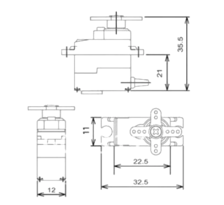

So, the ubiquitous MG90S servo.

For your reference:

Dimensions on one Aliexpress store 23 x 12.2 x 29mm with the caveat "Please allow 0-3cm difference due to manual measurement"!

So, somewhere between -7 or 53 x -17.8 or 42.2 x -1 or 59mm?

Ali the Crapper Award

Did we get this mixed up with the quantum states of electrons?

If it helps, 3cm is a poofteenth longer than an inch. Although admittedly the conversion factor is more straight forward if you use 3cm, since the radius of an atom is roughly between 0.3 and 3 ångströms.

So, how many atom radii in 0-3cm?
