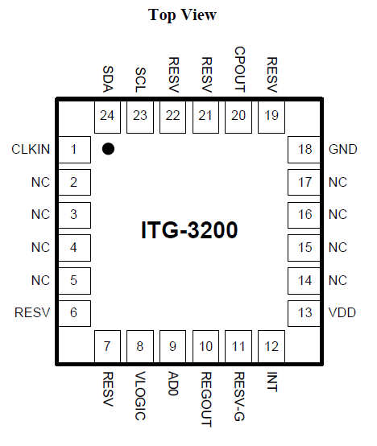
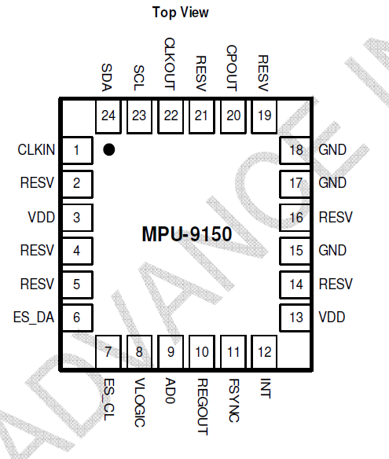
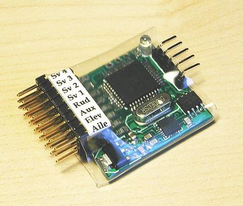
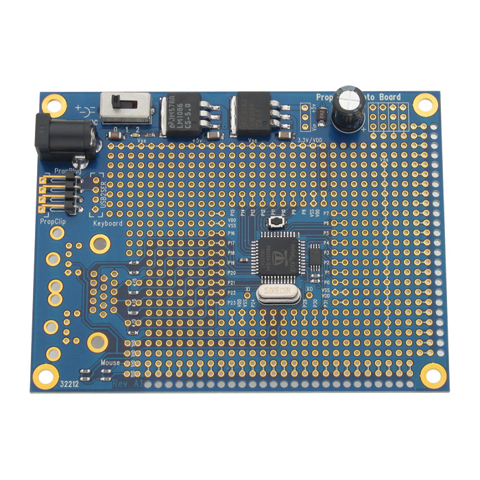

So, a while back I ordered 10 [PhuBar3](https://code.google.com/p/phubar/ "heli stabilizer") boards because I had a suspicion.
At the time the InvenSense [3 axis chip](https://www.sparkfun.com/datasheets/Sensors/Gyro/PS-ITG-3200-00-01.4.pdf "3 of 6 of 9") used in the design was looking to be pin compatible (more or less) with the 6 axis chip coming up.
Turns out, the 9 axis chip also seems to have (more or less) the same pin-out.

Now along with the new [Propeller C](http://learn.parallax.com/propellerc "More room for sophistication"), it seems like time to put a few things together to see if something a little more sophisticated can be stuffed into the small form factor.

# Stage 1

Set up a Propeller prototype of the PhuBar on the one of the prototype boards I have in the toolbox.

Realistically, the initial work should use the ITG-3200 to buzz out the prototyping configuration B4 changing to the MPU-9150.

# Stage 2

This will include getting a MPU 9150 breakout and getting the 3 axis based code running with the new chip.

# Stage 3

Take some of the example DCM code around (for Propeller and for Arduino) and get an IMU running.

# Stage n

Et cetera
