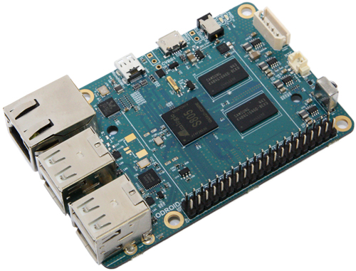

[caption id="attachment\_1702" align="aligncenter" width="500"] ODROID-C1[/caption]
All that carry on by Raspbogons about ODROID-W being a copy of the Raspberry Pi, Broadcom mysteriously canning supply of their chips to Hardkernel.  Sort of expected Hardkernel to roll over and die right.
Meet what is touted as a Raspberry Pi Killer.
Four cores, 1.5GHz, 1Mb RAM etc.
Makes it sort of a Beaglebone Black killer as well.
Why? $35.
Now if they can squeeze that chip onto the ODROID-W formfactor Hardkernel take the market.
