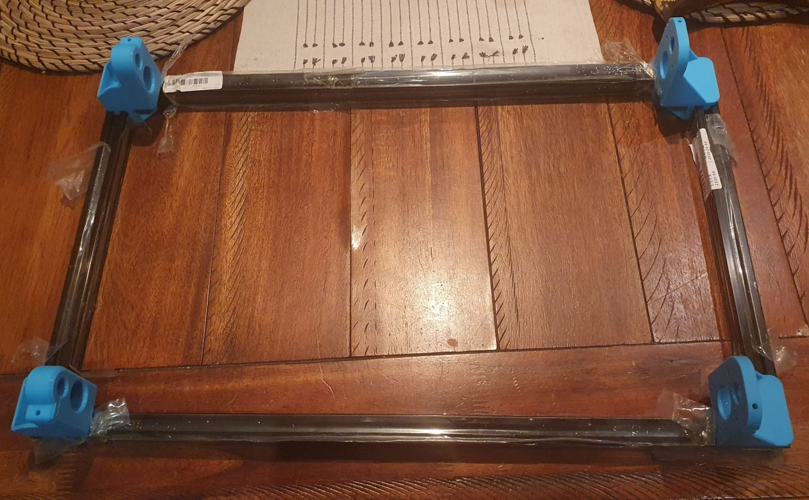
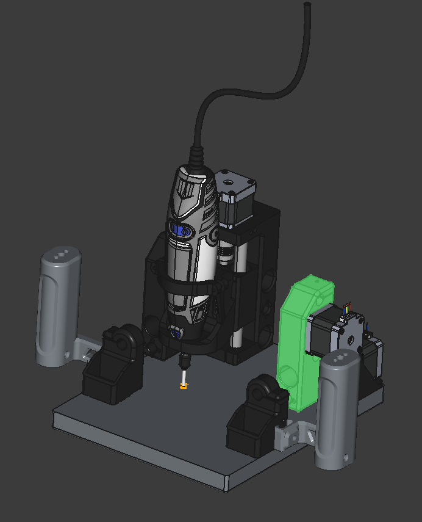

https://www.youtube.com/watch?v=I7woln6urVY&t=204s

I had originally tried printing this design, ages ago, on me trusy olde Flashforge Finder but quality outcomes of these parts was beyond the older 3D printer design. Then came me Bambu Labs P1P!

I optimised the print orientations for fewest supports and set density up and voila!

Just now trial fitting some of the prints for the Dremel CNC.

What?

You didn't think I was serious?

Just not sure at the mo if I want to go with a 500mmx300mm or 300mmx300mm format. I am leaning to 300mmx300mm format, based in no small part as I've 500mm and 300mm bits of 2020 extrusion lying around. It's just for emersing meself in learning CNC so a smaller footprint is good'n'uff I suspect.

The con with this design is, however, you appear to have to have to half dissemble to get waste board in/out. I am not convinced the current approach is therefore the best approach or the only approach.

What I am less serious about is building an open source hand router for my Dremel. But I did notice the Compass went through a Dremel version during prototyping.

https://www.youtube.com/watch?v=Tdpeqkf2NNs

But what got me thinking was, when printing parts for the Dremel CNC, I did rather get out of wack and print two perfectly good X-Carriage motor mounts.

Hmmm ...

The thing is though, clever! Using mouse sensors to sense motion.
