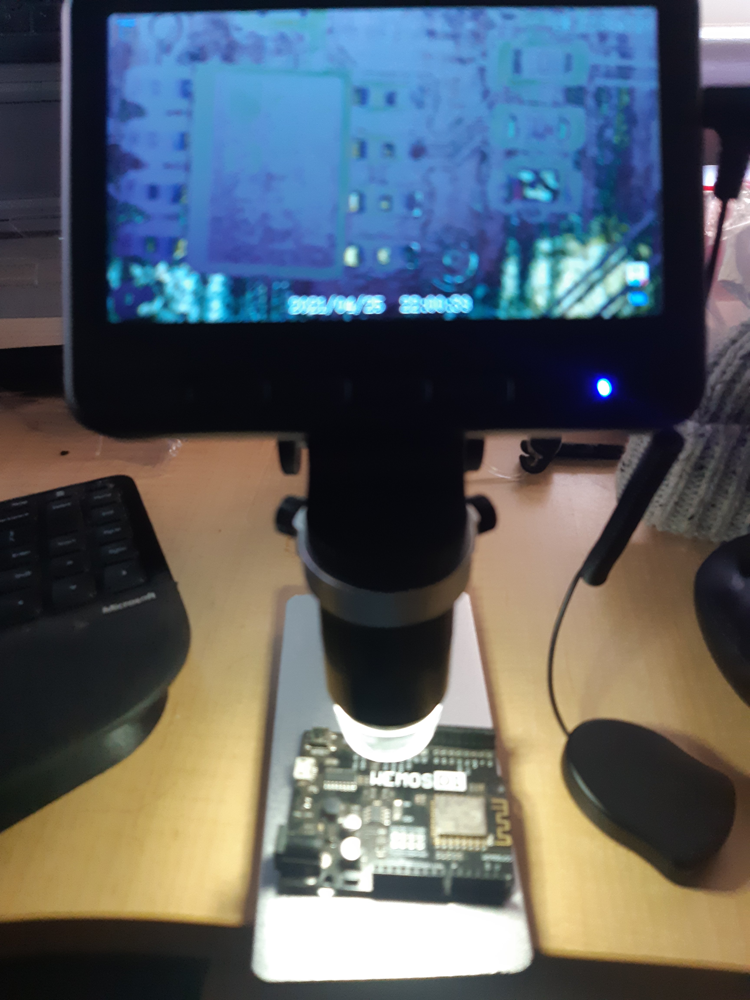

Zooooooooom!

Microscope upgrade for my bench turned up.  Well and truly ahead of my expectations.

The toy is also well above my expectations. Sehr gut.

My photography skills ... not so much.

One disappointment. The base is aluminium. A disappointment because I would like to use magnetic pcb holders. That is still an option with sets that include a steel plate. Found one that would fit on the base without mod. Will just need double sided tape.

The other, the Android app for it was a pain to find. It turns out the microscope is a Hiview. Disappointed as the app does not connect to the microscope, whether the phone is connected by the microscope hotspot or not.

On the upside, I bought a couple of smd soldering practice boards so will jump onto it soon, to christen it.

Further to the downside, I also added a dispute for kitchen gadget that has not turned up and the buyer protection is about to lapse. I keep an eye out for stocking stuffers for the wife for Christmas, knowing they need be ordered before August and may or may not turn up.
