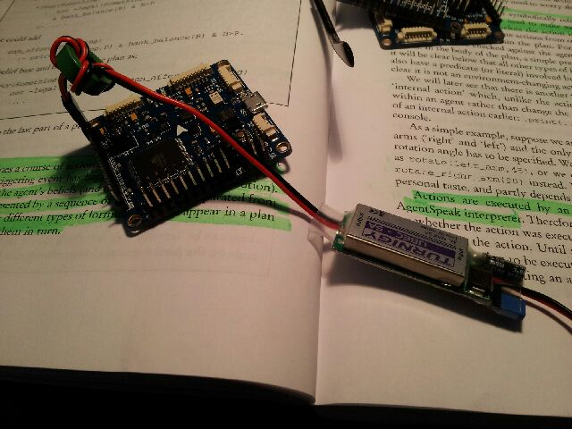

Adelaide is fairly poorly supported in the RC world.  It has stores but what is the point nowadays and especially when your staff are clueless.
First up, I thought I would do the right thing and got to a local store and not buy my Universal Battery Elimination Circuit (UBEC) off the internet. I thought also I would buy my motor and ESC for the rock crawler from a local store too.
Now, myself, I don't understand why UBEC are called what they are as I usually have always called, switch(ing) mode DC-DC converters switch(ing) mode DC-DC converters.
You could even get by thinking of them as regulators if you were so inclined.
All fell flat when I went to the hobby store.
It became apparent that the tool behind the counter was either lying to me or was clueless.
In his estimation, there was no such thing as UBEC!   Never used a "battery regulator" in his experience.  So, I opted to jump on to Hobby King and get 3 each 5/6 volt output and 3.3 volt output UBEC (switch mode DC-DC converters).
I needed this for the [flight controller boards](http://organicmonkeymotion.wordpress.com/2013/06/23/i-love-the-smell-of-rosin-in-the-morning/ "I love the smell of rosin in the morning …") as they would not be powered from the USB in flight.

I buzzed out each of the three flight controllers and they all happily blinked their startup sequences powered via the UBEC which confirmed my fine soldering work.
Now the biggest let down going to the RC hobby store was they were next to useless in sorting out motor and ESC for my rock crawler which, go figure, I bought from them 12 months or so ago when I caught them on special.
The rock crawler manual suggests a 50T, 55T or 60 T brushed motor - for the torque.
The hobby store dweeb was trying to tell me you can't get 60T brushed motors and I should by one of their 10T brushless motors and change the gearing of my rock crawler - an altogether stupid suggestion.
Now it turns out I can and likely will simply order directly from <http://www.integy.com/> as they happily sell 60T brushed motors paired with ESC.  I say paired as ESC come with motor turn maximum limits by design.  Which is why I won't be buying from a Perth based RC shop either as, while they have 60T brushed motors they don't have matching ESC at all in their catalogue.
So, while I try hard to buy Australian or at least through Australian specialist stores - where I expect to be able to talk to less than stupid people on the topics I am interested - I simply have to buy from the Internet.
