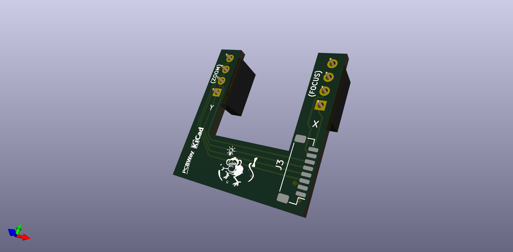
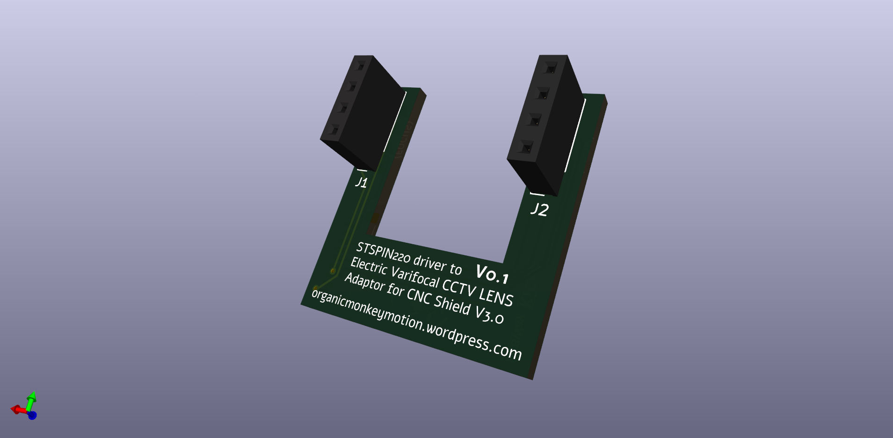
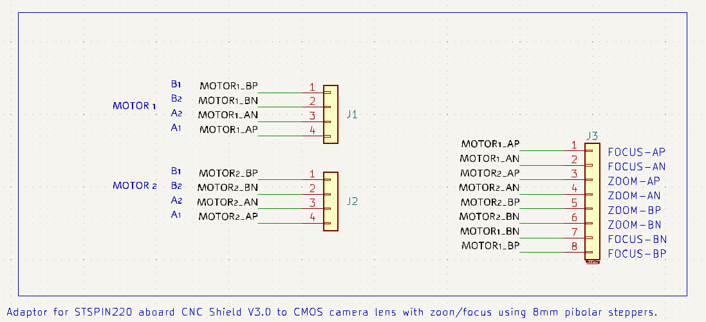
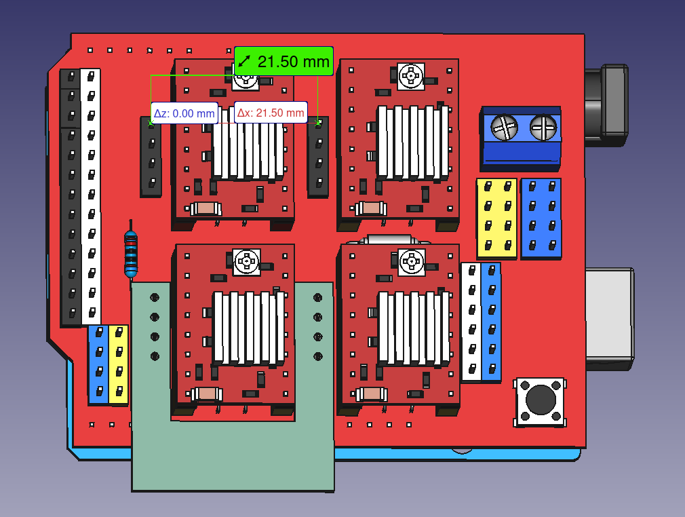
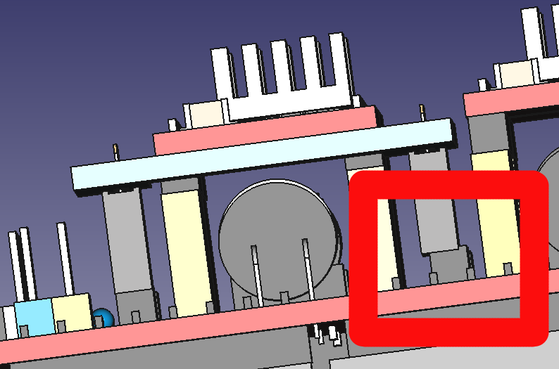
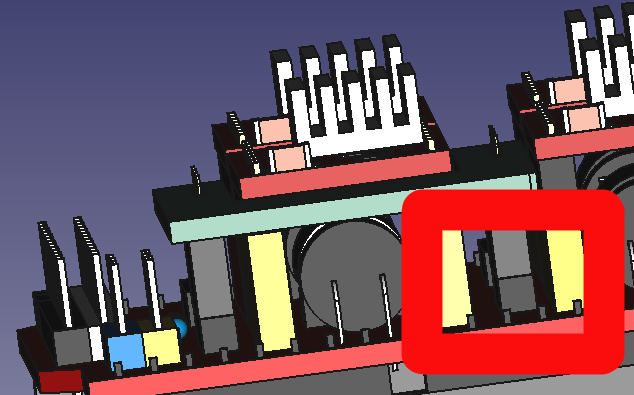
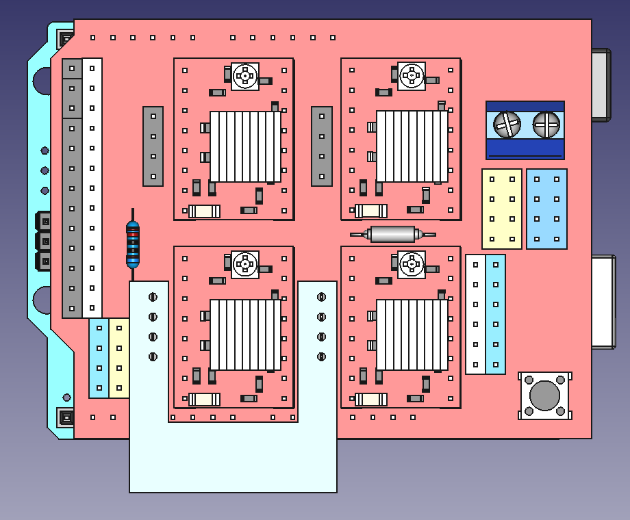
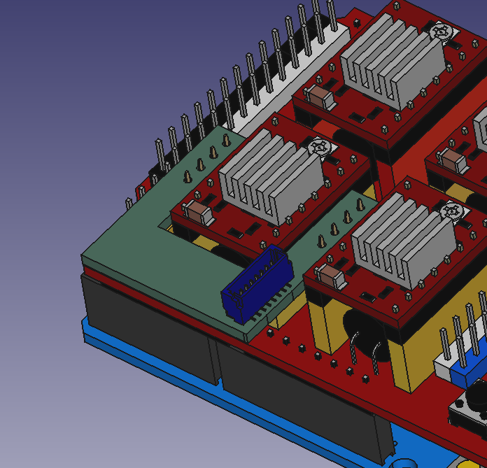
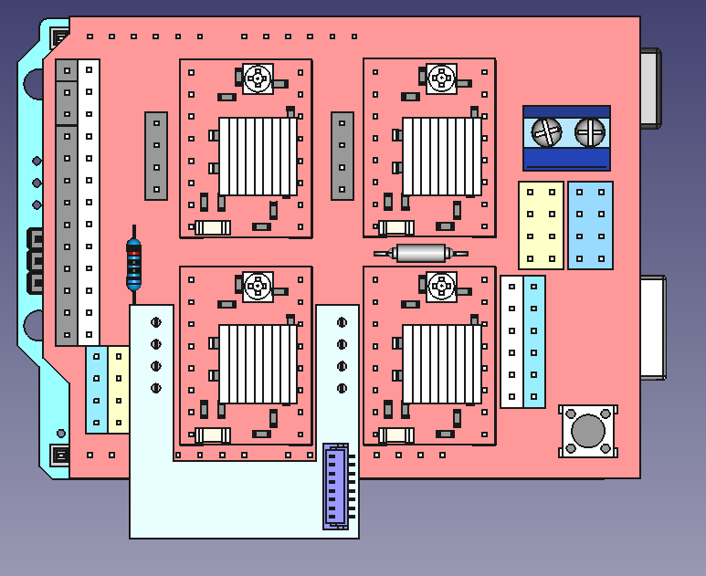
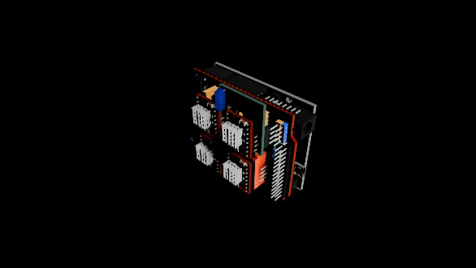

Assuming there are weirdoes out there, like myself, I thought it might do to make an adaptor board for the CNC Shield V3.0 (and maybe other versions). Hence Figure 1 and Figure 2.

Figure 1: Adaptor from the top, should sit on the pins for motors x and y (and why not right!)

Figure 2: From underneath

For experiments with one of these at Figure 3. Mitt the JST SH 1mm 1x8 connector.

Figure 3: The zoomable/focusable lens mitt 8mm steepers

Just so long as you use stepper drivers with an STSPIN220 on top, and supply and only supply 4v. The new schematic is at Figure 4.

Figure 4: Pretty straight forward

Although, I found this step file (would you believe) of the CNC Shield sitting on an UNO and my 21mm between pins may be out since the [CAD file I found, for the CNC Shield no less](https://grabcad.com/library/arduino-uno-cnc-shield-1), suggests it's actually 21.5mm in Figure 5.

Figure 5: Close but no bannana

Figure 6: Yikes! May look worse than it is.

I should have checked this before ordering, but who knew right, a 3D CAD model of the CNC shield. The batch coming only cost a few dollars and it should flex enough. But I'll need double check and knock out a V.02.

To wit, I have installed the github plugin into KiCAD. Installed gh (just in case). Staged, commited, then pushed MASTER, then V.02 out to github. Once I double check things, probably after I have a batch of V0.2 made by PCBWay, I'll put a story up of using it etc.

V.02 now seems to align per Figure 7.

Figure 7: Just needed be moved over a tad.

And just in case you were curious, Figure 8 is from above.

Figure 8: There you go!

Oh yeah! Why not add a 3D model of the JST SH 1mm 8-pin connector and therefore Figure 9 and, of course, Figure 10 and Figure 11.

Figure 9: [Of course JST as 3d models of all it's connectors](https://www.jst-mfg.com/product/index.php?series=231).

Figure 10: Now that makes it clearer!

Figure 11: Finally, I can relax!

No, sorry I can't! [I found a Wemos R1 model](https://grabcad.com/library/wemos-d1-r1-1), so swapped in that and swapped out the UNO model, hence Figure 12 as if it's from the movie TRON (mostly since its an export from FreeCAD).

Figure 12: Ooooooooh! Arrrrrrgh! TRON!

No really, all done.
