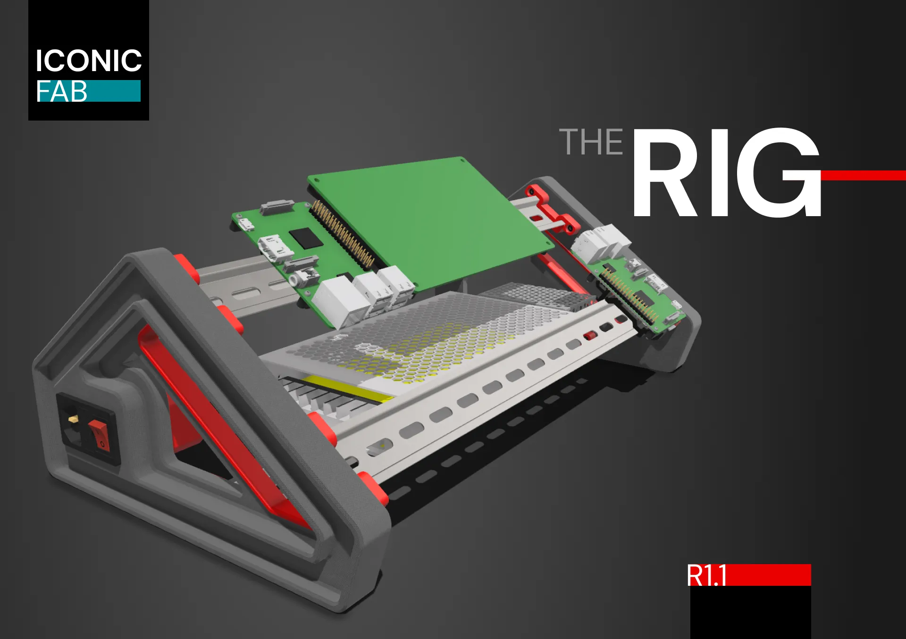
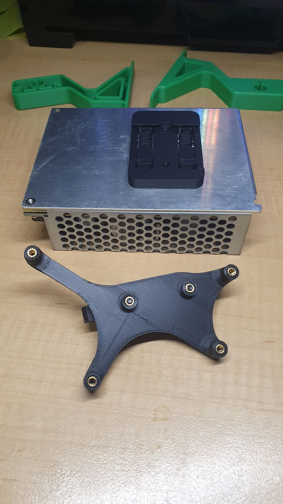

When DINning that is, so building a [The RIG](https://www.printables.com/model/837104-the-rig-r11-diy-helper-stand-for-testing-electroni):

The problem it solves is I'm now trying to get my Prusa Bear Clone set up with:

* The original BTT SKR Mini V2.0;
* the original Raspberry Pi Zero 2W; and now
* adding [BTT EBB36 tool head,](https://wiki.kb-3d.com/en/home/btt/voron/BTT_EBB36) and of course
* adding a BTT [U2C](https://wiki.kb-3d.com/en/home/btt/voron/u2c_v2).

So, with the crimping, wiring and fiddling to go to set up I got dishartened with bits strewn all over the place to bomb the software on the EBB but also the nuasance of setting up with the printer.

So, I've sourced a few DIN mounts where they exist and knocked up a DIN mount adaptor for the EBB36 so it can go onto The RIG as well (while prototyping the setup and checking out the integration before it gets finalised on the printer).

To wit, the sourced DIN connectors are:

* For the [BTT SKR Mini V2.0](https://www.printables.com/model/172510-bigtreetech-skr-mini-e3-v2030-bracket) which is an adaptor for a [generic DIN clip](https://github.com/VoronDesign/Voron-Trident/blob/f871f117cdf2a3b3881c3bc176f0a8eb04e42057/STLs/ElectronicsBay/pcb_din_clip_v2_x5.stl).
* A [Raspberry Pi Zero din mount](https://www.printables.com/model/648928-raspberry-pi-zero-2-w-din-rail-low-profile-mount) that uses compliancy to clip onto the DIN rail.
* For the [BTT U2C](https://github.com/VoronDesign/VoronUsers/tree/main/printer_mods/Electroleon/U2C_Mounting) which is also an adatptor for a [generic DIN clip](https://github.com/VoronDesign/Voron-Trident/blob/f871f117cdf2a3b3881c3bc176f0a8eb04e42057/STLs/ElectronicsBay/pcb_din_clip_v2_x5.stl).

Should be a good little general setup in the end. I've a Mean Well RD-65A in me drawer for 5 and 12 volt sources for general electronics, an LRS-200-24 for 24 volts on order for the steppers and hotplate emulations et al, and 3 x 2 to 4 DIN terminal blocks for power distribution.

I got the LRS-200 'cause, upon inspection, most combo 5/12/24 volt PSU really skimp on the ergs on the 24 volt line, and the LRS-200 was closest to the ergs in the Prusa PSU I got for my Bear Clone.

The BTT SKR Mini E3 DIN mount is RAD! Also found a [Mean Well LSR-100-5 mount](https://www.printables.com/model/78569-din-mount-for-meanwell-lrs-100-5-power-supply) that fits the RD-65A - double RAD!
