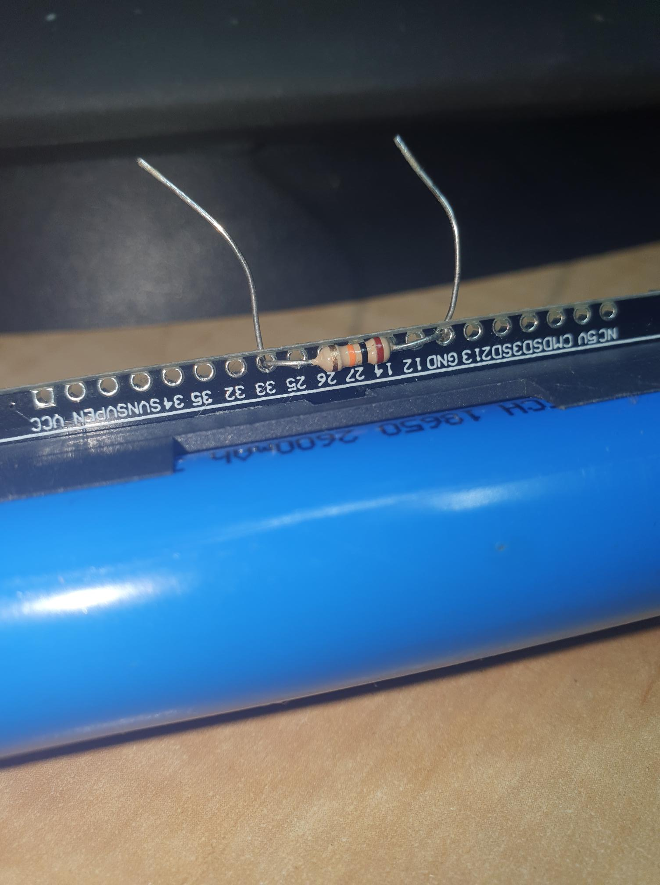
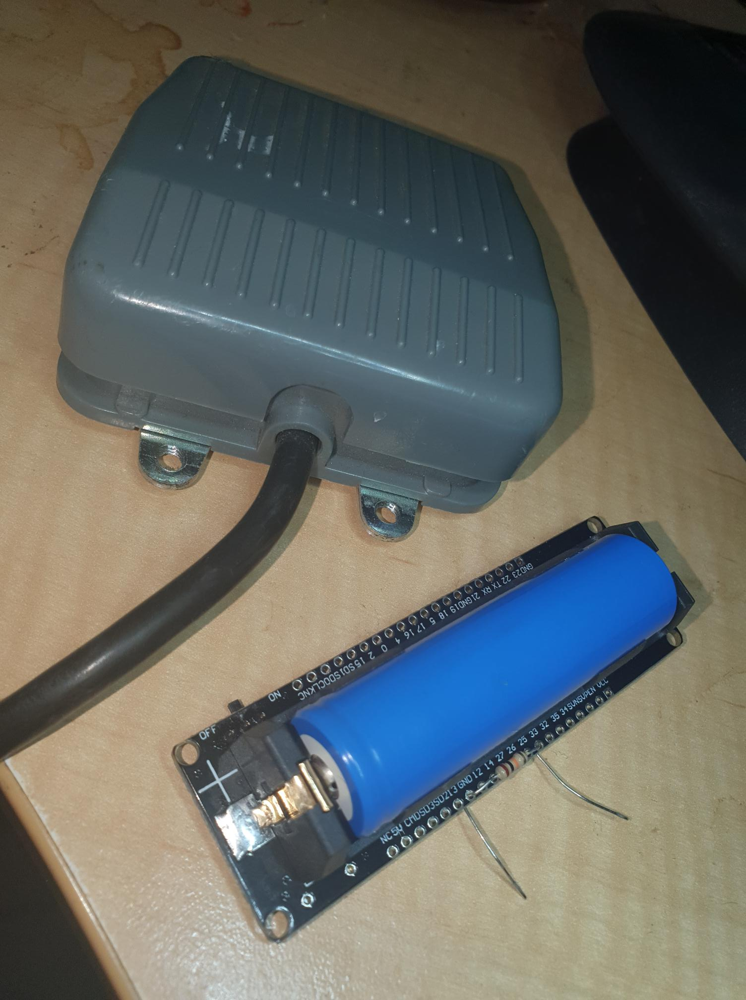
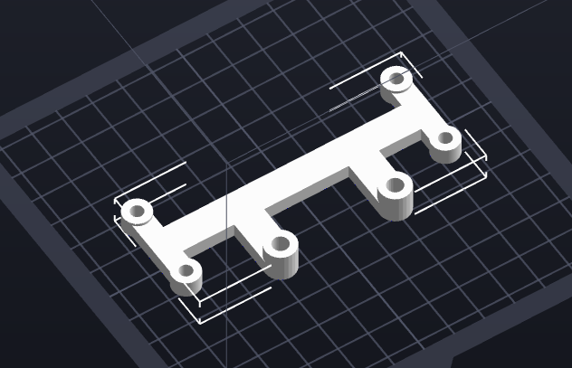
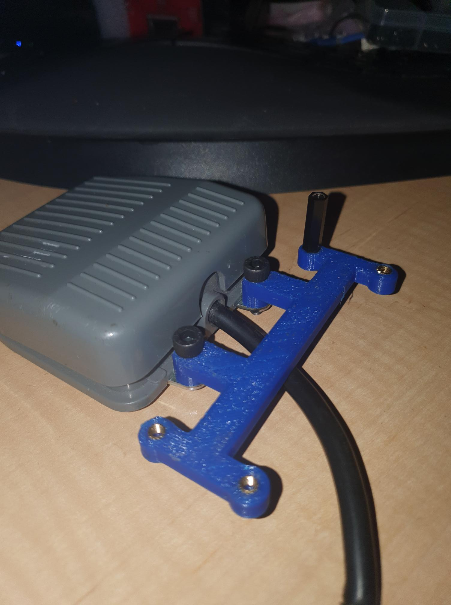
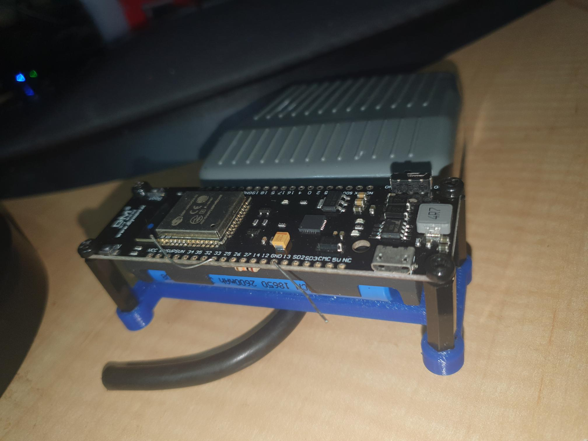
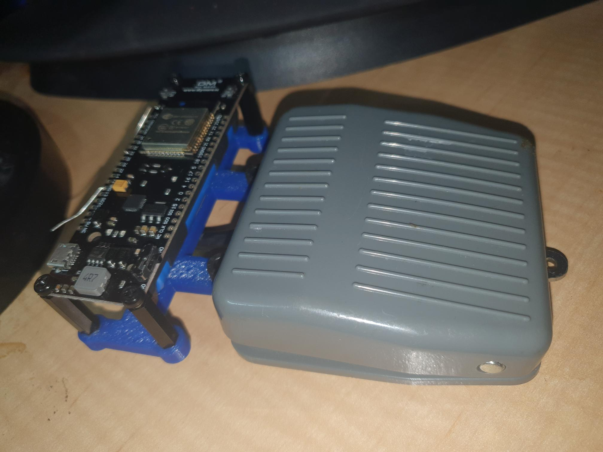

Since I am building a second smaller manual PnP, for small short jobs, I am building a battery powered vacuum setup to use on either manual PnP.

First step is to attach a ESP32 with battery to my foot pedal to create a wireless pedal.

Single 10Kohm resistor between GND and GIO33

The point of connection GIO33 to ground with the 10Kohm resistor is the 3.3V will go to the pedal, to then drive GIO33 high when the pedal is pressed. I want to save power, so the ESP32 (hopefully) will be in LP mode and awake when GIO33 goes high.

Notice the threads in the pedal? They weren't threaded out-of-the-box, but an M5 tap works a treat!

The N/O circuit of the pedal will be driven by 3.3volt and connect to GIO33.

I just need write code to set the pedal up to "talk" to the portable PnP vacuum unit. That unit will likely have a WEMOS D1 R2 with a quad realy board. I have a 12v SLA battery to drive the portable unit as there will be a 12v pnematic "switch" and a 12v vaccum pump. The aim is to drive the pump, then open the valve to create the vacuum. The reverse will be close the valve then turn off the pump.

The mount for the DIY ESP32 board. For the board, M3 heat sets will be used, M3 stand offs will be inserted and the board mounted battery downwards.

So, M5 tight and with M3 heat sets and one M3 post as an example.

DIY board mounted, some wiring TBD.

All very tidy. I may still make a cover for the electronics.
