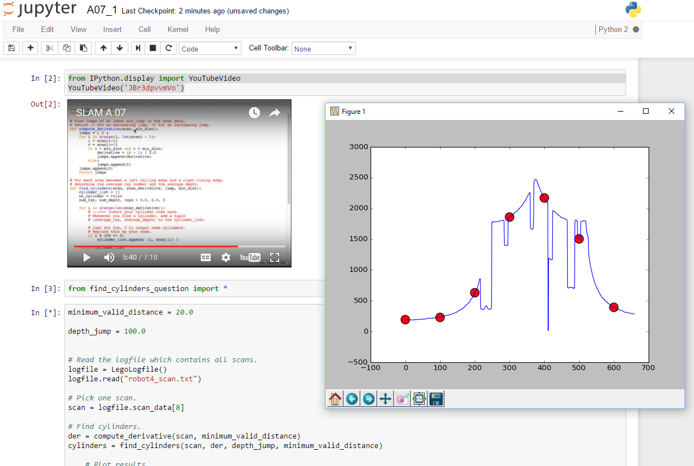

Now this is what I am talking about.
See [Claus for SLAM videos using Python](https://www.youtube.com/playlist?list=PLpUPoM7Rgzi_7YWn14Va2FODh7LzADBSm) whohoooo!
Get yourself some ipython so you can get access to the web based notebook.
Easy enough to embed Claus in the notebook page and then doodle learning SLAM in Python in ipython notebooks because you can.
