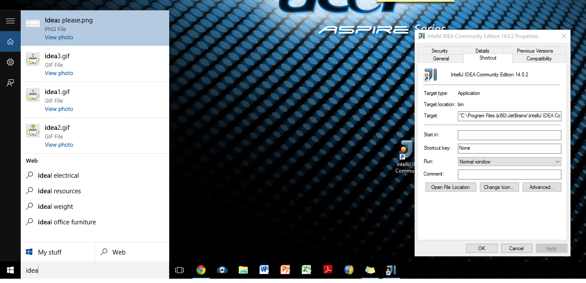
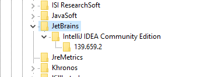
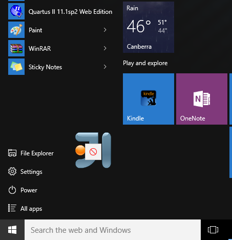

What on earth is this thing they call a "**Start Menu**".  I am a software developer come system engineer come safety engineer and I have loaded my machine with, well, stuff.
I take a deep breath and install Windows 10 over my Windows 7 install.  How bad can it be right, they have to run all the older software or go out of business right AND I hear that they brought the start menu back.
Nope.  They lied, it is a "**Stop Menu**".  I have rafts of applications that don't turn up at all in the "**Stop Menu**".  In some cases an entry might turn up and it will only have say a help file or even an uninstall program in the list under the menu - that is no application icon.
It isn't even obvious that if I go to the trouble of pining applications to the start menu that they will turn up in the half built menus that already exist for the application.  If the "**Stop Menu**" cannot work out to put them in the list then how would it know to associate an application with a skeleton folder?  Or, if it can why the frack didn't it put the application file in?
Makes me itch to want to write an Windoze 10 App call "The Other Start Menu".
They aren't real Apps in any event for crying out loud.  Why didn't they just buy Google or Apple and real App based environments.  I am still running consoles and IDE etc. - when I can find the fracking things.
I even downloaded an Explorer App.  Doh! Has same dopey sense of HMI (Horribly Modelled Interface).
I mean look at this.

No IDEA in "All Apps".  No Jetbrains either.  Nothing found in search.
I actually am playing with MPS and MBEDDR as well as IDEA so where the hell are they in the search if they aren't in the "All Apps"?
I have so much stuff on my machine I forget where I put IDEA ;) I must be powered by Windoze 10 LOL!
Any old how, I had a clutter of shortcuts on me desktop and ... phew ... there it was.
So, Windoze 10 cannot find an application in the Windoze "Program Files (x86)" folder.  Now I would forgive it ... not really ... if I had it in one of my D: or E: drive hidy holes but it is in a default Windoze application install folder and Windoze cannot find it!
WAIT A FRACKEN GODDAM MINUTE!!!  Have a look at this!

IDEA IS IN THE FRACKEN REGISTRY AND WINDOZE 10 "**Stop Menu**" search cannot find it!!!
As far as WINDOZE 10 is concerned, it has NO IDEA!  Apt if not App ... DIG IT!?
OH COME ON!!!!!!!!!!!   FRAAAAAAAAACCCCCCCCKKKKK!!!
Have a FRACKEN look at this!!!

NO IDEA in "**Stop Menu**"
NO IDEA in "**Search the web and Windoze - except for the bits we don't search**"
I tried dragging from folder and **NO** to IDEA for dropping into either start menu or apps.

#### QUADRUPLE FRAAAAAAAAACCCCCCCCKKKKK!!!

I tried skipping down to the folder were the exe is sitting. Sure enough right click and it has the option of "Pin to Start".
Except, 5 attempts and it doesn't work!  Nothing turns up in "**Stop Menu**" as often as I hit the "**Pin to Stop**" menu item.  There is even as 64bit exe in the bin folder.  That did not get put in list either.
Why is Windoze 10 anti-exe?
Isn't this the same people who wrote the BING search engine?  Is there really a "Dark Web" or is it just Microsoft can't write search algorithms?
