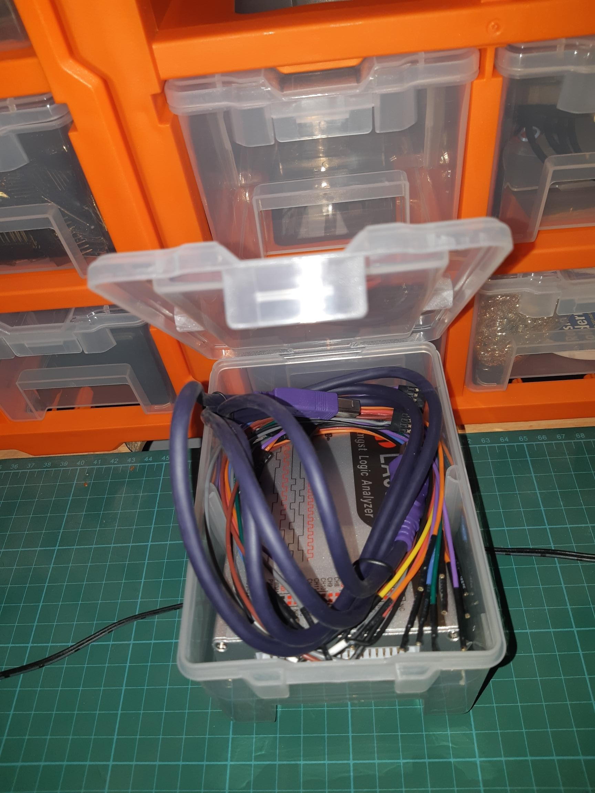
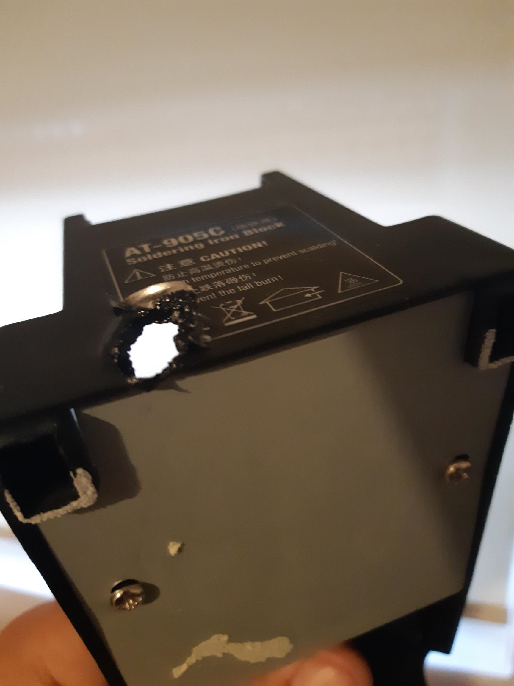

My Kingst LA5016 has turned up! Having been funded by sale of my Dangerous Prototypes Logic Sniffer and other miscellaneous underutilized widgets from my parts drawer.

Fits snuggly into the neat set of drawers I stacked onto the top my workbench. Managed to move my programmer and its bits into a second drawer from [the box I originally stashed it](https://organicmonkeymotion.wordpress.com/2020/11/09/authentic/), so I don't have to sort through boxes to find it (I've a hive of them down one side of my workbench.

On the way back from picking up the logic analyser from the post office I dropped into [Jaycar](https://www.jaycar.com.au/) to pick up a new ["delux" soldering iron stand](https://www.jaycar.com.au/deluxe-soldering-iron-stand/p/TS1507). Is it really? Nice heavy base, so maybe. The alternate has a [flimsy light metal sheet construction](https://www.jaycar.com.au/soldering-iron-stand/p/TS1502?pos=2&queryId=754d10e5bd0752ba0658f83cf2403ffb&sort=relevance) and probably a source of woe, since I can imagine top heavy with a iron in it, especially with it's power lead wobbling all over the place.

I actually had to buy a new soldering iron stand, as I did punch a hole through the trusty soldering stand that came with me good old [ATTEN 8586](https://organicmonkeymotion.wordpress.com/2021/04/06/refurbishing-my-soldering-station/).

Quite an exit wound wouldn't you say ...

Ouch!

Still useable but 'ken dangerous.

https://www.propertysigns.com.au/warning-sign-risk-of-fire/ for your warning sign needs in the workplace

Took quite a few hours to clear the stench out of the house.

Fine for years but just slipped up and missed the holder and peeeeeeeeeeeeeewwwwwwwwwwww!
