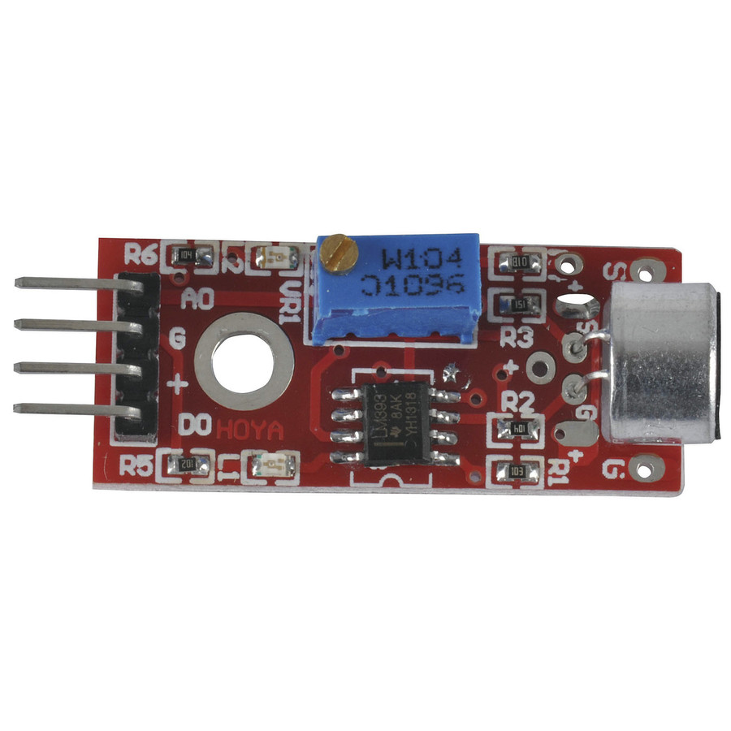

A neighbor complained that the dogs were barking all day.
Likely cause all the renovation work going on (late into the night as well).
I looked around for software so I could detect the barking and potentially turn sprinklers on for a minute - to distract them.
Options are also a buzzer, so they associate the buzzer with the sprinkler coming on.  Then later the sprinkler needn't come on.
HE is funny.  Not liking to wet he has an aversion to the solar powered, IR triggered, sprinkler I use to at least keep them away from the side of the house.
The psychology is funny though, they stop short of going down the side of the house and bark anyway.
Much of the software is really noddy.  Level sensing.  So I looked for microphones and downloaded python scripts etc.  The software would also send you an email if the dogs barked.
Still, the problem running on the PC was obvious.  The problems setting up a microphone on a C.H.I.P. or Orange Pi were not insurmountable BUT still was that over kill.
My time in signal processing get get me excited about using correlations to discern dogs barking from loud noises but there are other tricks there.  The load noise would be of a fixed duration that repeated.  So, a window with say four loud noises could count as barking in a backyard otherwise quiet.
The thought of the signal processing didn't daunt me, but the turn around time to get something running did.  So, the plan is a super duper system later, at the moment I just want to monitor their behaviour and sort something out that might curb it.
So I thought I would go with a arduino compatible microphone/sound sensor instead.  An ESP-01 would do it as the sensor has a tuneable level sensor and raises as signal if the level is at or over that set.
However, it also puts out an analogue signal, from the mic, so a WeMOS mini would be better since it has the ADC input.

The sound sensor takes 5v, as does one of the pins on the D1 mini.    This way I can pump out noise events by the level sensor early using mqtt.   And later, I can pump analogue samples out by wifi.
I am already using node-red to send emails from the OPiZ so I can pump out hourly "woof" stats.   This setup is also cheap enough to set a couple up so that different parts of the yard (and thereby irrigation sectors) can play their part.
I have a suspicion neighbors are not helping and banging the fence.  So I am looking for a vibration sensor to get stats on that as well.
