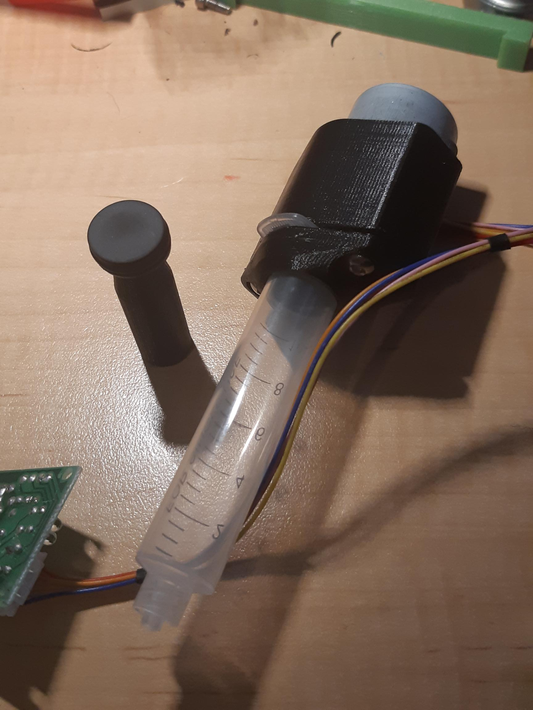
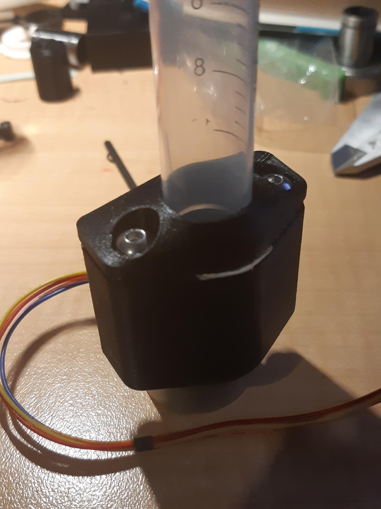
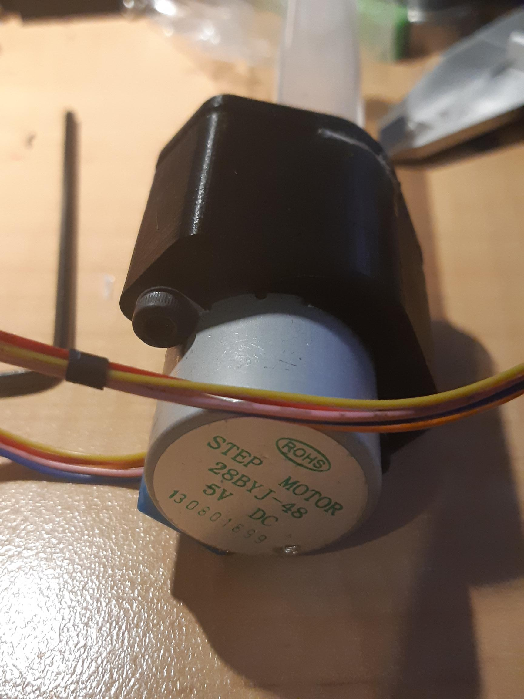

... so, in the middle of meetings I can listen in while fiddling with bits and bobs.

Figure 1

So, Figure 1 is my hand held solder paste extruder on it's way to being assembled. Find the design [here](https://www.pcbway.com/project/shareproject/Solder_paste_dispenser.html).

I ordered the usual 10 boards from pcbway for USD$5! So, I will assemble a couple for sale, and probably sell the others as is.

I didn't order a paste stencil for the boards at the time, but I found you could do so after the fact so I have a solder paste stencil coming for this and another solder paste dispenser which is for the manual PnP machine (though I understand the recommendation for that is also to use stencils).

I got a [3 pack of syringes with 36 types of various sizes](https://www.aliexpress.com/item/32851064915.html?spm=a2g0s.12269583.0.0.2278358foC2g1M). Ignore the advert which says 69 pieces, it's 39 pieces, though we do like a double entendre don't we.

The design in Figure 1 comes with OpenSCAD files for all the part BUT no need to twiddle as the syringes as procured are perfect.

Just need me a length of M4 thread and ...

Don't forget the fix the author recommends at Figure 2.

Figure 2

So a few extra shots of the in-work widget are below (Figures 3 and 4).

Figure 3

Figure 4

Best part, I had to use some of my M4 heat set inserts, ahead of the M4 heat set tip turning up for my soldering iron. However, the 3D print was set up perfectly to snuggly take the guide section of the heat set and the shape of the print square enough to allow for properly inserting of the heat sets. Makes it readily obvious the need to get the hole dimensions right, to ensure the heat setting process is painless.

Note, the absence of button head screws in Figure 4 (compared to Figure 3). The heads were too wide and jammed against the motor case.
