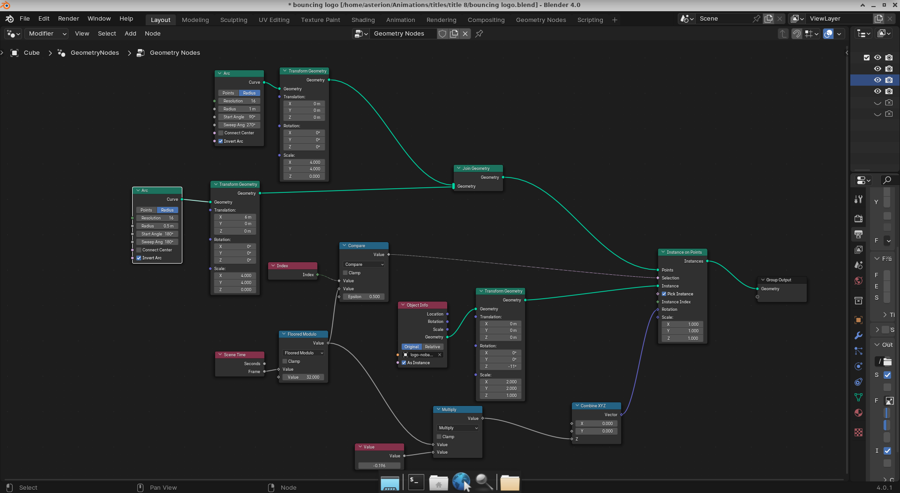
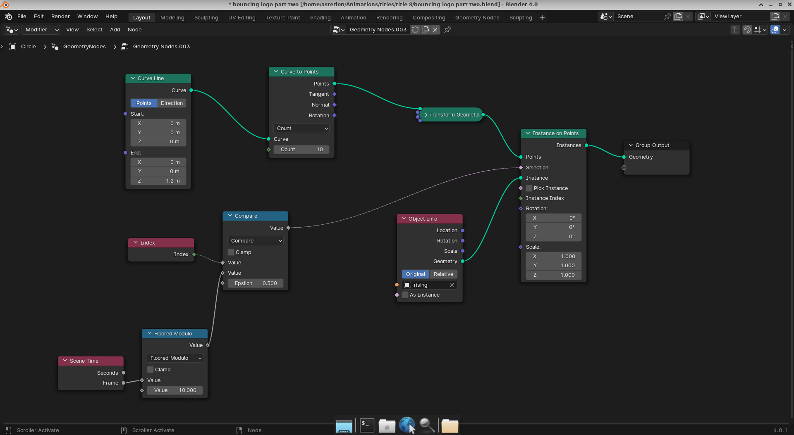

Just playing with geometry nodes to animate the tail of my video intro, since I have been opting to add new intros. Need to keep the branding though. Hence the bouncing logo. Still needs scaling and the text added, but not bad.

https://www.youtube.com/watch?v=IrUqU3hpA1M

I decided not to try to do one big complex node model for the entire animation. So I made a second file and the following nodes lifted the logo from whence it landed, ready for the text to appear.

I then started a new file with the stationary logo and added the appearing text. To finally compose the outputs from the three files thus.

https://www.youtube.com/watch?v=OkgmTXVyeXA
