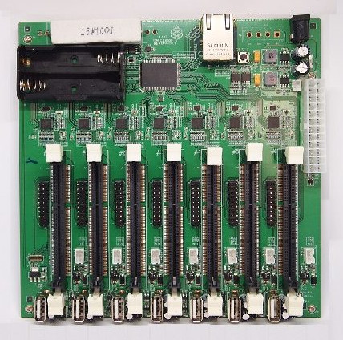

[Clusterised heavon!](https://www.mininodes.com/product/5-node-raspberry-pi-3-com-carrier-board/) Except they are blown out of the water by a new option, more modules, more features and [cheaper](https://turingpi.com/)! JESUS! Everyone [is now doing it](https://www.cnx-software.com/2018/02/01/pine64-clusterboard-is-now-available-for-100-with-one-sopine-a64-system-on-module/)!

Now the Turing Pi is to the Gumstix Stagecoach what the Odroid-W was to the Raspberry Pi. I wonder if the Raspberry Pi community gets the irony of a Raspberry Pi option cheating by copying another open source hardware design. Perhaps the Turing Pi should be pummelled the same way the Odroid-W was?

Now I have been at hardkernel to do a similar thing for years. If you talk about a sodimm DDR2 form factor and a cluster motherboard, people on the hardkernel forum still want 1) tell you why they like other form factors or 2) tell you to look at other offerings (such as those above). Losers!

I would even consider the Turing Pi, even though its under powered with only quad cores with 1G mem each. Really an educational toy. I hope then they have the module LED pointing in a useful direction for running lights. Plenty of USB for AI dongles, but still Raspingdoodleburry based. Still ...

However, since I am not a pi fan, mostly because monopoly aspects, I did just order a Pine64 Clusterboard. That will retire my 3 Odroid C1 current on the cluster, well not really, that will open them up for additional robotics projects. SBC based clusters are clumsy and too complicated given clusters based upon compute modules had been introduced by [gumstix](https://store.gumstix.com/stagecoach.html) years ago. Note that the gumstix "stagecoach" design is posted by gumstix so was always ripe for copying.

I note that a Rockchip RK1808 with 3TOP NPU is coming from Pine64 with the same compute module footprint. So there appear to be options of a [64bit](https://www.cnx-software.com/2017/01/17/pine64-introduces-sopine-a64-allwinner-a64-som-and-sopine-model-a-baseboard/) [2Gigabyte](https://www.cnx-software.com/2017/01/17/pine64-introduces-sopine-a64-allwinner-a64-som-and-sopine-model-a-baseboard/) compute and an [AI compute module](https://www.cnx-software.com/2019/08/05/pine64-soedge-rk1808-module-delivers-3-0-tops-via-rockchip-rk1808-soc/). Whether I need go wild though is a question, since I have a NVIDIA Jetson Nano and my [Parallella](https://www.parallella.org/). I note that there are USB ports in any event so probably need not burn cluster slots with the AI compute module, just need add [USB version](https://www.hackster.io/news/a-rockchip-rk1808-based-usb-stick-for-machine-learning-c7aea8096d1).

Since the Clusterboard is half the price of the Turing Pi it has to get my vote given AUS dollar means I need multiply all the costs by 1.5.

The Clusterboard will be a great docker based and or [Chapel](https://chapel-lang.org/) based toy.

OH ... MY ... GOD! A c[luster of cluster boards](https://ericdraken.com/compact-high-performance-compute-cluster-planning/). Eat shit hardkernel!
