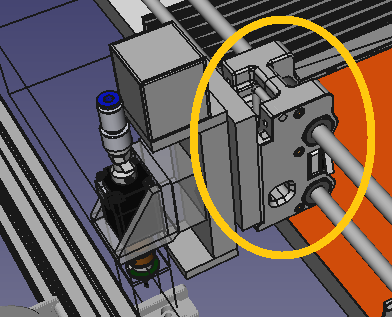

https://www.youtube.com/watch?v=OGSRvBVv\_RQ

WOW!

So, the two 10x10mm cylindrical magnets turned up.

One press fitted nicely into the "pin".

For the X-Axis, it was loose. The [two halves of the X-Axis were superglued together](https://organicmonkeymotion.wordpress.com/2021/10/04/two-peas-in-a-pod/) (it's only a prototype). The looseness may be a few things. Was it the fact it was split before printing? The way the plastic cools and may deform?

One other option, I may have not use the same radius, because I mistakenly took to tuning the circumradius in the calculator to get the right InRadius. It was the InRadius of 5mm I was after. I guess the problem was FreeCAD's prism tool is driven by circumradii, so I fell into that trap. Just jamming 5mm into the InRadius was what was required to get the circumradii to put into FreeCAD's prism tool.

No matter.

IT WORKS!

Really well. It locks in place TIGHTLY. It doesn't wobbly. It has sufficient pull force to require a positive step to pull apart, and I feel it will be fine for [pulling smt tape with the nozzle](https://www.youtube.com/watch?v=dZUW4wW2j_E) or pulling at the [pushpullfeeder lever](https://www.youtube.com/watch?v=cNCjjvCT4Fc).

Remembering that, what we are trying to get to is a manual quick change head system for the context in Figure 1.

Figure 1

Quick changing in, say, a laser, or a solder paste applicator. It could also change in a dual nozzle PnP head, if you were inclined.

Probably not a small milling head, since that might tax the magnetic connection. Although, I may still have a stab as it might (I say might) be okay for light engraving. Unless, maybe, I use a 10x20mm magnet (instead of the 10x10mm magnet) in the X-Carriage? Hmmm, that might be interesting.
