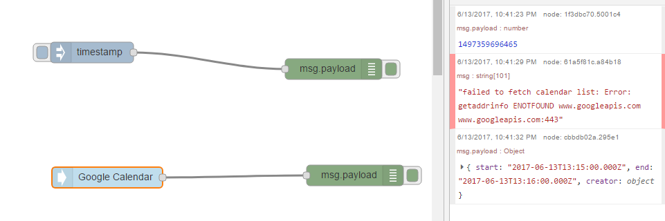

So voila!

This doesn't look like much but it made my teeth grate for the longest time.
The problem was setting up node-red on the OPiZ (and indeed the ODROID-C1) I could not use the google calendar as planned, for setting sprinklers on/off, because the embedded machine's IP would not resolve to the domain name "node-red.example.com".
Turns out I had the right idea, I just set the IP address incorrectly in my hosts file on my PC.
The problem was fixed by setting the c:\Windows\System32\Drivers\etc\hosts on my PC with the correct IP address of the OPiZ (I noted I had shrapnel there from the ODROID-C1 attempts and realised I had a 178 in place of 168 in the IP preamble).
The figure above shows now browsing from the PC into the OPiZ which is running node-red.
What you are seeing is a response from a google calendar I set up (to ping the node-red server when an event start occurred).   My heart stopped a little when the google api exception popped up (though that itself told me we were talking).  The start event I set came through regardless (so it must have resolve the lists in the background in any event).  The strange problem being that there is a time sync problem between what my computer says is the time and the calendar.  I can get events from calendar two minutes early according to my computer.  Likely source is whatever "clock" google calendar is running to (it reports the correct time from perspective of the calendar).  Something to track down.
Not the best solution, setting up a hosts files on every machine in the house is doable but there has to be a smarter way?
Now I have to muddle through the emqtt install again.  The problem there ended up none of the examples for starting the emqtt as a service worked for the armbian distro.
