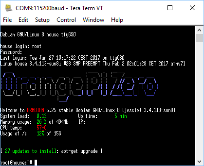

Given my journey here, to have node-red and emqttd running as services on Orange Pi Zero, I have to say the finale was not unexpected.
Re-burnt SD with Etcher as people were convinced I had caused problems with FS corruption using WIN32DiskImager.
Built node-red and emqttd as services (again).
I then started the Orange Pi Zero and left it running for two days.
I went to open on node-red in my browser this morning.
No connection.
Same for emqttd.
They were running last night.
The COM port to the OPiZ is still up as it shows up on the TerraTerm drop down.
I start up a console but not a sausage.
It should drop straight through to the root prompt for password.
For the halibut I tried sshing in via its static IP.
Nada.
What The Frack Over?
And, pulling power then reapplying sees the board not come up without IP address - but with node-red and emqttd running.

