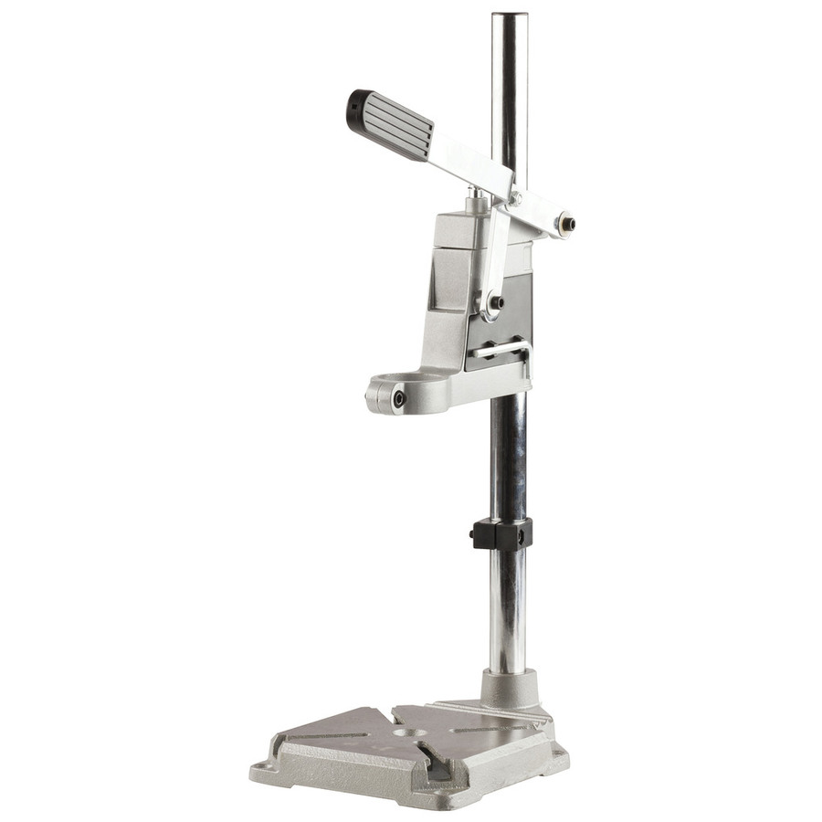
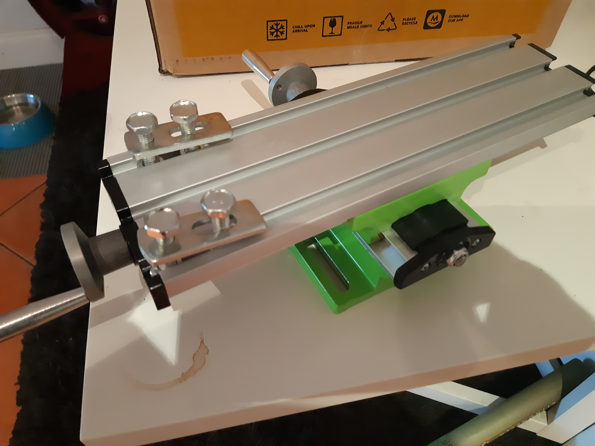
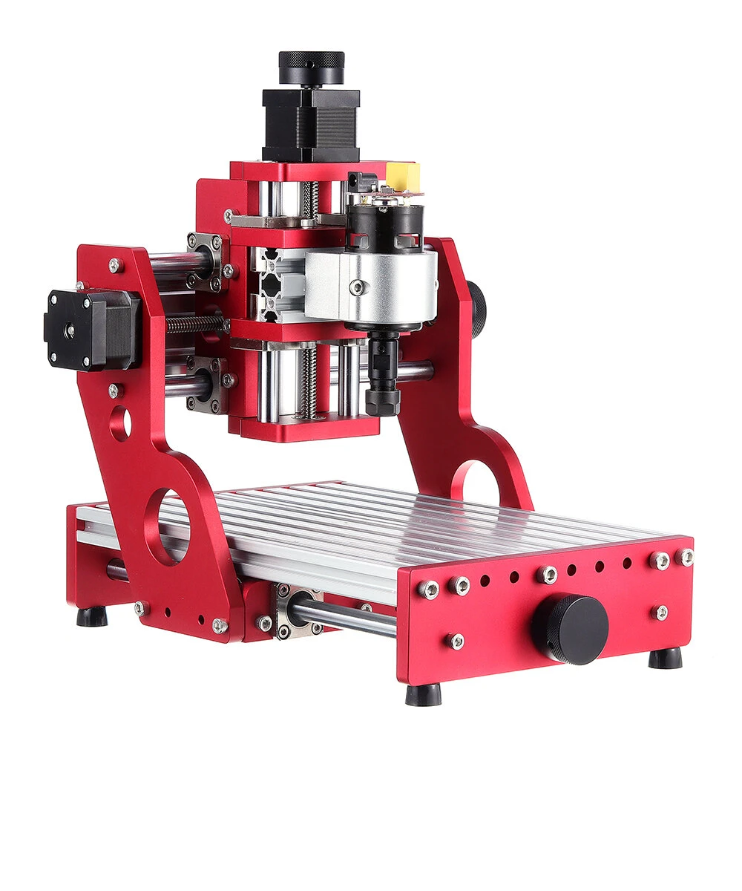

So, I was trying to think how to get to place where I could do limited machining of plastic and aluminium short of CNC machining, while I save for CNC machine.

I got a Jaycar gift card for Christmas, just enough to grab a small drill press for a hand drill. I was actually stumped when I got the gift card, as I had so much crap and was directed not to spend it on "expendables".

Whether it makes sense to buy the spindle early and 3D print something to mount it onto the drill press is a question. Still toying with that idea. Needs an xy table to get closer to a machining rig.

Then, as luck would have it, Aliexpress have an Australian "store" with small xy table beds thus (turned up today):

I was also thinking of a proper spindle for the CNC that I am saving up for, which is coincidently one of these:

I don't want anything bigger at the moment. I have "joined" a maker space so have access to a larger format CNC, so I just want something smaller for the fiddly bits that don't warrant waiting in line for the larger machine. This little ripper will rip certainly with a proper spindle. Maybe, after a bit of research, I might buy the spindle early and bodgy a mill with the drill press and xy bed. Maybe.
