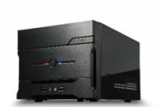
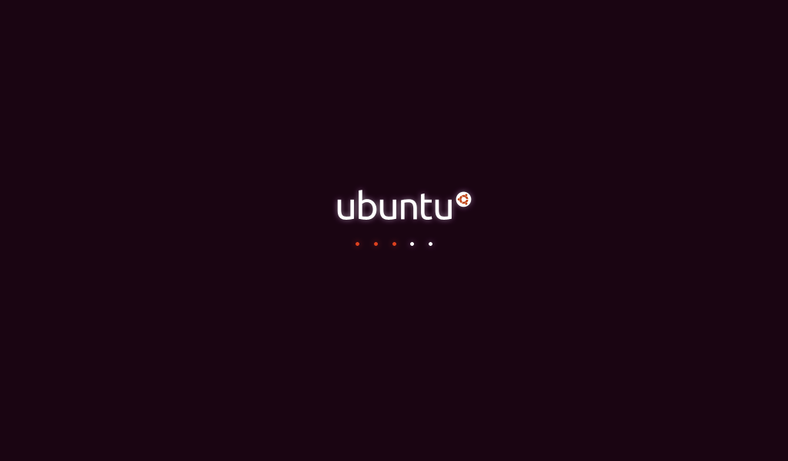
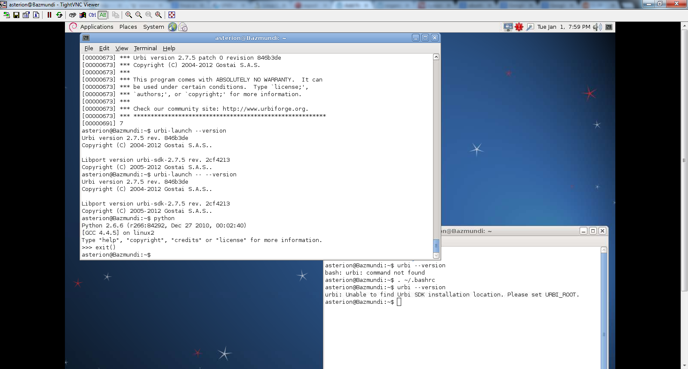

So, a couple of things sorted so that they are on hand.

Atom board setup with 32bit Debian.
Why not Ubuntu?  Well started out with Ubuntu 12 odd.  Server version wouldn't install.  Tried two times and got desktop running.  Spent a little time reading int X11 to get X-windows set up - as I am running the Atom box downstairs in the entertainment centre as it doesn't have wireless LAN and is hard wired into the ASDL router.
Turns out setting up X11 is strangely tricky.
The usual wanking opensource drivel - if you haven't done it before you're not good enough to use it.  Yeah yeah, I know I am dumb because I haven't done it before YOU freaking gimps!
Turns out, Ubuntu is less likely the choice for X11 etc because they are trying to be seen as replacement for Windoze so all sorts of things "native" to earlier versions of Ubuntu, and certainly of other Linux distros, are not there by default no more.
Blah blah, so on and so forth.  Scanned internet.
Came up with a couple to three good sources of information (not from Canonical!) and viola!  Installed XDM.
Changed a default line in config script to un-comment it.  Restarted the machine and ...
... it hung in the Ubuntu booting, slowly ticking away ... forever ...

Now, maybe I am dumb but how does un-commenting a default line in a default installation cause a mostly raw installation of Ubuntu to hang?  Probably a combination of the following:

* Ubuntu 12 is not really Atom friendly (who know why it installed at all let alone took two installation attempts before taking).
* XDM is not a "native" of Ubuntu.  The warning when you install it is that it isn't ported to Ubuntu by Canonical.

The upshot ...

Installed 32 bit Debian on the Atom box, wiping out Ubuntu.
Half a day later I had Tight VNC on my Acer desktop (Windoze 7) and remoted into my 32bit Debian Atom box to install and test both of [ROS](http://www.ros.org/wiki/ "ROS") and [Urbi](http://www.urbiforge.org/ "Urbi").
So, I have an old 64bit machine to build an that will definitely be a Debian installation.
