When using my USB microscope, I am finding big fat fiddly fingers are a nuisance, tweezers some help, but fine grain motion is best.

[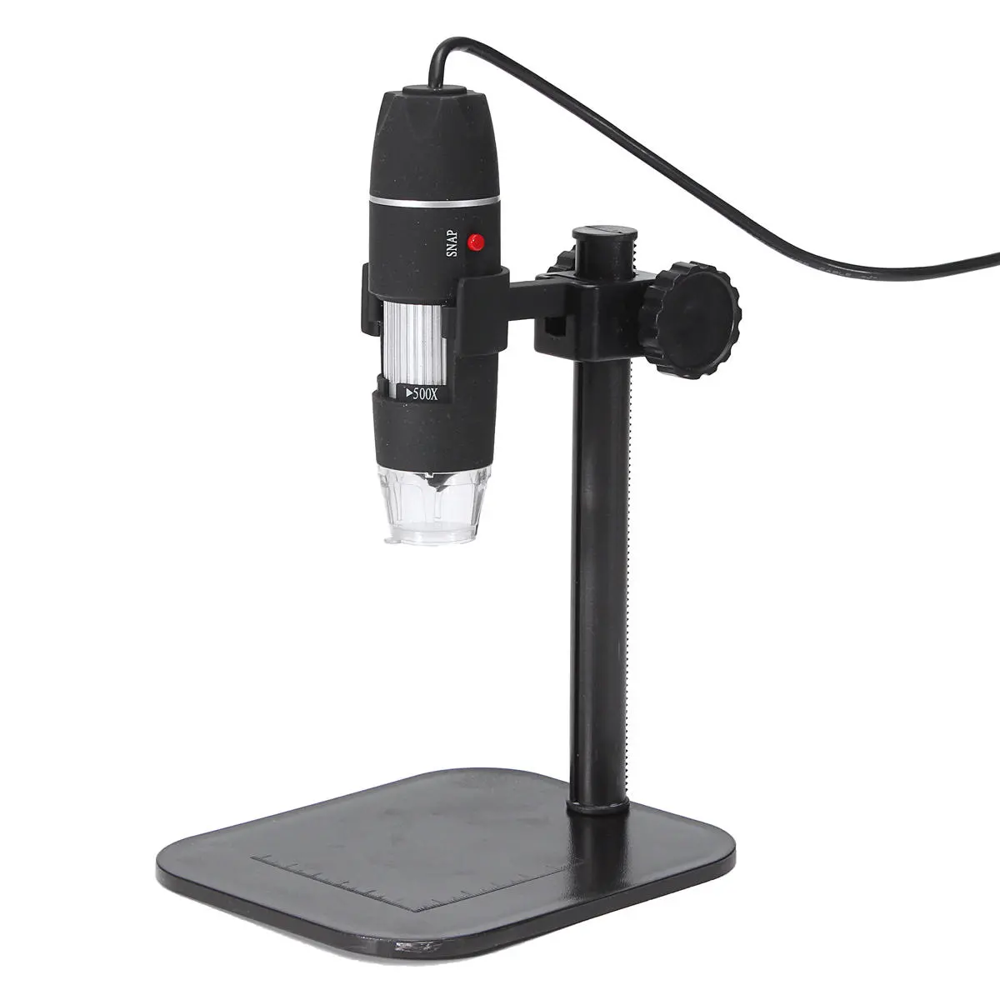](./usb-microscope.png)

So, what about an XY micro platter?

Well, that is possible because you can buy exactly that from Aliexpress, really bits salvaged from cameras.

Voila!

[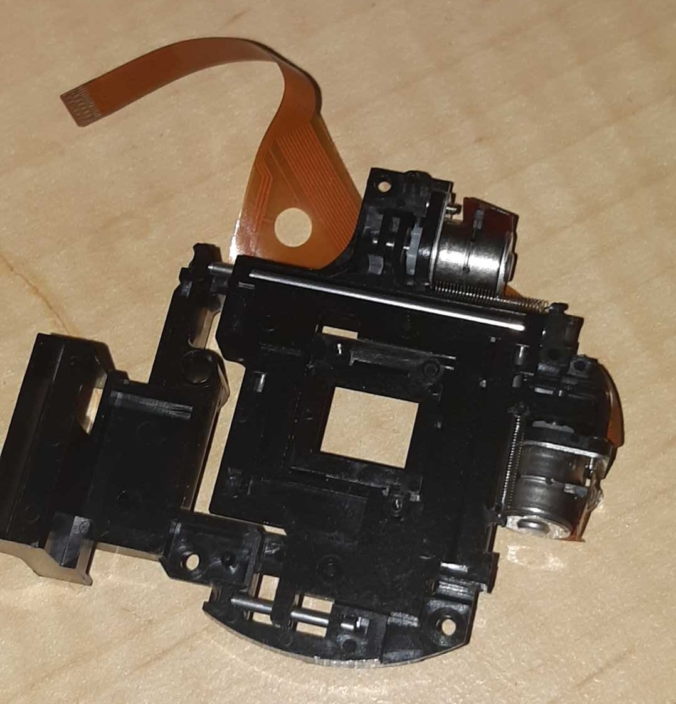](./xy-rig.jpg)

And, fortuitously, I over bought drv8825 modules, so according to [LastMinuteEngineers](https://lastminuteengineers.com/wp-content/uploads/arduino/DRV8825-Stepper-Motor-Driver-Pinout.png):

[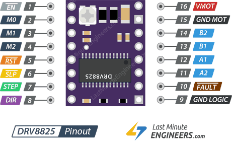](./drv8825-stepper-motor-driver-pinout-1.png)

[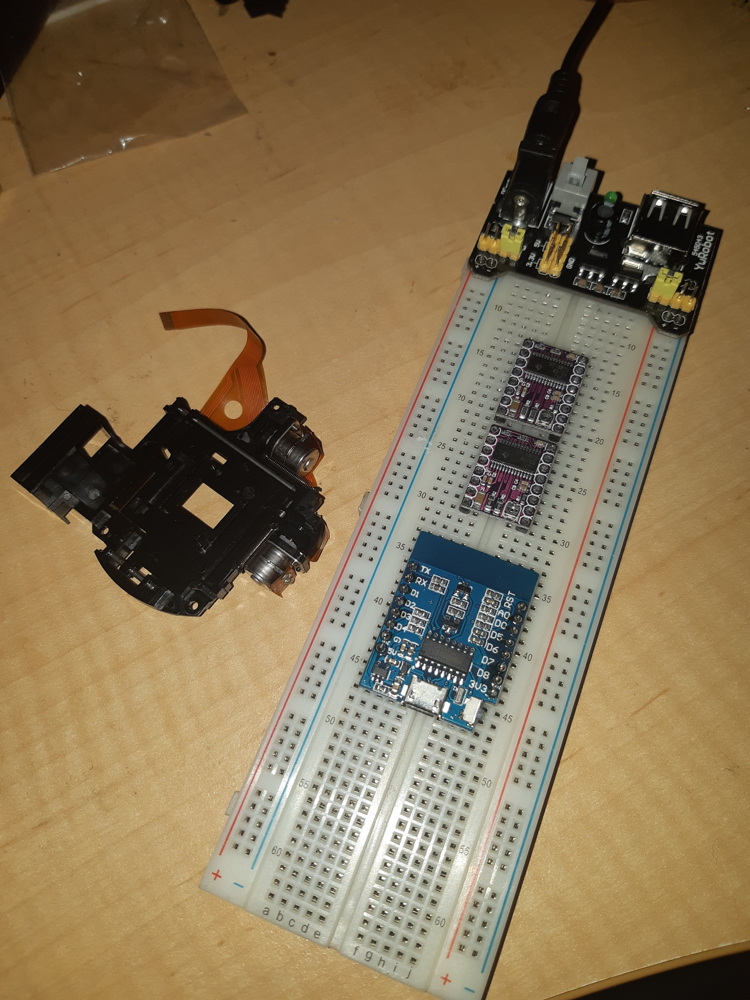](./dev-rig.jpg)

Just some wiring up and we can experiment.

In principle, for example, the setup will tend to look like the following:

[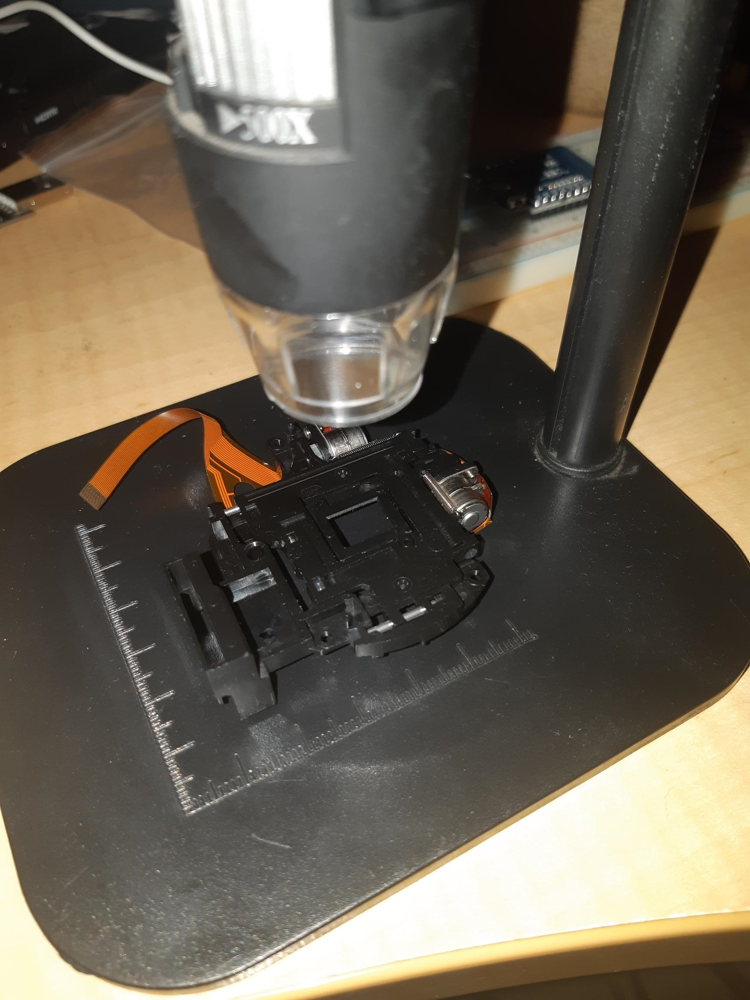](./xy-rig2.jpg)

It just needs something 3D printed to mount it, probably clipping onto the post so its removable. Some fun in FreeCAD or OpenSCAD for sure!

For the record, some useful info from the Aliexpress store:

[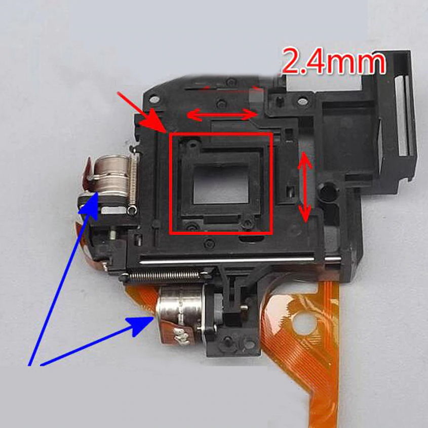](./xy-rig3.png)

[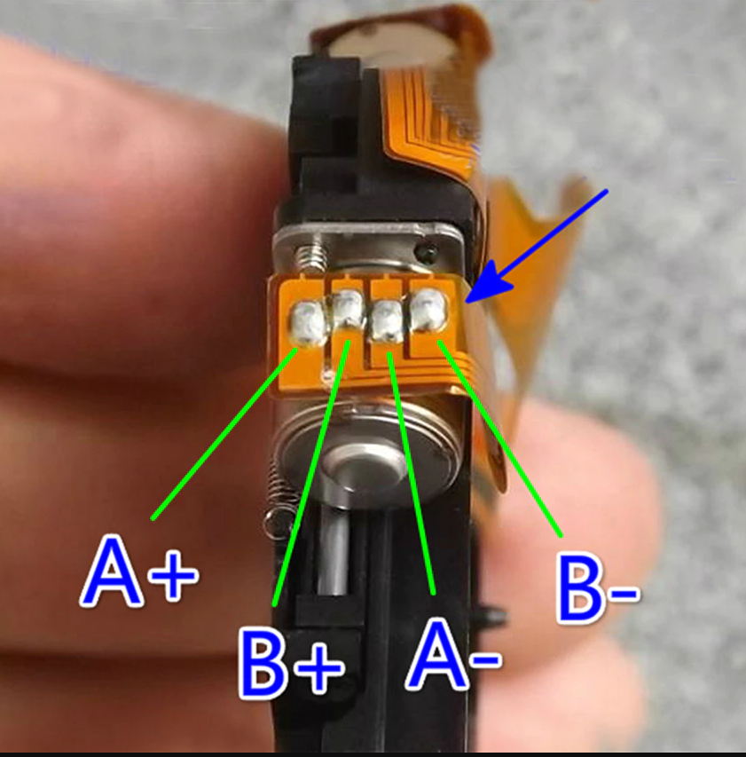](./xy-rig4.png)

* Phase resistance: 5 ohms
* Step angle: 18°
* Phase voltage: 5V
* Current: about 100mA

Now I know what you're thinking, how on earth do you detect end stops. I have a cunning plan ...

[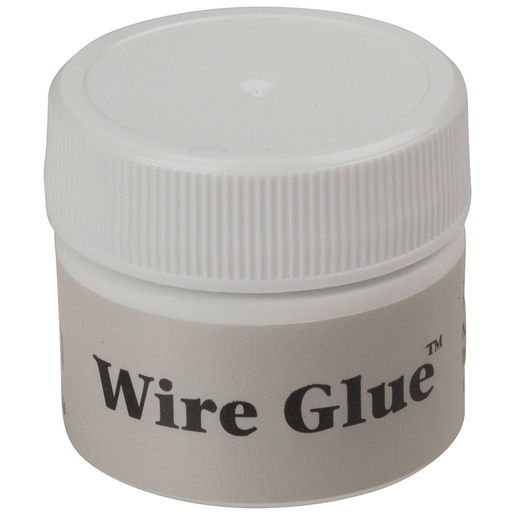](./nm2831-wire-glue-9mlimagemain-515.jpg)

... to hand build miniscule SPST "button" surfaces. Just need surfaces in or close to contact, plenty to choose from:

[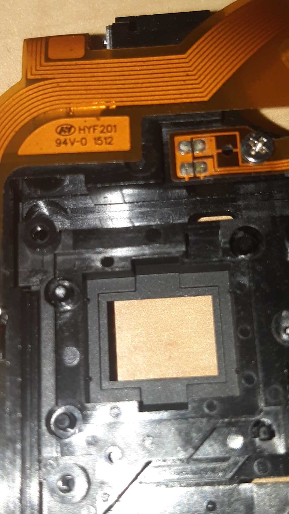](./zoom1.jpg)

[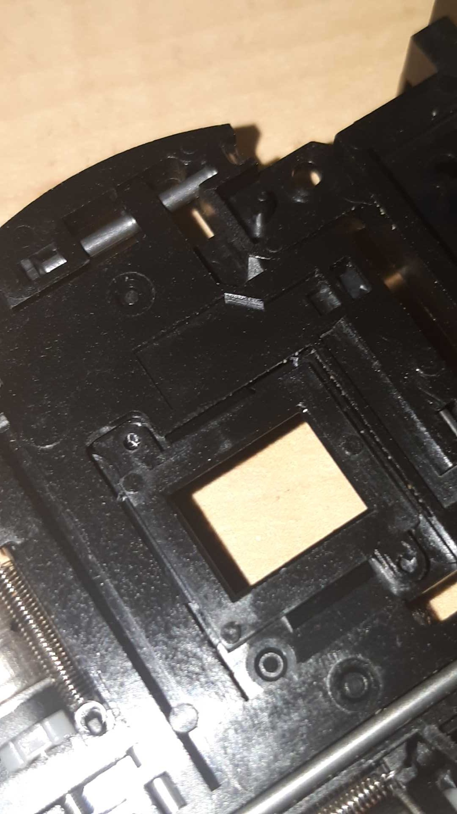](./zoom2.jpg)

Could also play, with conductive PLA, I suppose:

[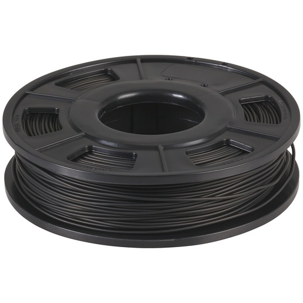](./tl4142-conductive-pla-filament-for-3d-printer-1-75mm-250gimagemain-515.jpg)

There'll obviously need to be a little experimentation ... mwahahahahah! Where's Igor when you need him.

The trick might be to use a couple of rotating controls, based on the KY-040, for controlling the XY position:

[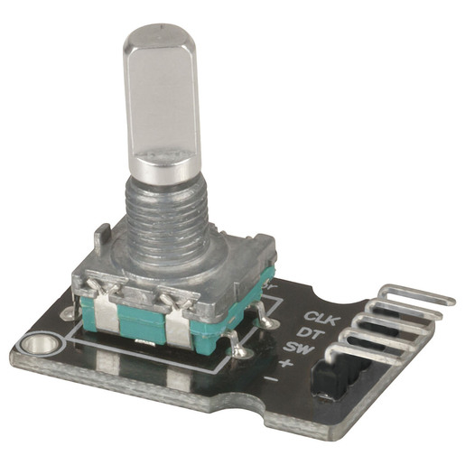](./xc3736-digital-rotation-sensor-for-arduinoimagemain-515.jpg)

Of note, the KY-040 comes with a push switch built in:

[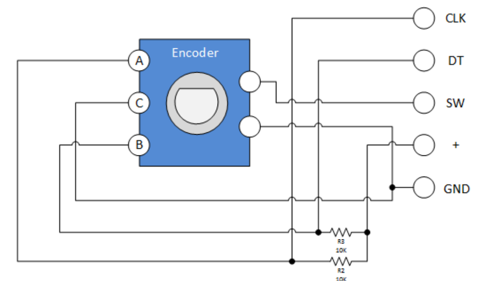](./rotary-encoder-schematic.png)

Using the Wemos D1 mini also leaves it open for WiFi, but not USB based, "remote" control - aiming to use most all available GPIO. BUT, notice the problem? Wemos D1 mini has 11 GPIO ports.

Sign up for RandomNerdTutorials @ https://rntlab.com/login/

Noting, according to Pololu, the [minimal drive configuration for the drv8825](https://www.pololu.com/picture/view/0J4232) is:

[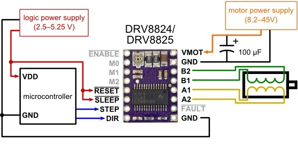](./0j4232.1200-1.jpg)

Noting the A0 pin will be used, since I need a rate multiplier for the KY-040 sensors - to flip between fine and coarse movements. Having a pot on the A0 line is perfect for that.

* 2x 2 pins for controlling the XY motors
* 2x 2 encoder pins for a KY-040 for each axis (two dials, one for each axis)
* 4 pins for XY min/max end stops
* 1 analogue pot for rate multiplier for axis

So 11!

NO!

12 GPIO pins!

Arrrrrrgggghhhhh!

And 1 analogue pin.

DOH! Only have 11 GPIO pins.

Hmmm.

Ah! So, looks like I can save pins by putting a toggle button and then using only one KY-040 and giving up two end stops. So, something like:

* 2x 2 pins for XY motors
* 2 encoder pins for a single KY-040 to be shared (one dial with X or Y mode)
* 1 pin for toggle switch, to toggle KY-040 between XY axis
* 2 pins for XY min only end stops
* 1 analogue pot for rate multiplier for axes

So 9 GPIO pins and 1 analogue pin. Looking like then the TxRx can be left open.

So, the button press of the KY-040 will do fine, each press will toggle between X then Y mode and back again. Or could use click versus click and hold. That will be the meat of the experimentation.

There is an apparent quirk in that the technical data for the KY-040 says 5V, but people are driving it with 3.3V and appears fine. Probably makes sense since there are discretes inside the sensor and so 3.3V may well be within margins.

The rate multiplier for the axis is required, especially if the micro stepping is used, so that coarse and fine adjustments are provided. At the finest, you think that 1 step per encoder tick might be the go, but that depends ultimately on the resolution. A log scale might be appropriated.

Perfect, we have all the info we need, and assuming the mini is happy giving up all its GPIO for this.

[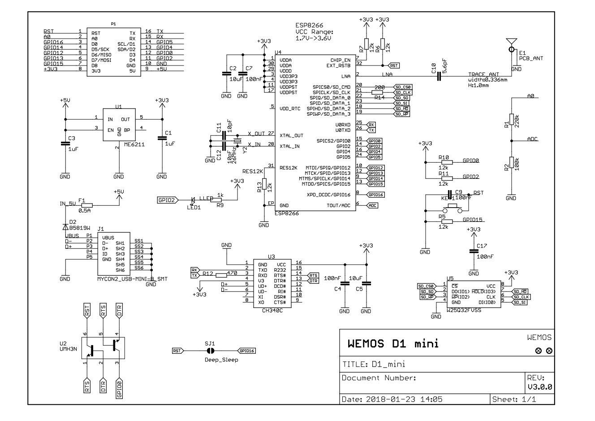](./2020-02-10_12-06-36.jpg)

As an appetiser, I have drafted a V0.1 of the board, once I sort out some issues with the design while prototyping. The 6pin DIP are actually 3 spst dip switches, so I need source step files for those. I notice the search function in KiCAD, when selecting footprints, is missing. So it's a real pain trying to trawl through to find even things like a footprint for a 100uf 50V electrolytic it seems.

The motor pins are currently using a 1.27mm spaced vertical connector, as I have gauged that 1.27mm is the pin spacing of the pins on the motors. They won't be jumpered though, I just need sort using a padded footprint. I will solder the wires direct.

[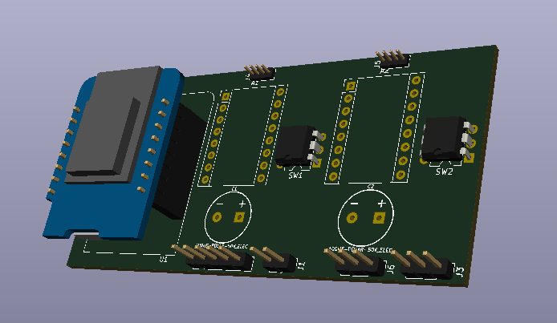](./v0.1.png)

Okay, so a little fiddling and V0.2. Only because of the "art" but I need to work out if there is a step file for the 100uf 50V (really Capacitor\_THT:CP\_Radial\_D8.0mm\_P3.50mm) lying down.

[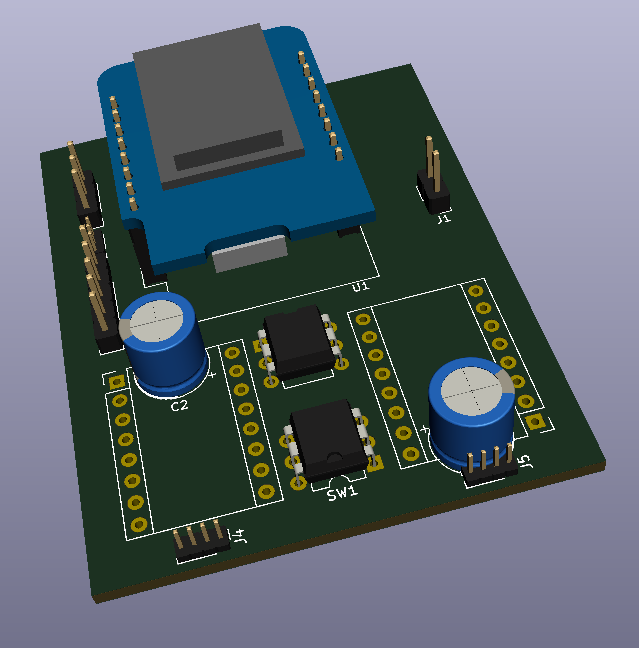](./v0.2.png)

And, with a little more poking around on the Net plus fiddling with KiCAD options, voila!

[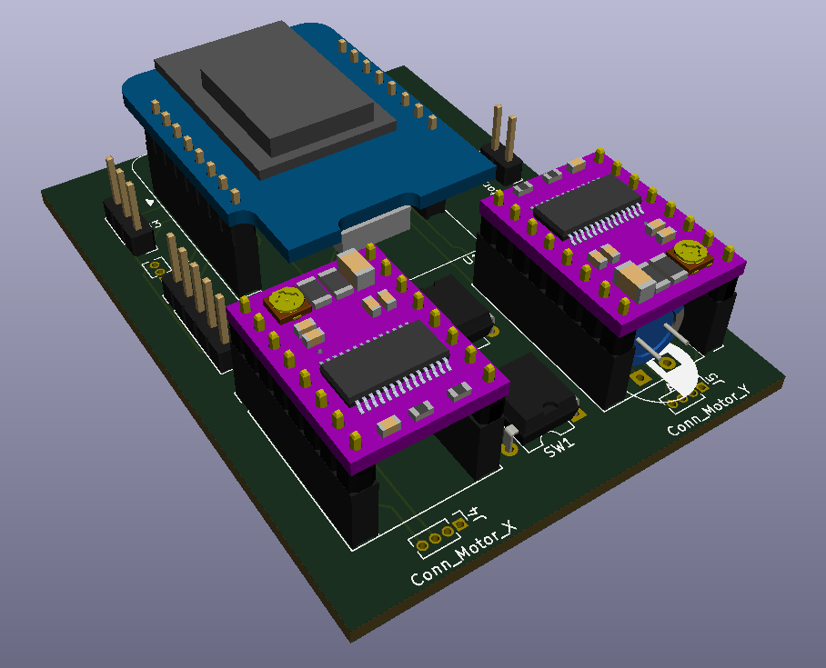](./v0.2b.png)

[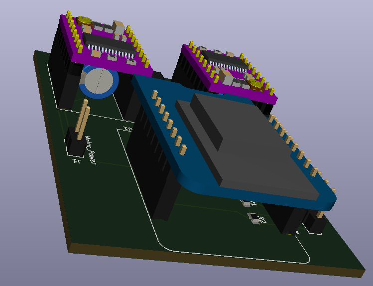](./v0.2c.png)

Obviously. you might scrunch it up more by giving up on the dip switches for the step size. So expect final board to be different again. Just having fun with KiCAD as I had to hand build the 3D model for the dvr8825 from sources, so I am getting more and more impressed with KiCAD as I was able to discover that without reading the manuals or watching videos. Plus finding step sources has been useful, though the next step is go through the process of building my own 3D files. The one that might be the exam question is the electrolytic caps. I just rotated and stretched and translated a default cap to give the feel of the result. It does bug me the leads of the caps are poking out and not bent and in there pads. It's only cosmetic but it also is a little learning experience which is fun.

Still a little queasy about all those GPIO pins ... it's tight.

Still, all indications are that while the ESP8266 has 17 GPIO pins (0-16), you can definitely use 11 of them. The 6 pins (GPIO 6 - 11) are used to connect the flash memory chip so they are out. GPIO 1 and 3 are used as TX and RX of the hardware Serial port (UART), so in most cases, you can’t use them as normal I/O while sending/receiving serial data. We'll just be giving up the UART and running from dials or remotely over Wifi on the finished board. That's why the prototyping will be most important.

Of course, while we're at it, we have to note the steppers are 5volt and the minimum drive voltage on dvr8825 is 8volt, so there may still be a back flip on the driver section. And really [MP6500 are the ticket](https://www.pololu.com/product/2966) (Pololu again), I just don't happen to have any in my drawers at the moment. Serve me right for crashing ahead with the process, but hey, we call that Agile (TM) don't we, but only minor changes to the board once I source the libraries for the MP6500.

So, back to the drawing board with:

[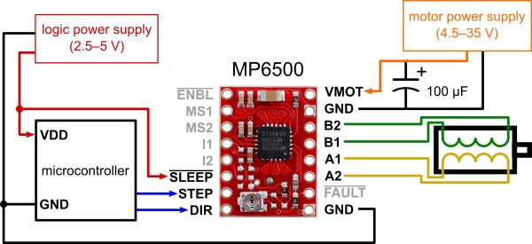](./0j8411.600.jpg)

Doesn't break to pin count, but now have to put an order in. So local purchase made to expedite the project, when I finalise the board I will probably do a bulk buy from Aliexpress and sell 10 or so units to recover costs.
