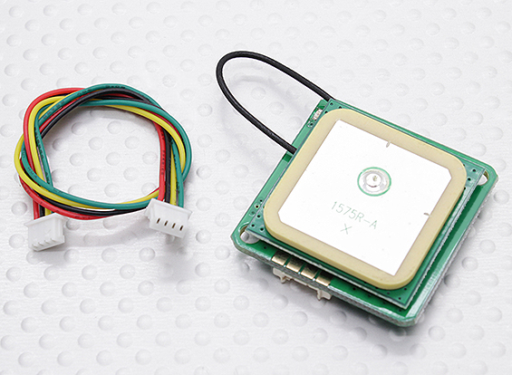
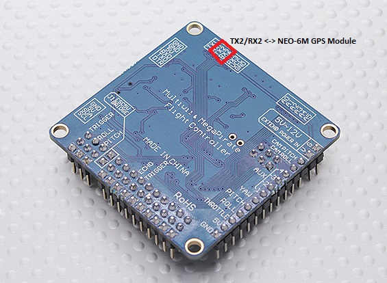
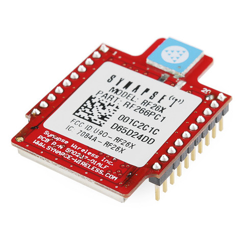

So, the three NEO-6M GPS Modules I ordered, to pair up with the AIO, have turned up.
A little bit of work to connect the two - I have to pair two cables that came with the AIO,

TX3/RX3 next door will go to SNAP module.

 
Although, you do know that you can program an Arduino over the air with a SNAP module!  So I might look at the FTDI port as well as an option.
