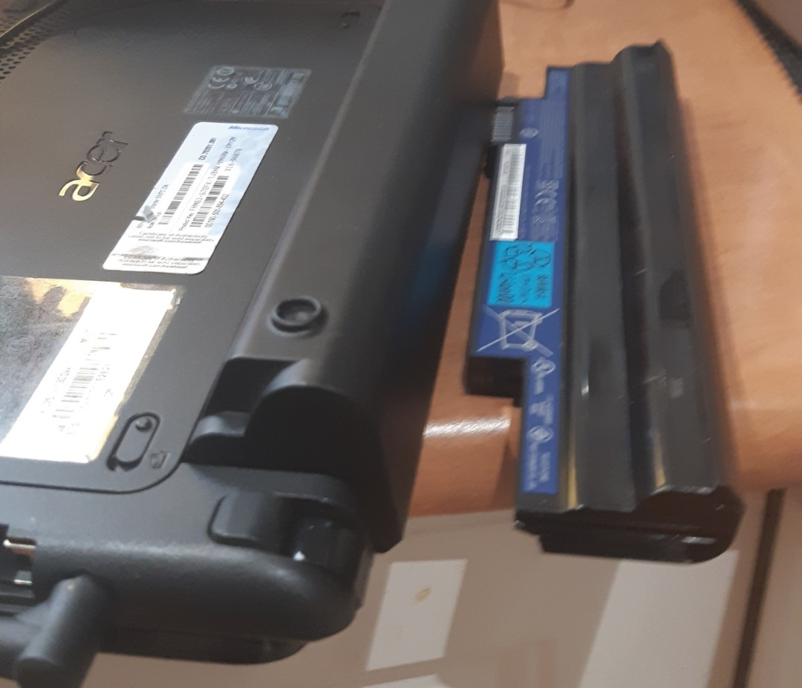

THIS is a battery!

So, my old Acer Aspire 1 is now mobile again.

Better yet, I tried connecting it to my 5MP microscope camera and it runs.

I bought that camera for cheap as I have a basic Celestron telescope that I wanted a camera for. Problem is, it may be the low light for astronomy is no good for the camera BUT, the telescope is probably best for moon shots.

So plenty of light there.

Will try it out soon.
